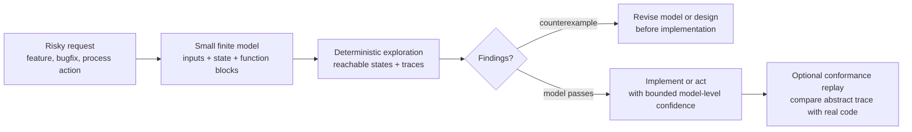

# FlowGuard

<!-- README HERO START -->
<p align="center">
  
</p>

<p align="center">
  <strong>A lightweight finite-state simulator for checking risky AI-agent workflows, arguments, and decisions before action.</strong>
</p>
<!-- README HERO END -->

| Public release | Schema | Runtime | License |
| --- | --- | --- | --- |
| `v0.15.0` | `1.0` | Python standard library only | MIT |

English lead content comes first; a full Chinese mirror follows below.

In one sentence: FlowGuard is a lightweight architecture and process-flow
simulator for AI agents. It helps agents turn the risky part of a planned
software workflow, high-impact process, structured argument, or decision path
into a small finite-state, executable model before action, then reports
reachable paths and counterexample traces.

**Best with spec-driven skills:** use OpenSpec/SPAC-style planning skills to
clarify intent, acceptance criteria, and task structure, then use FlowGuard to
stress-test the risky state transitions, side effects, retries, ownership
boundaries, and completion evidence before execution.

FlowGuard is not an LLM wrapper, does not call model APIs, does not estimate
probabilities, and does not run Monte Carlo. It performs finite, deterministic,
reviewable workflow simulation.

## English

### Start Here: What FlowGuard Can Do Now

FlowGuard is now both a small Python library and a Codex-ready model-first
workflow system. The core remains simple: represent risky behavior as finite
state transitions, enumerate the possible traces, and inspect counterexamples
before action. Around that core, FlowGuard now has focused helper routes for
the common places where AI agents overclaim confidence.

Use it for:

- **Behavior modeling:** model a workflow as `Input x State -> Set(Output x State)`.
- **Scenario and invariant review:** check human expectations, hard invariants,
  repeated inputs, dead branches, loops, and progress.
- **Conformance replay:** compare representative abstract traces with real
  implementation behavior when code exists.
- **Model-Test Alignment:** check whether model obligations, code external
  contracts, and ordinary test evidence actually line up.
- **UI Flow Structure:** model UI-level controls, states, button events,
  failures, recovery paths, and availability before deriving menu levels,
  overlays, stable layout positions, information-display ownership, duplicate
  UI information checks, overlapping control-function checks, and parent/child
  UI topology.
- **Code Structure Recommendation:** derive module, facade, state-owner,
  side-effect, config, and validation boundaries from a functional model before
  writing code.
- **ModelMesh, TestMesh, and StructureMesh:** keep large model, validation, and
  refactor surfaces split into parent/child evidence instead of one oversized
  graph or test command.
- **DevelopmentProcessFlow:** decide whether done, archive, publish, or release
  claims still have fresh validation evidence after requirements, code, tests,
  docs, models, or peer writes changed.
- **Model-Miss Review:** when runtime or manual validation fails after a
  FlowGuard pass, classify what the model missed and add a generalized
  same-class bad case before closing the issue.

### Codex Skill Architecture

FlowGuard ships one canonical Codex Skill Kernel plus directly invokable
satellite skills:

```text
.agents/skills/model-first-function-flow/
.agents/skills/flowguard-model-test-alignment/
.agents/skills/flowguard-development-process-flow/
.agents/skills/flowguard-model-miss-review/
.agents/skills/flowguard-code-structure-recommendation/
.agents/skills/flowguard-ui-flow-structure/
.agents/skills/flowguard-model-mesh/
.agents/skills/flowguard-test-mesh/
.agents/skills/flowguard-structure-mesh/
```

Use `model-first-function-flow` for applicability, hard gates, flow lenses, and
ambiguous route selection. Use a satellite skill directly only when the request
clearly matches that route. Package helpers such as
`review_ui_interaction_model(...)`, `review_ui_structure_derivation(...)`,
`review_model_test_alignment(...)`, `review_test_mesh(...)`, and starter
templates remain Python helpers, not independent Codex skills.

### What FlowGuard Is

FlowGuard is an architecture simulator and workflow simulator used before code
is written or before a high-impact process is executed. It does not make an AI
agent write more code directly. It gives the agent an environment for simulating
the workflow path it is about to create, change, or act on.

When an agent is about to build a workflow, refactor module boundaries, or
change retry, cache, deduplication, or idempotency behavior, FlowGuard does not
ask it to formalize the whole architecture upfront. It asks the agent to
compress the risky boundary in front of it into a finite, executable,
enumerable model. FlowGuard then runs that model, keeps every trace, and checks
invariants, scenario expectations, loop/progress behavior, contracts, and
implementation conformance. The useful part is that workflow defects can appear
before the real code exists.

If no FlowGuard model script exists yet, that is not a blocker. The AI agent
should create one from the current plan or adapt the included model template.
The model does not have to be the shortest possible script; it should be
fit-for-risk, meaning it captures the customer-visible failure modes, state,
side effects, retries, ordering rules, and invariants that matter for the task.
As the workflow and observed risks change, the model should be revised,
expanded, or connected to other models instead of treated as a one-time sketch.

The same model-first idea also applies outside code when a process, argument,
or decision has meaningful state, ordering constraints, external dependencies,
irreversible or costly actions, privacy/reputation risk, evidence or proof
dependencies, commitments, payment or reservation side effects, publication
side effects, or rollback concerns. In that mode FlowGuard is a blindspot
preflight: it can expose risky paths before the action is taken or before a
claim or decision is relied on, but it does not prove that live real-world
facts, prices, availability, policies, vendor behavior, or source material are
safe.

### Task Modes

FlowGuard is not only a checker for finished code. The same finite model can
support several agent tasks:

- **Workflow designer:** create or evolve a FlowGuard model script that turns a
  proposed process into finite inputs, abstract state, named function blocks,
  possible outputs, and hard invariants before production code exists.
- **Pre-change experimenter:** compare candidate designs against repeated
  inputs, ordering changes, retries, cache/source-of-truth choices, and side
  effect rules before choosing an implementation.
- **Workflow bug checker:** surface counterexamples for duplicate side effects,
  stale caches, contradictory decisions, stuck loops, missing progress, or wrong
  state ownership.
- **Implementation guardrail:** replay or compare representative model traces
  against real code when production code exists, and treat skipped checks as
  confidence boundaries rather than hidden passes.
- **Adoption reviewer:** keep lightweight evidence about why FlowGuard was
  used, which checks ran, what was skipped, and what changed after inspecting
  the model.

### Why It Is Interesting

- It turns architecture reasoning into a runnable simulation instead of a prose
  discussion.
- It keeps the math lightweight: model the current risky boundary first, not
  the entire system.
- It can compound over time: repeated use leaves behind an inspectable library
  of project-specific workflow models.
- It lets a model grow with customer risk: start with the boundary that matters
  now, then strengthen the model when new failure modes or workflows appear.
- It turns "remember dedup / retry / cache / idempotency" into executable
  invariants instead of reminders for the agent.
- It checks the state transitions of the modeled workflow, not only whether one
  local function runs.
- It enumerates repeated inputs, branches, dead paths, loops, and state drift,
  then reports a reproducible counterexample trace.
- It fits naturally into Codex or another AI agent workflow: simulate first,
  then write code, revise the process, or take the high-impact action.

### Mathematical Simulation: A Finite-State Automaton

FlowGuard's core method is close to an engineering-oriented finite-state
automaton / finite-state transition system. You define four things:

- External inputs: events, objects, retry requests, queued tasks, or user
  actions entering the workflow.
- Abstract state: the finite state needed to expose risk, such as records,
  cache entries, attempts, side effects, decisions, and owners.
- State transitions: how each function block turns the current input and state
  into output and new state.
- Check rules: invariants, scenario oracles, loop/progress rules, contracts,
  and conformance adapters.

Mathematically, each function block is modeled as:

```text
F: Input x State -> Set(Output x State)
```

This means a block receives an input and the current state, then returns every
possible `(output, new_state)` pair. One result is a deterministic transition.
Multiple results are explicit branching. Zero results mean a dead path that
should be reported. FlowGuard does not sample and does not assign probability.
It enumerates the outcomes you modeled.

Function blocks compose into workflows:

```text
Workflow = F_C o F_B o F_A
```

Because every block may branch, a workflow becomes an execution tree or
reachable state graph:

```text
(input sequence, initial state)
  -> reachable states
  -> traces
  -> invariant / scenario / loop / contract findings
  -> counterexample trace
```

That is the "architecture simulation" in FlowGuard: within finite bounds, it
enumerates the state machine paths and checks whether any path violates
invariants, scenario expectations, state ownership, idempotency, termination, or
real-code conformance.

### Lightweight, Incremental Modeling

FlowGuard's advantage is not a new branch of mathematics. It applies classic
finite-state modeling, invariant checking, and counterexample traces at the
scale where an AI coding agent can actually use them during everyday work.

Instead of requiring a complete formal model of the whole product, FlowGuard
lets the agent model one behavior boundary at a time:

- local: one function flow, retry path, cache refresh, or side-effect write;
- mid-level: several modules passing state, ownership, or idempotency rules
  across a boundary;
- higher-level: a release flow, maintenance flow, process preflight, or
  multi-agent coordination loop.

This makes the method progressive. A project can start with the smallest model
that can expose the current risk, inspect the counterexamples, revise the
design, and only grow or connect models when the workflow boundary grows.
FlowGuard therefore gives bounded evidence for the modeled slice; it does not
claim one command can prove an entire production system correct.

When FlowGuard grows with a project, the small models do not have to stay
isolated. Feature-level models, module-boundary models, Skill-triggered models,
release/process models, and conformance adapters can accumulate into a
project-specific model library. Over time, that library can become an
inspectable simulation network: local models explain individual changes,
mid-level models explain cross-module state movement, and higher-level models
explain process or agent coordination behavior.

That long-term model library is still bounded and explicit. It is powerful
because each piece remains small enough to review, rerun, revise, and connect
when the project evolves.

For graph-style models that grow too large for one comfortable run, FlowGuard
also provides budgeted model groups. A budgeted model group runs the same
reachable graph in shards, defaults to 10,000 processed states per shard, keeps
a SQLite ledger of seen/pending/processed states, and reports the whole group
as `incomplete` until no pending states remain. This is different from progress
visibility: a shard can show 100% while the model group is still incomplete.

For projects that grow into several models, or for one model that becomes too
large to inspect comfortably, FlowGuard also provides hierarchical model-mesh
helpers. A parent model is treated like a total map, child models are region
maps, and `review_hierarchical_mesh(...)` checks whether the regions cover the
parent space without unsafe overlap. The same mesh can trigger large-model
split review, classify legacy models, and keep stale, skipped, or incomplete
evidence visible.

### Why It Exists

AI coding agents often fix a local bug while damaging the global workflow. For
example, an agent may accidentally:

- score the same object twice;
- append duplicate records for the same item;
- forget deduplication;
- retry a side effect twice;
- let cache drift from the source of truth;
- let the wrong module mutate state it does not own;
- produce an output the downstream block cannot consume;
- create a record without a final decision;
- assign both apply and ignore to the same object;
- create a workflow that has an exit but no progress guarantee;
- write production code that runs but no longer matches the abstract design.

FlowGuard is not a replacement for unit tests. It is a pre-production modeling
layer for exposing workflow-level and side-effect-level defects before the code
change lands.

### With FlowGuard vs Without It

| Without FlowGuard | With FlowGuard |
| --- | --- |
| The agent usually moves from a natural-language request directly into code edits. | The agent first models the risky part of the architecture change as a small finite function flow. |
| Risks often appear only after code is written, tests fail, or review catches the issue. | Repeated inputs, branches, state transitions, and side effects are enumerated and checked in the model first. |
| "Remember dedup / retry / cache" is only a reminder the agent may miss. | Deduplication, idempotency, state ownership, loops, and contracts become executable invariants or scenarios. |
| Architecture quality depends mostly on intuition and after-the-fact debugging. | Failed paths appear as counterexample traces, so the agent can revise the local or mid-level workflow design before implementation. |

The practical benefit is not that FlowGuard writes the production code for you.
It gives the agent a design-time simulation layer, so architectural defects and
workflow risks can be found before the implementation becomes harder to change.

### How FlowGuard Differs From Spec-Driven / Plan-Driven Methods

FlowGuard focuses on a different problem from spec-driven or plan-driven AI
coding methods.

Many existing methods help AI coding agents turn natural-language requests into
clearer specifications, acceptance criteria, technical plans, task lists, or
implementation workflows. Their main value is to make intent, planning, and task
structure more explicit before the agent edits code.

FlowGuard follows a different validation path. It does not primarily check
whether the requirement text is complete, and it does not primarily manage
project plans or task lists. Instead, it turns a stateful workflow into a finite
executable function-flow model and checks the behavior of that model directly.

This difference makes the methods suitable for cross-validation. FlowGuard is
therefore a strong companion to spec-driven skills: the spec tool clarifies
what should be built or changed, while FlowGuard checks whether the proposed
stateful workflow can safely run.

Spec-driven or plan-driven methods usually ask:

```text
Are the requirements clear?
Is the plan complete?
Do the tasks cover the requirements?
Is the implementation workflow organized?
```

FlowGuard asks:

```text
If the same input is processed twice, can it create duplicate side effects?
If a retry happens after a partial failure, can it corrupt state?
If cache and source of truth both exist, can they drift apart?
If the workflow contains a loop, can it get stuck?
If multiple modules write the same state, does that violate ownership boundaries?
```

This is not a replacement claim. It is a methodological difference. Text-level
and planning-level checks can reveal issues in requirements, tasks, and workflow
organization. FlowGuard's executable model can reveal behavioral issues related
to state transitions, repeated inputs, idempotency, side effects, cache
consistency, loops, and ownership boundaries.

FlowGuard can therefore be used as an independent cross-checking method: after a
design has been structured at the specification or planning level, FlowGuard can
further test whether the proposed workflow is safe within a finite abstract
behavior space.

### What It Checks Today

| Capability | What FlowGuard does |
| --- | --- |
| Finite-state simulation | Expands input sequences, abstract state, and transitions into reachable state graphs and traces |
| Function-flow model | Represents blocks as `Input x State -> Set(Output x State)` |
| Workflow exploration | Expands branching workflows and keeps every trace |
| Explorer progress heartbeat | Emits bounded ten-step `stderr` progress for long serial Explorer runs |
| Invariant checking | Detects duplicate records, repeated processing, contradictions, cache mismatch |
| Repeated input | Explores sequences such as `[A]`, `[A, A]`, and `[A, B, A]` |
| Scenario sandbox | Compares human oracle expectations with observed results |
| Counterexample trace | Emits a readable path explaining a failure |
| Trace export | Exports traces and reports as JSON-compatible structures |
| Mermaid diagram export | Exports copyable Mermaid source for traces and reachable state graphs when a diagram helps explain the model |
| Conformance replay | Replays abstract traces against real code through an adapter |
| Loop / stuck review | Finds stuck states, bottom SCCs, and unreachable success |
| Progress checks | Flags cycles with escape edges but no progress guarantee |
| Contract checks | Checks preconditions, postconditions, read/write ownership, forbidden writes, traceability |
| Agent helper layer | Provides RiskIntent, property factories, RiskProfile, check plans, summary reports, and domain packs |
| Finding ledger | Flattens model, audit, scenario/live, progress, contract, conformance, and skipped-check findings into one repair ledger |
| UI flow structure | Models UI controls, information displays, states, events, failure/recovery paths, redundancy rationale, and state availability before deriving menu levels, overlays, stable layout positions, and parent/child UI topology |
| Code structure recommendation | Turns a FlowGuard functional model into a recommended module/script split before code is written |
| Model-test alignment | Compares explicit model obligations with ordinary test evidence without requiring TestMesh or StructureMesh |
| Test hierarchy mesh | Reviews parent/child test partitions, child-suite/script ownership, stale/hidden/timeout evidence, background completion, and routine-vs-release gates |
| Structure refactor mesh | Reviews existing large script/module splits with mandatory model-derived target structure, child ownership, public entrypoint compatibility, facades, dependency cycles, config drift, parity evidence, and routine-vs-release refactor gates |
| Development process flow | Reviews lifecycle ordering, artifact overwrite, validation freshness, minimum revalidation, and V-style done/release confidence as a sibling route |
| Skill Kernel route map | Keeps `model-first-function-flow` as the compact router for core modeling, support protocols, and ambiguous FlowGuard route selection |
| Codex Skills | Provides the kernel plus direct satellite skills for Model-Test Alignment, DevelopmentProcessFlow, Model-Miss Review, Code Structure Recommendation, UI Flow Structure, ModelMesh, TestMesh, and StructureMesh |
| Optional planner handoff | Lets spec/SPAC-style planning skills hand a structured plan to FlowGuard without becoming a dependency |

### UI Flow Structure In v0.15.0

`v0.15.0` adds UI Flow Structure as a model-first route for interface design.
This route does not start by arranging buttons visually. It first builds or
reviews a UI interaction model: initial UI state, controls, events, state
nodes, transitions, failure and recovery paths, terminal states, and control
availability.

After that model is reviewed, FlowGuard derives the UI structure from it:
parent/child UI nodes, first-level persistent menus, second-level contextual
regions, third-level local controls, overlays, stable layout positions,
navigation ownership, information-display ownership, duplicate/redundancy
rationale, and validation boundaries. This is the layer that can tell an AI
agent why a global settings control belongs in a fixed top toolbar, why a retry
button belongs in a failure inspector, why a cancel action should be an overlay
tied to the running state, or why a chart and a text block should not repeat
the same result on one page unless accessibility or summary/detail separation
is explicitly modeled.

Use `UIInteractionModel`, `UIControl`, `UIDisplayElement`, `UIStateNode`,
`UITransition`, `UIStructureDerivation`, `UIRegionRecommendation`,
`review_ui_interaction_model(...)`, and
`review_ui_structure_derivation(...)` when UI hierarchy should come from a
modeled interaction flow rather than arbitrary layout preference.

Create a starter scaffold with:

```powershell
python -m flowguard ui-flow-structure-template --output .
python .flowguard/ui_flow_structure/run_checks.py
```

See [docs/ui_flow_structure.md](docs/ui_flow_structure.md) for the API and
workflow.

### Code Structure Recommendation In v0.11.0

`v0.11.0` adds a parallel Code Structure Recommendation route for turning a
FlowGuard functional model into a recommended implementation split before code
is written. Use `TargetModuleRecommendation`,
`CodeStructureRecommendation`, and
`review_code_structure_recommendation(...)` when a user asks for a module,
script, package, or facade plan and the functional model already exposes the
important FunctionBlocks, state, side effects, config, public entrypoints, and
validation boundaries.

This route is deliberately not a hard gate for every ordinary model-first
workflow. Ordinary modeling can stay focused on behavior. Code Structure
Recommendation is for direct architecture/file-split requests or features that
are likely to become too large if implementation starts as one long script.

StructureMesh now consumes the same recommendation shape when it reviews an
existing large script or module split. In that case model-derived target
structure is mandatory inside `StructureMeshPlan`, and
`review_structure_mesh(...)` blocks missing or mismatched FunctionBlock, state,
side-effect, config, facade, public-entrypoint, or validation ownership.

Create a starter scaffold with:

```powershell
python -m flowguard code-structure-recommendation-template --output .
python .flowguard/code_structure_recommendation/run_checks.py
```

See [docs/code_structure_recommendation.md](docs/code_structure_recommendation.md)
for the API and workflow.

### Model-Test Alignment In v0.10.0, v0.12.0, And v0.13.0

`v0.10.0` added a standalone Model-Test Alignment helper for checking whether a
FlowGuard model and ordinary tests cover the same obligations. The helper now
also accepts optional code external contracts, so one review can compare model
obligations, code-visible behavior, and test evidence without invoking a mesh
route. Use `ModelObligation`, `CodeContract`, `TestEvidence`,
`ModelTestAlignmentPlan`, and `review_model_test_alignment(...)` when
scenarios, invariants, hazards, state transitions, or input/output contracts
need matching current test evidence and code contract proof.

The review flags missing test evidence, orphan tests, unknown obligation or
code-contract references, duplicate same-kind test claims, stale or non-passing
evidence, missing required test kinds, tests that overclaim model confidence,
missing code contract owners, code contracts that miss model-declared external
behavior, exact contracts that add model-forbidden external behavior, and tests
that inspect only internal paths while claiming external contract proof.

`v0.13.0` adds conservative Python source audits for this route:
`audit_python_code_contracts(...)` extracts structural facts from real Python
functions, `audit_python_test_assertions(...)` checks whether real tests call
the target code contract and contain assertions, and
`review_python_contract_source_audit(...)` reports source-level gaps before
declared rows are trusted. This is not a full semantic proof; use conformance
replay or manual review for behavior that cannot be inferred from the Python
AST.

This is not TestMesh and not StructureMesh. It does not split tests, refactor
code, or read mesh reports. Use TestMesh only when the validation flow itself
needs parent/child test hierarchy ownership. Use StructureMesh only when source
structure is being split.

Create a starter scaffold with:

```powershell
python -m flowguard model-test-alignment-template --output .
python .flowguard/model_test_alignment/run_checks.py
```

See [docs/model_test_alignment.md](docs/model_test_alignment.md) for the API
and workflow.

### Development Process Flow In v0.14.0

`v0.14.0` adds DevelopmentProcessFlow as a sibling route for lifecycle evidence
freshness. Use `ProcessArtifact`, `ProcessAction`, `ProcessEvidence`,
`ValidationRequirement`, `DevelopmentProcessPlan`, and
`review_development_process_flow(...)` when requirements, models, code, tests,
docs, release assets, or peer-agent writes can make earlier validation evidence
stale before a done, release, archive, or publish claim.

This route does not supervise ModelMesh, TestMesh, StructureMesh, Model-Test
Alignment, LongCheck, or Conformance Adoption. It can reference sibling route
evidence ids and covered artifact versions, then decide whether the lifecycle
claim still has current evidence or needs minimum revalidation.

Create a starter scaffold with:

```powershell
python -m flowguard development-process-flow-template --output .
python .flowguard/development_process_flow/run_checks.py
```

See [docs/development_process_flow.md](docs/development_process_flow.md) for
the API and workflow.

### Codex Skill Satellites In v0.14.0 And v0.15.0

`v0.14.0` upgraded the Codex-facing architecture from one large skill with many
internal routes into one kernel plus direct satellite skills. `v0.15.0` adds
the UI Flow Structure satellite:

```text
.agents/skills/model-first-function-flow/
.agents/skills/flowguard-model-test-alignment/
.agents/skills/flowguard-development-process-flow/
.agents/skills/flowguard-model-miss-review/
.agents/skills/flowguard-code-structure-recommendation/
.agents/skills/flowguard-ui-flow-structure/
.agents/skills/flowguard-model-mesh/
.agents/skills/flowguard-test-mesh/
.agents/skills/flowguard-structure-mesh/
```

Use `model-first-function-flow` for applicability, hard gates, flow lenses, and
ambiguous routing. Use a satellite skill directly when the request clearly
matches one mature route. Package helpers such as `review_test_mesh(...)`,
`review_model_test_alignment(...)`, `review_ui_interaction_model(...)`, and
starter templates remain helper APIs, not Codex skills by themselves.

### Skill Kernel Modularization In v0.9.0

`v0.9.0` also turns the `model-first-function-flow` Skill into a compact
FlowGuard Skill Kernel. The main `SKILL.md` now owns only trigger selection,
hard gates, route selection, workflow skeleton, helper/API boundaries, and the
resource map. Detailed procedures move into dedicated reference protocols:

- core modeling;
- code structure recommendation;
- ModelMesh;
- TestMesh;
- StructureMesh;
- DevelopmentProcessFlow;
- UI Flow Structure;
- post-runtime model-miss review;
- conformance/adoption and install sync;
- long-check observability;
- FlowGuard framework upgrades.

This keeps FlowGuard usable through one canonical kernel while allowing mature
routes to become standalone satellite skills. Helper APIs such as `RiskIntent`,
property factories, templates, and mesh review functions remain package
helpers, not skills by themselves.

### Structure Refactor Mesh In v0.9.0

`v0.9.0` adds optional StructureMesh helper APIs for splitting large scripts,
packages, modules, commands, and API surfaces into parent/child structure
evidence. Use `StructureMeshPlan`, `StructurePartitionItem`,
`ModuleStructureEvidence`, `PublicEntrypointEvidence`, and
`review_structure_mesh(...)` when a refactor moves functions, state, config,
side effects, public entrypoints, behavior contracts, or release obligations.

As of `v0.11.0`, StructureMesh for an existing large-script or large-module
split also requires model-derived target structure evidence. The target
recommendation is stored directly on `StructureMeshPlan`; it is not an optional
callout to another skill.

The review checks partition coverage, unregistered owners, duplicate partition
ownership, duplicate state/side-effect/config ownership, removed public
entrypoints, missing or mismatched target-structure ownership, missing facades,
unsafe dependency cycles, config/default drift, missing or stale behavior
parity, insufficient evidence tiers, and the difference between routine and
release refactor confidence. It does not refactor code; project adapters or
agents collect source inventory, dependency, facade, and parity evidence and
pass it into FlowGuard.

Create a starter scaffold with:

```powershell
python -m flowguard structure-mesh-template --output .
python .flowguard/structure_mesh/run_checks.py
```

See [docs/structure_mesh.md](docs/structure_mesh.md) for the workflow and API
sketch.

### Test Hierarchy Mesh In v0.8.0

`v0.8.0` adds optional TestMesh helper APIs for splitting large test scripts,
suites, or validation flows into parent/child test hierarchy layers. Use
`TestMeshPlan`, `TestPartitionItem`, `TestSuiteEvidence`, and
`review_test_mesh(...)` when a parent test gate depends on several child suites
or child scripts, background regressions, release-only checks, or evidence that
can become stale.

TestMesh is parallel to ModelMesh and StructureMesh: ModelMesh splits models,
TestMesh splits tests, and StructureMesh splits code structure. The parent test
gate consumes child ownership and evidence contracts instead of expanding every
child test case or fixture into one giant parent graph.

As of `v0.11.0`, TestMesh parent confidence also requires a
`TestTargetSplitDerivation` from the FlowGuard validation-structure model. The
derivation records the source model, target child suites/scripts, covered
partition items, ownership fields, and split rationale.

The review checks partition coverage, unregistered owners, duplicate state or
side-effect ownership, hidden skipped tests, stale evidence, timeout/failed
suites, background progress without final exit/result artifacts, and the
difference between routine and release confidence. It does not run the tests;
project adapters run pytest, unittest, Playwright, shell commands, or manual
checks and pass structured evidence into FlowGuard.

Create a starter scaffold with:

```powershell
python -m flowguard test-mesh-template --output .
python .flowguard/test_mesh/run_checks.py
```

See [docs/test_evidence_mesh.md](docs/test_evidence_mesh.md) for the
hierarchy, evidence workflow, and API sketch.

### Optional Skill-Orchestrator Collaboration In v0.6.0

`v0.6.0` adds a documented collaboration path for environments that also use
spec/SPAC-style planning or orchestration skills. FlowGuard still works on its
own. When an upstream planner is available, its plan can become optional handoff
context for FlowGuard to inspect before execution.

The handoff should name planned steps, state fields, side effects, parallel
ownership, repeat or retry points, skipped checks with reasons, and completion
evidence. If the planner is absent or the handoff is incomplete, FlowGuard
falls back to its normal standalone path or blocks only the incomplete
collaboration handoff.

The self-review lives in:

```text
examples/flowguard_skill_collaboration/
```

It checks that complete handoffs pass, missing planners fall back, incomplete
handoffs block collaboration before execution, hidden side effects fail,
parallel work needs ownership, skipped checks need reasons, counterexamples
block execution, trivial work does not over-trigger, and risky work needs
completion evidence.

### Explorer Progress Heartbeat In v0.5.5

`v0.5.5` adds minimal progress visibility to direct `Explorer(...)` runs. The
Explorer still runs serially and returns the same `CheckReport`, but long runs
now emit a bounded start line plus up to ten progress lines on `stderr`.

Progress is counted by top-level work units:

```text
len(initial_states) * len(enumerate_input_sequences(external_inputs, max_sequence_length))
```

Example progress output:

```text
[flowguard] start phase=explore work_total=4096 progress_steps=10
[flowguard] progress 10% work=410/4096 traces=8300 violations=0
[flowguard] progress 20% work=820/4096 traces=17120 violations=0
```

This is observability only. It does not change pass/fail semantics, traces, or
invariant results, and it is not a timeout or watchdog. Use
`Explorer(..., progress_steps=0)` or `FLOWGUARD_PROGRESS=0` to silence progress
in strict environments.

### Risk Purpose Headers In v0.5.4

`v0.5.4` makes generated and AI-created FlowGuard model files explain why they
exist at the top of the file. A model header now points to the FlowGuard GitHub
repository, names the workflow under review, lists the concrete failure modes
the model guards against, says when future agents should run or update it, and
shows the companion run command.

This keeps the artifact lightweight while making the model's value obvious to
another AI or developer opening the project later.

### Local Model Mesh In v0.5.3

`v0.5.3` upgrades the Skill standard for projects that already have several
FlowGuard models. When a project has three or more local models, or a decision
depends on multiple model boundaries, the agent should create or update a local
model mesh before broad continue, release, completion, or production-confidence
claims.

The mesh is a model-of-models. It inventories child models, runners, result
files, adoption logs, evidence tiers, freshness rules, live/conformance
adapters, cross-model dependencies, skipped checks, and blindspots. It must
catch hazards such as abstract-only permission, hidden skipped replay, stale
result reuse, unregistered model evidence, cross-model contradiction, missing
conformance, unrepresented model misses, sealed/private body reads, stale
installed skill copies, and no mesh at the three-model threshold.

See [docs/model_mesh_protocol.md](docs/model_mesh_protocol.md) for the
inventory checklist and prompt template.

### Hierarchical Model Mesh In v0.7.3

`v0.7.3` adds optional helper APIs for multi-level model partition governance.
Use `HierarchyPartitionMap`, `HierarchyCoverageItem`, `ChildModelEvidence`, and
`review_hierarchical_mesh(...)` when a parent model needs child regions, when a
project reaches three or more models, or when one model crosses a large-model
threshold such as 10,000 estimated or observed states.

The review checks parent coverage gaps, unsafe sibling overlap, duplicate
state-write ownership, duplicate side-effect ownership, stale/skipped child
evidence, large-model split decisions, and legacy compatibility contracts. It
does not expand every child state graph into the parent; child models remain
contract-bearing evidence sources.

As of `v0.11.0`, each parent boundary should include a
`ModelTargetSplitDerivation` from the FlowGuard source model or model-of-models
before the child layout is trusted as green parent evidence.

Run `python examples/hierarchical_model_mesh/run_review.py` for a minimal nested
hierarchy example. See
[docs/hierarchical_model_mesh.md](docs/hierarchical_model_mesh.md) for the
plain-language workflow and API sketch.

### Three Flow Types In v0.5.2

`v0.5.2` keeps the core API and existing templates unchanged, but clarifies how
the Codex Skill decides when FlowGuard applies. Use the same
`State + FunctionBlock + Invariant` model for three broad lenses:

- **Behavior Flow:** software, automation, operations, releases, UI state, or
  human workflow actions. Track phases, completed steps, persisted records,
  side effects, retries, terminal status, and rollback state.
- **Argument Flow:** papers, reports, design docs, README claims, proposals,
  proofs, or explanations. Track reader knowledge, defined terms, declared
  assumptions, cited evidence, proved claims, referenced figures, and allowed
  conclusions.
- **Decision Flow:** planning, technical choices, release/open-source choices,
  roadmaps, resource tradeoffs, or architecture decisions. Track goals,
  constraints, assumptions, evidence, options, tradeoffs, commitments,
  irreversible steps, and changed conditions.

These are modeling lenses, not separate template families. The existing
`project-template`, `risk-intent-template`, `model-miss-template`, and
`maintenance-template` remain the execution scaffolds. If none fits, create a
custom fit-for-risk model from the same FlowGuard primitives.

### Public Starter Templates In v0.5.1

`v0.5.1` refreshes the public template surface without adding private project
workflow details. The basic model template now shows a two-block flow with
validation, rejection, duplicate-input handling, and traceable storage.
Additional optional scaffolds now include:

- `risk-intent-template`: starts from `RiskIntent`, `RiskProfile`, and
  `FlowGuardCheckPlan` before running `run_model_first_checks(...)`;
- `model-miss-template`: models the feedback loop used when runtime, tests,
  replay, or manual validation finds an issue after a FlowGuard pass.
- `code-structure-recommendation-template`: models a direct pre-code module or
  script split recommendation from a FlowGuard functional model.
- `development-process-flow-template`: models lifecycle ordering, artifact
  overwrite, validation freshness, V-style validation pairs, and minimum
  revalidation before done or release claims.
- `test-mesh-template`: models parent/child test hierarchy and evidence for
  large suites/scripts, slow routine regressions, background suites, and
  release-only gates.
- `structure-mesh-template`: models parent/child structure evidence for large
  script or module splits, public compatibility, and routine/release refactor
  gates.

Use them as neutral starting points:

```powershell
python -m flowguard project-template --output .
python -m flowguard risk-intent-template --output .
python -m flowguard model-miss-template --output .
python -m flowguard code-structure-recommendation-template --output .
python -m flowguard development-process-flow-template --output .
python -m flowguard test-mesh-template --output .
python -m flowguard structure-mesh-template --output .
```

These templates are scaffolds, not reusable business logic. Rename the state,
inputs, outputs, invariants, and blindspots to match the target project before
claiming confidence.

### Coverage-First Finding Ledger In v0.5.0

`v0.5.0` adds a coverage-first finding ledger to `FlowGuardSummaryReport`.
Instead of leaving model failures, audit warnings, scenario gaps, progress
findings, contract findings, conformance gaps, and skipped sections scattered
across separate report sections, the summary now exposes
`summary.finding_ledger` and includes the ledger in `summary.to_dict()`.

This is mainly for FlowGuard or LiveFlowGuard upgrades, live failure triage,
and post-runtime model-miss repairs. The intended agent behavior is:

1. build or inspect the full ledger;
2. decide whether the finding means "fix the real system", "adjust the check
   flow", "extend the model", or "mark this boundary out of scope";
3. only then add a point rule if the ledger shows a point rule is the right
   repair.

The normal lightweight path still exists: direct `Explorer(...)` and ordinary
project models do not have to run FlowGuard's internal benchmark suite.

### Post-Runtime Model-Miss Review In v0.4.2

`v0.4.2` makes a FlowGuard pass provisional until the modeled change or process
has also been checked against the strongest practical runtime signal: tests,
conformance replay, logs, manual validation, or another production-facing
source.

If a later runtime/test/replay/manual-validation step exposes a new issue after
FlowGuard passed, the agent should not simply patch the code and finish. It
should reopen the model-first work, classify why the earlier model missed the
issue, represent the issue as a scenario, invariant, replay, representative
trace, or explicit out-of-scope boundary, rerun the relevant checks, and then
validate the repair with production-facing evidence.

This turns "FlowGuard did not catch it last time" into a normal feedback loop:
the model gets sharper when real validation finds a blindspot.

### AI-Created Model Scripts In v0.4.1

`v0.4.1` clarifies the normal no-existing-model path for AI agents. FlowGuard
does not require the customer to provide a finished model script first. After
connecting the real `flowguard` package, the agent should create or adapt a
model script from the plan, run it, inspect counterexamples, and revise the
model until it is useful for the risk being checked.

The word "minimal" means "the smallest boundary that still exposes the relevant
risk", not "the shortest script" and not "only the template". If the customer
needs to catch retry, cache, side-effect, ordering, or module-ownership bugs,
the model should include enough state and branches to make those bugs visible.
When later work exposes a new risk, strengthen the existing model or connect it
to a broader one.

### Risk Intent Briefs In v0.4.0

`v0.4.0` adds `RiskIntent`, a compact way to record why a FlowGuard model
exists before defining state or function blocks. A Risk Intent Brief names the
failure modes the model is meant to expose, the harms it protects against, the
state and side effects that must be visible, adversarial inputs to simulate,
hard invariants, and known blindspots.

This makes model-first work less mechanical. Instead of building a generic
state machine first and explaining it later, the agent starts by naming the
accidents the model should catch. `RiskProfile` now accepts
`risk_intent=RiskIntent(...)` or an equivalent mapping, and the model quality
audit reports a suggestion when the brief is missing or thin.

```python
from flowguard import RiskIntent, RiskProfile

risk_profile = RiskProfile(
    modeled_boundary="publish handoff",
    risk_classes=("side_effect", "conformance"),
    risk_intent=RiskIntent(
        failure_modes=("published before approval",),
        protected_harms=("public release with an unreviewed artifact",),
        must_model_state=("approval_status", "published_artifacts"),
        adversarial_inputs=("retry after partial publish",),
        hard_invariants=("no publish without approval",),
        blindspots=("external host availability is not modeled"),
    ),
)
```

### Mermaid Diagram Export In v0.3.1

`v0.3.1` adds opt-in Mermaid source export. FlowGuard can now generate
copyable diagram text for representative traces, generic state graphs, and loop
review graphs through `trace_to_mermaid_text(...)`,
`graph_to_mermaid_text(...)`, and `loop_report_to_mermaid_text(...)`.

This is intentionally not part of the default report. Use it when a user asks
for a diagram, when a counterexample needs a visual explanation, or when a
reachable state graph makes the architecture easier to discuss. The output is
text source that can be pasted into GitHub Markdown, docs tools, Mermaid
renderers, or other software without OCR.



Minimal use:

```python
from flowguard import check_loops, loop_report_to_mermaid_text

report = check_loops(config)
mermaid_source = loop_report_to_mermaid_text(report)
```

Runnable example:

```powershell
python examples/mermaid_export_example.py
```

### Process Preflights In v0.3.0

`v0.3.0` expands the Codex Skill trigger from coding/repository work to
process-design work. Use `process_preflight` when a non-code or mixed workflow
needs validation, adjustment, observation, or loss-prevention review before
action.

Good process-preflight candidates have meaningful state or side effects:
approvals, confirmations, reservations, payments, published artifacts, user
commitments, vendor dependencies, deadlines, cancellation windows, or rollback
options. Trivial reversible tasks should still skip FlowGuard with a short
reason.

### Lightweight Helpers In v0.2.0

`v0.2.0` does not change the core mathematical model. The minimum useful path
is still:

```text
State + FunctionBlock + Invariant + Explorer
```

The new surface is a helper layer for AI coding agents:

- standard invariant factories for duplicate records, source traceability,
  cache/source consistency, state ownership, and label ordering;
- `RiskProfile`, `FlowGuardCheckPlan`, and `run_model_first_checks()` for a
  low-friction path through audit, exploration, scenario review, minimized
  counterexamples, and summary reporting;
- `ScenarioMatrixBuilder` and optional domain packs for repeated input, retry,
  deduplication, cache, and side-effect risks;
- `ModelQualityAudit` and `FlowGuardSummaryReport` so skipped checks, warnings,
  and `pass_with_gaps` stay visible;
- optional adoption evidence review, state write inventory guidance, and a
  maintenance workflow scaffold.

These helpers are not mandatory gates. `pass_with_gaps` means the model result
is useful but bounded. Without conformance replay or equivalent real-code
evidence, do not report model-level confidence as production confidence.

### Typical Workflow

```text
feature, bugfix, or process-preflight request
  -> create a new FlowGuard model script if none exists yet
  -> choose the smallest risky boundary worth modeling
  -> grow the boundary when the customer risk cannot be simulated otherwise
  -> define external inputs
  -> define finite abstract state
  -> define function blocks
  -> define state transitions
  -> define possible outputs
  -> define invariants
  -> run workflow exploration
  -> inspect reachable state graph
  -> run scenario review
  -> inspect counterexample traces
  -> implement or modify production code, or perform the modeled process action
  -> replay representative traces against real code or compare against observed process evidence
  -> grow or connect the model when the workflow boundary grows
```

FlowGuard is especially useful for:

- stateful workflows;
- deduplication;
- idempotency;
- retry;
- cache;
- queue;
- human review loops;
- abstract modeling of AI/LLM decision outputs;
- module boundaries and state ownership;
- checking whether real code still conforms to an abstract model;
- high-impact process preflights such as booking, purchase, publication
  handoff, operational runbook, data migration, support escalation, and
  multi-agent coordination flows;
- structured argument preflights for reports, papers, design docs, proposals,
  and other claim/evidence chains;
- decision preflights for plans, technical choices, release choices, and
  commitment-heavy tradeoffs.

### Quick Start

FlowGuard is currently source-install only. It is not published on PyPI yet.

#### Easiest Path For Regular Users: Let An AI Agent Install It

If you use Codex, or another AI coding agent that can read GitHub repositories,
work with local files, and run commands, the easiest path is to give the
repository URL or a repository checkout to the agent:

```text
https://github.com/liuyingxuvka/FlowGuard
```

Then tell the agent:

```text
Install this GitHub repository as the FlowGuard tool source and use the
model-first-function-flow skill. Before changing stateful workflow, retry,
cache, deduplication, idempotency, or module-boundary code, or before executing
a high-impact process with state and side effects, relying on a structured
argument, or locking in a decision path with assumptions and commitments, use
it to simulate the architecture, process, argument, or decision flow. If no
FlowGuard model script exists yet, create one from the plan or adapt the
included model template; make the model strong enough to catch the customer's
relevant failure modes, and evolve it as new risks appear.
```

A capable AI coding agent can usually read `.agents/skills/`, clone or use the
local checkout, connect the `flowguard` package, run the import/schema
preflight, then use the Skill in the target project to model, check
counterexamples, and only then edit real code or perform the high-impact
process action.

#### Manual Developer Install

```powershell
git clone https://github.com/liuyingxuvka/FlowGuard.git
cd FlowGuard
python -m pip install -e .
python -m flowguard schema-version
```

Run tests:

```powershell
python -m unittest discover -s tests
```

If `flowguard.exe` is not on `PATH`, prefer:

```powershell
python -m flowguard schema-version
```

### Run Examples

The looping workflow example shows stuck states, bottom SCCs, unreachable
success, and progress issues:

```powershell
python examples/looping_workflow/run_loop_review.py
```

For more runnable examples, see [examples/](examples/).

### Minimal Python Sketch

```python
from dataclasses import dataclass

from flowguard import FunctionResult, Invariant, InvariantResult, Workflow, Explorer


@dataclass(frozen=True)
class State:
    records: tuple[str, ...] = ()


class RecordItem:
    name = "RecordItem"
    accepted_input_type = str
    reads = ("records",)
    writes = ("records",)
    input_description = "item id"
    output_description = "record status"
    idempotency = "same item is recorded once"

    def apply(self, input_obj, state):
        if input_obj in state.records:
            yield FunctionResult("already_exists", state, "record_already_exists")
            return
        yield FunctionResult(
            "added",
            State(records=state.records + (input_obj,)),
            "record_added",
        )


def no_duplicate_records():
    def check(state, trace):
        if len(state.records) != len(set(state.records)):
            return InvariantResult.fail("duplicate records")
        return InvariantResult.ok()

    return Invariant("no_duplicate_records", "records are unique", check)


workflow = Workflow((RecordItem(),))
report = Explorer(
    initial_states=(State(),),
    external_inputs=("item-1",),
    workflow=workflow,
    invariants=(no_duplicate_records(),),
    max_sequence_length=2,
).run()

print(report.format_text())
```

### Use With Codex Or Another AI Agent

This repository includes the `model-first-function-flow` Skill Kernel and
direct FlowGuard satellite skills. Codex is the most direct current host; other AI
agents can use the same workflow if they can read repository files, run local
commands, and follow Skill/AGENTS.md instructions.

```text
.agents/skills/model-first-function-flow/
.agents/skills/flowguard-model-test-alignment/
.agents/skills/flowguard-development-process-flow/
.agents/skills/flowguard-model-miss-review/
.agents/skills/flowguard-code-structure-recommendation/
.agents/skills/flowguard-ui-flow-structure/
.agents/skills/flowguard-model-mesh/
.agents/skills/flowguard-test-mesh/
.agents/skills/flowguard-structure-mesh/
```

In another project, ask Codex or another AI coding agent:

```text
Use the model-first-function-flow skill before changing this workflow or
preflighting this high-impact process, structured argument, or decision path.
If no FlowGuard model exists yet, create one that captures the current
customer-relevant risks, then iterate it when new risks appear. If runtime
validation later exposes an issue after FlowGuard passed, reopen the model,
classify the miss, represent it in executable evidence or mark it out of scope,
rerun checks, and only then validate the fix.
```

You can also copy this rule into the target project's `AGENTS.md`:

```text
For non-trivial tasks involving behavior, workflows, state, module boundaries,
retries, deduplication, idempotency, caching, repeated inputs, repeated bugs,
meaningful process validation/adjustment/observation with side effects,
argument prerequisites, or decision commitments, use the
model-first-function-flow skill before editing production code, performing the
high-impact action, relying on the argument, or locking in the decision. Treat
post-FlowGuard runtime failures as model-miss review triggers before final
completion.
```

See the full rule in [docs/agents_snippet.md](docs/agents_snippet.md).

The Skill includes:

- modeling protocol;
- invariant examples;
- model-creation guidance and a minimal model template;
- run checks template;
- public CLI starter templates for basic models, Risk Intent check plans, and
  post-runtime model-miss reviews;
- a compact Skill Kernel route map with direct satellite skills for code
  structure recommendation, UI flow structure, ModelMesh, TestMesh, StructureMesh,
  DevelopmentProcessFlow, model-test alignment, and model-miss review;
- kernel-routed support protocols for conformance/adoption, long checks, and
  framework upgrades;
- Code Structure Recommendation starter template for pre-code architecture and
  module split recommendations;
- UI Flow Structure starter template for UI interaction models, menu levels,
  overlays, stable placement, display ownership, redundancy review, and
  parent/child UI topology;
- DevelopmentProcessFlow starter template for lifecycle freshness and minimum
  revalidation before done/release claims;
- TestMesh starter template for layered test validation evidence;
- StructureMesh starter template for large script/module split evidence with
  model-derived target structure;
- optional spec/SPAC-style planner handoff guidance that preserves standalone
  FlowGuard use;
- toolchain preflight helper;
- lightweight run log template.

### Who It Is For

FlowGuard is for:

- people who want AI coding agents to model behavior before editing code;
- people who want AI agents to preflight high-impact process flows before
  costly or irreversible action;
- people who want to check structured arguments, reports, papers, or decisions
  for missing prerequisites before relying on them;
- teams that often deal with duplicate side effects, retry, cache, dedup, or state ownership;
- engineers who want executable architecture checks instead of prose-only reminders;
- projects that need workflow review before implementation.

FlowGuard is not for:

- prompt tools that directly call LLM APIs;
- random property-based testing;
- replacing all unit tests, integration tests, or formal verification;
- proving an entire production system correct with one command;
- projects that are unwilling to write abstract state, function blocks, and invariants.

### What The Public Repository Includes

| Path | Content |
| --- | --- |
| [flowguard/](flowguard/) | Core Python package |
| [.agents/skills/model-first-function-flow/](.agents/skills/model-first-function-flow/) | FlowGuard Codex Skill Kernel |
| [.agents/skills/flowguard-model-test-alignment/](.agents/skills/flowguard-model-test-alignment/) and other `flowguard-*` skill folders | Direct Codex satellite skills |
| [docs/](docs/) | Concept, modeling, conformance, scenario, loop, progress, and contract docs |
| [examples/](examples/) | Runnable public examples |
| [tests/](tests/) | Public test suite |
| [ROADMAP.md](ROADMAP.md) | Roadmap |

### What The Public Repository Does Not Include

This public repository intentionally excludes the local maintenance system:

- local maintenance records;
- experiment process notes;
- machine-specific paths or configuration;
- authentication material, access tokens, or other sensitive configuration;
- large internal experiment outputs.

The public surface is the minimal usable product: core library, docs, Skill,
examples, and tests.

### Documentation Map

- [docs/concept.md](docs/concept.md): worldview and mathematical model.
- [docs/modeling_protocol.md](docs/modeling_protocol.md): modeling process.
- [docs/model_mesh_protocol.md](docs/model_mesh_protocol.md): local model mesh standard for projects with several FlowGuard models.
- [docs/test_evidence_mesh.md](docs/test_evidence_mesh.md): layered test evidence and routine/release validation gates.
- [docs/structure_mesh.md](docs/structure_mesh.md): structure refactor evidence and routine/release refactor gates.
- [docs/productized_helpers.md](docs/productized_helpers.md): lightweight helpers, audit, and summary reporting.
- [docs/check_plan.md](docs/check_plan.md): `RiskProfile`, `FlowGuardCheckPlan`, runner, and packs.
- [docs/api_surface.md](docs/api_surface.md): core, helper, reporting, and evidence API layers.
- [docs/state_write_inventory.md](docs/state_write_inventory.md): state writer checklist for invariant fields.
- [docs/invariant_examples.md](docs/invariant_examples.md): invariant patterns.
- [docs/scenario_sandbox.md](docs/scenario_sandbox.md): expected-vs-observed scenario review.
- [docs/conformance_testing.md](docs/conformance_testing.md): replay abstract traces against real code.
- [docs/loop_detection.md](docs/loop_detection.md): stuck states and bottom SCCs.
- [docs/progress_properties.md](docs/progress_properties.md): progress and escape-edge cycles.
- [docs/contract_composition.md](docs/contract_composition.md): function contracts and ownership.
- [docs/refinement.md](docs/refinement.md): projection from real state to abstract state.
- [docs/project_integration.md](docs/project_integration.md): connect FlowGuard to another repository.
- [docs/skill_orchestrator_collaboration.md](docs/skill_orchestrator_collaboration.md): optional spec/SPAC-style planner handoff contract.
- [docs/framework_upgrade_checks.md](docs/framework_upgrade_checks.md): FlowGuard framework upgrade and benchmark checks.

### Current Limits

- Deterministic finite exploration only.
- No random testing.
- No Hypothesis dependency.
- No probability model.
- No Monte Carlo.
- No complete formal proof claim.
- Not a replacement for unit tests.
- Conformance replay requires a user-written adapter.
- No PyPI release yet.
- No full stable CLI yet, only a lightweight `python -m flowguard` entry.

### License

MIT. See [LICENSE](LICENSE).

## 中文说明

### 先看这里：FlowGuard 现在能做什么

FlowGuard 现在既是一个小型 Python 库，也是一个可以直接给 Codex 使用的
model-first 工作流系统。核心仍然很简单：把有风险的行为表达成有限状态转移，枚举可能
trace，在真正行动前先看 counterexample。围绕这个核心，FlowGuard 已经有多条针对
AI agent 常见过度自信点的 helper route。

可以用它做：

- **行为建模：** 把 workflow 表达成 `Input x State -> Set(Output x State)`。
- **Scenario 和 invariant review：** 检查人工预期、硬约束、重复输入、dead branch、
  loop 和 progress。
- **Conformance replay：** 有真实实现时，把抽象 trace replay 到实现上做对照。
- **Model-Test Alignment：** 检查模型义务、代码外部契约和普通测试证据是否真的对齐。
- **UI Flow Structure：** 先建 UI 层的 controls、states、button events、失败恢复、
  availability 模型，再推导菜单层级、overlay、固定布局位置、信息显示归属、
  重复信息/重叠按钮检查和父子 UI 拓扑。
- **Code Structure Recommendation：** 从功能模型推导 module、facade、state owner、
  side effect、config 和验证边界。
- **ModelMesh、TestMesh、StructureMesh：** 把过大的模型、验证和重构表面拆成父子证据，
  而不是塞进一个巨大的图或一个大测试命令。
- **DevelopmentProcessFlow：** 在 requirements、code、tests、docs、models 或 peer 写入
  变化后，判断 done/archive/publish/release 证据是否仍然新鲜。
- **Model-Miss Review：** 如果 runtime 或人工验证在 FlowGuard 通过后失败，先分类模型漏掉了什么，
  加入同类 generalized bad case，再关闭问题。

### Codex Skill 架构

FlowGuard 提供一个统一的 Codex Skill Kernel，加上一组可直接调用的 satellite skills：

```text
.agents/skills/model-first-function-flow/
.agents/skills/flowguard-model-test-alignment/
.agents/skills/flowguard-development-process-flow/
.agents/skills/flowguard-model-miss-review/
.agents/skills/flowguard-code-structure-recommendation/
.agents/skills/flowguard-ui-flow-structure/
.agents/skills/flowguard-model-mesh/
.agents/skills/flowguard-test-mesh/
.agents/skills/flowguard-structure-mesh/
```

`model-first-function-flow` 负责适用性判断、硬门槛、flow lens 和不明确路线选择。
当请求明显属于某个成熟路线时，可以直接调用对应的 satellite skill。像
`review_ui_interaction_model(...)`、`review_ui_structure_derivation(...)`、
`review_model_test_alignment(...)`、`review_test_mesh(...)` 和 starter templates 仍然是
Python helper，不是单独的 Codex skill。

### FlowGuard 是什么

FlowGuard 是一个在写代码前、执行高影响流程前、依赖结构化论证前，或锁定决策路径前
使用的轻量架构模拟器 / 工作流模拟器。它不是让 AI 直接多写一点代码，而是给 AI agent
一个先模拟流程路径、论证链或决策路径的环境。

**最适合和 spec 类技能配合使用：** 先用 OpenSpec/SPAC 这类规划技能澄清意图、
验收标准和任务结构，再用 FlowGuard 在执行前检查最危险的状态转移、副作用、
retry、ownership 边界和完成证据。

当 agent 要新建 workflow、重构模块边界，或者修改 retry、cache、
deduplication、idempotency 这类容易出全局问题的逻辑时，FlowGuard 不要求它一次性
形式化整个架构，而是要求它先把眼前最有风险的边界压缩成一个有限、可执行、可枚举的
模型。然后 FlowGuard 会跑这个模型，保留每条 trace，检查不变量、场景预期、
loop/progress、contract 和真实实现一致性。真正有价值的地方在于：如果流程有漏洞，
反例会在代码写出来之前出现。

如果还没有现成的 FlowGuard 模型脚本，这不是阻碍。AI agent 应该根据当前计划创建
一个模型脚本，或者改造仓库里提供的 model template。这个模型不一定是最短脚本；
它应该足够贴合客户要抓的问题，能看见相关 failure mode、状态、副作用、retry、
顺序约束和不变量。随着 workflow 和真实问题变化，这个模型也应该被修改、加强，或与
其他模型连接，而不是只用一次就丢掉。

同样的 model-first 思路也可以用在代码以外的流程、论证和决策上：只要它有明确状态、
顺序约束、外部依赖、不可逆或高成本动作、隐私/声誉风险、证据或证明依赖、承诺变化、
付款/预订/发布副作用，或者回滚问题，就可以先把它建成有限模型做盲点检查。在这个
模式下，FlowGuard 是风险预演工具；它能暴露危险路径，但不能证明现实世界事实、价格、
库存、政策、供应商行为或原始资料一定安全。

### 任务模式

FlowGuard 不只是用来检查已经写完的代码。同一个有限模型可以支持几类 agent 任务：

- **流程设计者：** 在生产代码出现之前，创建或增强 FlowGuard 模型脚本，把一个拟议
  流程整理成有限输入、抽象状态、命名 function blocks、可能输出和硬性不变量。
- **改动前实验者：** 在选择实现方案之前，用重复输入、顺序变化、retry 路径、
  cache/source-of-truth 选择和副作用规则去比较候选设计。
- **流程错误检查者：** 找出重复副作用、陈旧缓存、矛盾决策、卡住的循环、缺失进展、
  错误状态所有权等问题的 counterexample。
- **实现护栏：** 当生产代码已经存在时，把代表性模型 trace replay 到真实代码，
  或与真实行为对照；没有运行的检查要报告成可信边界，而不是偷偷当成通过。
- **采用审阅者：** 保留轻量证据，说明为什么使用 FlowGuard、跑了哪些检查、跳过了
  什么，以及看完模型后改了什么。

### 核心吸引点

- 它把“先想清楚架构”变成可以运行的模拟，而不是停留在自然语言讨论。
- 它保持数学方法轻量：先建模当前有风险的边界，而不是一上来证明整个系统。
- 它有长期复利：反复使用后，会留下一个可检查的项目专属 workflow model library。
- 它允许模型跟着客户风险成长：先抓住当前最重要的边界，后续遇到新的 failure mode
  或 workflow 时继续加强。
- 它把“注意 dedup / retry / cache / 幂等性”变成可执行 invariant，而不是给
  agent 的一句提醒。
- 它看的是已建模 workflow 的状态转移，不只是某个函数局部能不能跑。
- 它会枚举重复输入、分支、死路、循环和状态漂移，输出能复现问题的
  counterexample trace。
- 它适合放进 Codex 或其他 AI agent 的工作流里，让 agent 先模拟，再写码、调整流程
  或执行高影响动作。

### 数学模拟方法：有限状态自动机

FlowGuard 的核心方法接近一个工程化的有限状态自动机 / 有限状态转移系统。你先
定义四类东西：

- 外部输入：进入 workflow 的事件、对象、重试请求、队列任务或用户动作。
- 抽象状态：只保留能暴露风险的有限状态，例如记录、缓存、attempt、side effect、
  decision、owner。
- 状态转移：每个 function block 如何从当前输入和当前状态，产生输出和新状态。
- 检查规则：invariant、scenario oracle、loop/progress 规则、contract 和
  conformance adapter。

在数学上，每个 function block 都表达成：

```text
F: Input x State -> Set(Output x State)
```

意思是：一个功能块接收输入和当前状态，返回所有可能的 `(输出, 新状态)`。如果
只有一个结果，它就是确定性转移；如果有多个结果，它就是显式分支；如果没有结果，
它就是一条需要报告的死路。FlowGuard 不会抽样，也不会算概率，而是把你建模出来
的可能结果全部列出来。

多个 function blocks 可以组合成 workflow：

```text
Workflow = F_C o F_B o F_A
```

因为每个功能块都可能分支，workflow 会形成一棵执行树或一个可达状态图：

```text
(input sequence, initial state)
  -> reachable states
  -> traces
  -> invariant / scenario / loop / contract findings
  -> counterexample trace
```

这就是 README 里说的“架构模拟”：FlowGuard 在有限边界内穷举这个状态机的路径，
看每条路径是否违反不变量、场景预期、状态所有权、幂等性、终止性或真实代码一致性。

### 轻量、渐进的建模方式

FlowGuard 的优势不是发明了一套全新的数学。它把经典的有限状态建模、不变量检查和
counterexample trace 放到 AI coding agent 在日常工作中真的能用起来的尺度上。

它不要求项目先建立完整系统的形式化模型，而是让 agent 一次只建模一个行为边界：

- 局部：一个 function flow、retry 路径、cache refresh 或 side-effect write；
- 中层：几个模块之间的状态传递、ownership、idempotency 规则；
- 更高层：release flow、maintenance flow、流程预演或多 agent 协作循环。

这种方式是渐进的。项目可以从“能暴露当前风险的最小模型”开始，先看反例、修设计，
然后只在 workflow 边界变大时再扩展或连接模型。因此 FlowGuard 给出的是对已建模
切片的有限证据；它不声称一个命令就能证明整个生产系统正确。

当 FlowGuard 跟着一个项目长期使用时，这些小模型不必彼此孤立。feature-level
model、module-boundary model、Skill 触发产生的 model、release/process model 和
conformance adapter 可以逐渐积累成一个项目专属的模型库。时间久了，这个模型库会
变成一个可检查的模拟网络：局部模型解释单个改动，中层模型解释跨模块状态流动，更高
层模型解释流程或 agent 协作行为。

这个长期模型库仍然是有限、显式、有边界的。它强在每一块都足够小，可以被 review、
rerun、revision，并在项目演进时继续连接起来。

对于那种状态图特别大的模型，FlowGuard 也提供 budgeted model group。它不会换成
一个轻量替代模型，而是把同一个可达状态图按片运行，默认每片处理 10,000 个状态，
并用 SQLite 账本记录 seen / pending / processed。只要账本里还有 pending state，
整个 model group 就是 `incomplete`，不能因为当前 shard 显示 100% 就当作全局通过。

当项目逐渐有多个模型，或者一个模型本身已经大到不容易 review 时，FlowGuard 也提供
hierarchical model-mesh helper。可以把父模型理解成总地图，子模型理解成分区地图，
`review_hierarchical_mesh(...)` 会检查这些分区有没有覆盖完整、有没有危险重叠。
同一层 mesh 也会触发大模型拆分 review、分类旧模型，并把 stale、skipped 或
incomplete 证据显式暴露出来。

### 为什么需要它

AI coding agent 很容易在局部修 bug 时破坏全局流程，例如：

- 给同一个对象重复打分；
- 给同一个 item 追加两条记录；
- 忘记 deduplication；
- retry 时重复发送副作用；
- cache 和 source of truth 不一致；
- 一个模块修改了另一个模块拥有的状态；
- 下游函数无法消费上游输出；
- 记录已经产生，但决策没有产生；
- 同一个对象同时出现 apply 和 ignore；
- workflow 有出口，但没有进展保证；
- 真实代码看起来能跑，但偏离了抽象设计。

FlowGuard 的目标不是替代单元测试，而是在写生产代码前，把这些 workflow-level
和 side-effect-level 问题先暴露出来。

### 用了它和不用它的区别

| 不用 FlowGuard | 用 FlowGuard |
| --- | --- |
| Agent 通常从自然语言需求直接进入代码修改。 | Agent 先把架构改动中最有风险的部分写成一个小的有限 function-flow 模型。 |
| 风险往往要到代码写完、测试失败或人工 review 时才暴露。 | 重复输入、分支、状态变化和副作用会先在模型里被枚举和检查。 |
| “注意 dedup / retry / cache” 只是提示，agent 可能会忘。 | dedup、幂等性、状态所有权、loop、contract 等规则变成可执行 invariant 或 scenario。 |
| 架构方案是否安全，主要靠直觉和事后调试。 | 失败路径会以 counterexample trace 的形式出现，agent 可以先修正局部或中层流程设计再写代码。 |

所以 FlowGuard 的实际收益不是“替 AI 写代码”，而是让 AI 在设计阶段就能模拟
一个流程方案，提前看到架构漏洞和潜在风险，并把更稳的流程带入实现阶段。

### 与现有 spec-driven / plan-driven 方法的区别

FlowGuard 和现有的 spec-driven / plan-driven AI 编程方法关注的问题不同。

许多现有方法主要帮助 AI coding agent 把自然语言需求整理成更清晰的
specification、acceptance criteria、technical plan、task list 或 implementation
workflow。它们的主要作用是让需求、计划和任务更加明确，减少 agent 直接从模糊
描述跳到代码修改的风险。

FlowGuard 走的是另一条验证路径。它不主要检查需求文字是否完整，也不主要管理项目
计划或任务列表。它把一个有状态 workflow 抽象成有限的 function-flow model，并
通过可执行模拟来检查行为本身。

因此，两类方法可以形成交叉验证。FlowGuard 很适合作为 spec-driven 技能的搭配层：
spec 工具澄清应该构建或修改什么，FlowGuard 检查这个有状态 workflow 是否真的能
安全运行。

spec-driven / plan-driven 方法通常检查：

```text
需求是否清楚？
计划是否完整？
任务是否覆盖需求？
实现步骤是否有序？
```

FlowGuard 检查的是：

```text
如果同一个输入被处理两次，会不会产生重复副作用？
如果 retry 发生在部分失败之后，状态会不会被破坏？
如果 cache 和 source of truth 同时存在，会不会发生 drift？
如果 workflow 有循环，它会不会卡在 stuck state？
如果多个模块写同一个状态，是否违反 ownership boundary？
```

这种差异不是替代关系，而是方法层面的差异。文本和计划层面的检查可以发现需求、
任务和流程组织问题；FlowGuard 的可执行模型可以发现状态转移、重复输入、幂等性、
side effect、cache consistency、loop 和 ownership 相关的行为问题。

因此，FlowGuard 可以作为一种独立的交叉验证方法：当一个方案已经通过
specification 或 planning 层面的整理后，FlowGuard 可以进一步检查这个方案在有限
抽象行为空间中是否安全。

### 它现在能检查什么

| 能力 | FlowGuard 做什么 |
| --- | --- |
| Finite-state simulation | 把输入序列、抽象状态和状态转移展开成可达状态图与 trace |
| Function-flow model | 用 `Input x State -> Set(Output x State)` 表达功能块 |
| Workflow exploration | 展开多分支 workflow，保留每条 trace |
| Explorer progress heartbeat | 长时间串行 Explorer 运行会在 `stderr` 输出有界的十等分进度 |
| Invariant checking | 检查重复记录、重复处理、矛盾决策、缓存不一致等硬约束 |
| Repeated input | 明确探索 `[A]`、`[A, A]`、`[A, B, A]` 这类重复输入 |
| Scenario sandbox | 把人工预期 oracle 和实际观察结果并排比较 |
| Counterexample trace | 输出能解释问题的失败路径 |
| Trace export | 把 trace / report 导出为 JSON-compatible 结构 |
| Mermaid diagram export | 在需要解释模型时，把 trace 和可达状态图导出为可复制的 Mermaid 源码 |
| Conformance replay | 把抽象 trace replay 到真实实现，通过 adapter 比较行为 |
| Loop / stuck review | 检查 stuck state、bottom SCC、unreachable success |
| Progress checks | 检查有 escape edge 但没有进展保证的循环 |
| Contract checks | 检查前置条件、后置条件、读写边界、禁止写入和 traceability |
| Agent helper layer | 提供 RiskIntent、property factories、RiskProfile、check plan、summary report 和 domain packs |
| Finding ledger | 把 model、audit、scenario/live、progress、contract、conformance 和 skipped-check findings 汇总成一张修复清单 |
| UI flow structure | 先建 UI controls、信息显示、states、events、失败/恢复路径、重复理由和 availability 模型，再推导菜单层级、overlay、稳定布局位置和父子 UI 拓扑 |
| Code structure recommendation | 把 FlowGuard 功能模型转成写代码前的 module/script 拆分建议 |
| Model-test alignment | 直接对照模型义务和普通测试证据，不要求 TestMesh 或 StructureMesh |
| Test hierarchy mesh | 检查父子测试分区、子套件/子脚本 ownership、stale/hidden/timeout 证据、后台完成证据，以及 routine/release gate |
| Structure refactor mesh | 检查已有大脚本/模块拆分，并强制带上模型推导出的目标结构、子模块 ownership、公开入口兼容、facade、依赖环、配置漂移、行为 parity，以及 routine/release refactor gate |
| Development process flow | 作为并列路线检查开发生命周期顺序、artifact 覆盖、验证新鲜度、最小重验证，以及 V 型 done/release 置信度 |
| Skill Kernel route map | 让 `model-first-function-flow` 保持成一个轻量 router，负责 core modeling、支撑协议和不明确 FlowGuard 路线的总入口 |
| Codex Skills | 提供 Kernel 和直接 satellite skills，覆盖 Model-Test Alignment、DevelopmentProcessFlow、Model-Miss Review、Code Structure Recommendation、UI Flow Structure、ModelMesh、TestMesh 和 StructureMesh |
| Optional planner handoff | 让 spec/SPAC 类型的规划技能把结构化计划交给 FlowGuard 检查，但不把它变成依赖 |

### v0.15.0 的 UI Flow Structure

`v0.15.0` 增加 UI Flow Structure，作为一个面向界面设计的 model-first route。它不是先开始摆按钮。
它先建立或审查 UI interaction model：初始 UI 状态、controls、events、state nodes、
transitions、failure/recovery path、terminal state 和 control availability。

模型审查之后，FlowGuard 再从这个模型推导 UI 结构：父子 UI 节点、一级常驻菜单、
二级上下文区域、三级局部操作、overlay、稳定布局位置、navigation ownership、信息显示归属、
重复/冗余理由和验证边界。
这一层可以告诉 AI agent 为什么全局 settings 应该固定在 top toolbar，为什么 retry 属于
failure inspector，为什么 cancel 应该是绑定 running state 的 overlay，也可以判断为什么
一个 chart 和一段文字不应该在同一页面重复表达同一个结论，除非它们有 accessibility、
summary/detail 或跨页面连续性的明确理由。

当 UI 层级应该来自被建模的 interaction flow，而不是来自任意 layout 偏好时，可以用
`UIInteractionModel`、`UIControl`、`UIDisplayElement`、`UIStateNode`、`UITransition`、
`UIStructureDerivation`、`UIRegionRecommendation`、
`review_ui_interaction_model(...)` 和 `review_ui_structure_derivation(...)`。

起步模板：

```powershell
python -m flowguard ui-flow-structure-template --output .
python .flowguard/ui_flow_structure/run_checks.py
```

完整说明见 [docs/ui_flow_structure.md](docs/ui_flow_structure.md)。

### v0.11.0 的 Code Structure Recommendation

`v0.11.0` 增加了一个并行的 Code Structure Recommendation route，用来把
FlowGuard 功能模型转成写代码前的实现结构建议。当用户直接要 module、script、
package 或 facade 方案，或者功能模型已经暴露出关键 FunctionBlock、state、side
effect、config、公开入口和验证边界时，可以用 `TargetModuleRecommendation`、
`CodeStructureRecommendation` 和
`review_code_structure_recommendation(...)`。

它不是普通建模的硬门槛。普通 model-first workflow 仍然可以只专注行为；Code
Structure Recommendation 适合直接的架构/文件拆分请求，或者明显有潜力变成一个超长脚本
的功能。

StructureMesh 在检查已有大脚本或大模块拆分时会消费同一类推荐结构。这个场景下，
模型推导出的目标结构必须直接写在 `StructureMeshPlan` 里；
`review_structure_mesh(...)` 会阻止缺失或不匹配的 FunctionBlock、state、side
effect、config、facade、公开入口和验证边界 ownership。

起步模板：

```powershell
python -m flowguard code-structure-recommendation-template --output .
python .flowguard/code_structure_recommendation/run_checks.py
```

完整说明见
[docs/code_structure_recommendation.md](docs/code_structure_recommendation.md)。

### v0.10.0、v0.12.0 和 v0.13.0 的 Model-Test Alignment

`v0.10.0` 增加了独立的 Model-Test Alignment helper，用来检查 FlowGuard 模型
和普通测试是否覆盖同一组义务。这个 helper 现在也可以接收可选的代码外部契约，所以同一个
review 可以对照模型义务、代码可见行为和测试证据，而不需要启动 mesh 路线。当模型里的
scenario、invariant、hazard、state transition 或 input/output contract 需要对应的
当前测试证据和代码契约证明时，可以用 `ModelObligation`、`CodeContract`、
`TestEvidence`、`ModelTestAlignmentPlan` 和 `review_model_test_alignment(...)`。

这个 review 会标出缺少测试证据的模型义务、没有绑定模型义务的孤儿测试、引用未知义务或
未知代码契约的测试、重复声明同一种义务覆盖的测试、stale 或非 pass 的证据、缺少
failure/edge/replay 等必要测试路径、测试报告过度声明模型置信度、缺少代码契约 owner、
代码契约少做模型要求的外部行为、exact 契约多做模型没有允许的外部行为，以及只检查内部路径
却声称证明外部契约的测试。

`v0.13.0` 给这条路线增加了保守的 Python 源码审计：
`audit_python_code_contracts(...)` 从真实 Python 函数里抽取结构事实，
`audit_python_test_assertions(...)` 检查真实测试是否调用目标代码契约并包含断言，
`review_python_contract_source_audit(...)` 会在信任声明行之前报告源码层面的缺口。
这不是完整语义证明；AST 无法可靠推断的行为仍然需要 conformance replay 或人工 review。

它不是 TestMesh，也不是 StructureMesh。它不会拆测试、不会重构代码，也不会读取 mesh
报告。只有当测试流程本身需要父子测试层级 ownership 时才用 TestMesh；只有当源码结构
被拆分时才用 StructureMesh。

起步模板：

```powershell
python -m flowguard model-test-alignment-template --output .
python .flowguard/model_test_alignment/run_checks.py
```

完整说明见 [docs/model_test_alignment.md](docs/model_test_alignment.md)。

### v0.14.0 的 Development Process Flow

`v0.14.0` 增加 DevelopmentProcessFlow，作为并列路线检查开发生命周期证据是否仍然新鲜。
当 requirements、model、code、tests、docs、release assets 或 peer-agent 写入可能让
先前验证证据 stale，而后面又要声明 done、release、archive 或 publish 时，可以用
`ProcessArtifact`、`ProcessAction`、`ProcessEvidence`、`ValidationRequirement`、
`DevelopmentProcessPlan` 和 `review_development_process_flow(...)`。

这条路线不监督 ModelMesh、TestMesh、StructureMesh、Model-Test Alignment、LongCheck
或 Conformance Adoption。它只引用兄弟路线产出的 evidence id 和 artifact version
元数据，然后判断当前 lifecycle claim 是否仍然有 current evidence，或者需要哪些最小重验证。

起步模板：

```powershell
python -m flowguard development-process-flow-template --output .
python .flowguard/development_process_flow/run_checks.py
```

完整说明见 [docs/development_process_flow.md](docs/development_process_flow.md)。

### v0.14.0 和 v0.15.0 的 Codex 并行技能

`v0.14.0` 把 Codex 侧架构从“一个大 Skill 里挂很多内部路线”升级成
“一个 Kernel + 一组可直接调用的 satellite skill”；`v0.15.0` 增加
UI Flow Structure satellite：

```text
.agents/skills/model-first-function-flow/
.agents/skills/flowguard-model-test-alignment/
.agents/skills/flowguard-development-process-flow/
.agents/skills/flowguard-model-miss-review/
.agents/skills/flowguard-code-structure-recommendation/
.agents/skills/flowguard-ui-flow-structure/
.agents/skills/flowguard-model-mesh/
.agents/skills/flowguard-test-mesh/
.agents/skills/flowguard-structure-mesh/
```

`model-first-function-flow` 继续负责适用性判断、硬门槛、flow lens 和不明确路线的
总入口。用户明确要求某条成熟路线时，可以直接调用对应的 `flowguard-*` 技能。
`review_test_mesh(...)`、`review_model_test_alignment(...)`、
`review_ui_interaction_model(...)` 和模板 CLI 仍然是 package helper，不是它们自己单独变成 skill。

### v0.9.0 的 Skill Kernel 结构维护

`v0.9.0` 也把 `model-first-function-flow` Skill 调整成更可维护的 FlowGuard
Skill Kernel。主 `SKILL.md` 只负责触发判断、硬门槛、路由选择、工作流骨架、
helper/API 边界和资源索引；详细流程拆到独立 reference protocol：

- core modeling；
- code structure recommendation；
- ModelMesh；
- TestMesh；
- StructureMesh；
- DevelopmentProcessFlow；
- UI Flow Structure；
- post-runtime model-miss review；
- conformance/adoption 和 install sync；
- long-check observability；
- FlowGuard framework upgrades。

这样 FlowGuard 仍然有一个统一 Kernel，同时成熟路线可以拆成并行的 satellite
skill。`RiskIntent`、property factories、templates 和 mesh review functions
仍然是 package helper，不是它们自己单独变成 skill。

### v0.9.0 的 Structure Refactor Mesh

`v0.9.0` 增加了 StructureMesh helper API，用来把大型脚本、package、module、command
或 API surface 拆成父子结构证据层。当一次 refactor 会移动 function、state、config、
side effect、公开入口、behavior contract 或 release obligation 时，可以用
`StructureMeshPlan`、`StructurePartitionItem`、`ModuleStructureEvidence`、
`PublicEntrypointEvidence` 和 `review_structure_mesh(...)`。

从 `v0.11.0` 开始，StructureMesh 检查已有大脚本/大模块拆分时还必须包含模型推导出的
目标结构证据。目标结构推荐直接放在 `StructureMeshPlan` 上，不是临时调用另一个 skill
的可选步骤。

这个 review 会检查结构分区是否有 owner、owner 是否注册、partition/state/side
effect/config 是否被重复拥有、公开入口是否被删除、目标结构 ownership 是否缺失或不匹配、
facade 是否保留、是否引入危险依赖环、config/default 是否漂移、behavior parity
是否缺失或 stale、证据等级是否不足，以及 routine confidence 和 release confidence
是否被区分。它不会替你移动代码；项目 adapter 或 agent 负责收集 source inventory、
dependency、facade 和 parity evidence，再把结构化证据交给 FlowGuard。

起步模板：

```powershell
python -m flowguard structure-mesh-template --output .
python .flowguard/structure_mesh/run_checks.py
```

完整说明见 [docs/structure_mesh.md](docs/structure_mesh.md)。

### v0.8.0 的 Test Hierarchy Mesh

`v0.8.0` 增加了 TestMesh helper API，用来把很慢、很大的测试脚本、测试套件或
验证流程拆成父子测试层级。当一个父级测试 gate 依赖多个子套件/子脚本、后台回归、
release-only 检查，或者依赖可能变 stale 的测试证据时，可以用 `TestMeshPlan`、
`TestPartitionItem`、`TestSuiteEvidence` 和 `review_test_mesh(...)`。

TestMesh 和 ModelMesh、StructureMesh 是并列关系：ModelMesh 拆模型，
TestMesh 拆测试，StructureMesh 拆代码结构。父级测试 gate 只消费子测试块的
ownership 和 evidence contract，不把每个子测试 case 或 fixture 全部摊进一个巨大的父图。

从 `v0.11.0` 开始，TestMesh 的父级信心还需要一个来自 FlowGuard 验证结构模型的
`TestTargetSplitDerivation`。它记录 source model、目标子套件/子脚本、覆盖的分区、
ownership 字段和拆分理由。

这个 review 会检查测试分区是否有 owner、owner 是否注册、state/side-effect 是否
被多个子套件重复拥有、是否隐藏 skipped tests、证据是否 stale、suite 是否 timeout
或 failed、后台进度是否缺少最终 exit/result artifact，以及 routine confidence 和
release confidence 是否被区分。它不会替你运行测试；项目 adapter 负责运行 pytest、
unittest、Playwright、shell command 或人工检查，再把结构化证据交给 FlowGuard。

起步模板：

```powershell
python -m flowguard test-mesh-template --output .
python .flowguard/test_mesh/run_checks.py
```

完整说明见 [docs/test_evidence_mesh.md](docs/test_evidence_mesh.md)。

### v0.6.0 的可选 Skill 编排协作

`v0.6.0` 增加了一条给 spec/SPAC 类型规划或编排技能使用的协作路径。
FlowGuard 依旧可以独立工作；如果上游规划工具存在，它拆出来的计划可以作为
FlowGuard 的可选 handoff context，在执行前先做风险检查。

handoff 应该说明 planned steps、state fields、side effects、parallel
ownership、repeat or retry points、skipped checks with reasons 和 completion
evidence。如果没有上游规划工具，或者 handoff 不完整，FlowGuard 会回到自己的
standalone 流程，或者只阻塞不完整的 collaboration handoff。

自检模型在：

```text
examples/flowguard_skill_collaboration/
```

它检查完整 handoff 可以通过、缺少上游规划工具可以 fallback、不完整 handoff 会在
执行前阻塞、隐藏 side effects 会失败、parallel work 需要 ownership、跳过检查必须
有理由、counterexample 会阻止执行、trivial work 不应过度触发，以及高风险工作必须
有 completion evidence。

### v0.5.5 的 Explorer 进度心跳

`v0.5.5` 给直接的 `Explorer(...)` 运行增加了最小进度可见性。Explorer 仍然是串行运行，
最终返回同样的 `CheckReport`，但长时间运行时会往 `stderr` 输出一条 start 和最多十条
progress。

进度按顶层工作单元计算：

```text
len(initial_states) * len(enumerate_input_sequences(external_inputs, max_sequence_length))
```

示例输出：

```text
[flowguard] start phase=explore work_total=4096 progress_steps=10
[flowguard] progress 10% work=410/4096 traces=8300 violations=0
[flowguard] progress 20% work=820/4096 traces=17120 violations=0
```

这只是可观测性信号，不改变 pass/fail 语义、trace 或 invariant 结果，也不是超时或
watchdog。严格环境可以用 `Explorer(..., progress_steps=0)` 或 `FLOWGUARD_PROGRESS=0`
关闭进度输出。

### v0.5.4 的 Risk Purpose Header

`v0.5.4` 让自动生成和 AI 创建的 FlowGuard 模型文件在文件顶部先说明自己为什么存在。
模型 header 会指向 FlowGuard 的 GitHub 仓库，说明它检查哪个 workflow、具体防哪些
错误、未来 agent 什么时候应该运行或更新它，以及配套运行命令是什么。

这样不会给项目增加 manifest 或额外脚手架，但另一个 AI 或开发者打开模型文件时，
能直接看懂这个模型的价值。

### v0.5.3 的本地模型 Mesh

`v0.5.3` 升级的是 Skill 标准：当一个项目已经有三个或更多本地 FlowGuard 模型，
或者当前决策依赖多个模型边界时，agent 应该先建立或更新一个本地 model mesh，
再做继续、发布、完成或生产信心判断。

这个 mesh 是 model-of-models。它盘点子模型、runner、结果文件、adoption log、
证据等级、freshness 规则、live/conformance adapter、跨模型依赖、skipped checks
和 blindspots。它至少要抓住这些 hazard：只用 abstract pass 当 live permission、
隐藏 skipped replay、复用 stale result、未登记模型当权威证据、跨模型矛盾、
缺失 conformance、model miss 没有进入模型、读取 sealed/private body、本地 skill
安装副本过期，以及模型数达到三但没有 mesh。

清单和提示词见 [docs/model_mesh_protocol.md](docs/model_mesh_protocol.md)。

### v0.7.3 的分层模型 Mesh

`v0.7.3` 增加了多层模型分区治理的可选 helper API。项目达到三个或更多模型、某个
模型超过大模型阈值（默认可以按 10,000 个估计或观测状态理解）、或者父模型需要拆出
子区域时，可以用 `HierarchyPartitionMap`、`HierarchyCoverageItem`、
`ChildModelEvidence` 和 `review_hierarchical_mesh(...)`。

这个 review 会检查父模型覆盖缺口、兄弟子模型危险重叠、重复 state-write owner、
重复 side-effect owner、stale/skipped 子模型证据、大模型拆分决策，以及旧模型的
compatibility contract。它不会把所有子模型状态图展开塞回父模型；子模型仍然只是带
contract 的证据来源。

从 `v0.11.0` 开始，每个父级边界在被信任为绿色父级证据前，应该带上从 FlowGuard
源模型或 model-of-models 推导出的 `ModelTargetSplitDerivation`。

最小示例可以运行：

```powershell
python examples/hierarchical_model_mesh/run_review.py
```

完整说明见 [docs/hierarchical_model_mesh.md](docs/hierarchical_model_mesh.md)。

### v0.5.2 的三大 Flow 类型

`v0.5.2` 不改变核心 API，也不新增模板体系；它明确了 Codex Skill 判断
FlowGuard 适用范围时的三种大视角。三种视角都继续使用同一个
`State + FunctionBlock + Invariant` 模型：

- **Behavior Flow：** 软件、自动化、运营、发布、UI 状态或人工操作流程。重点看阶段、
  已完成步骤、持久化记录、副作用、retry、终态和回滚状态。
- **Argument Flow：** 论文、报告、设计文档、README claim、proposal、证明或解释。
  重点看读者已知内容、术语定义、已声明假设、引用证据、已证明结论、图表引用和可用结论。
- **Decision Flow：** 计划、技术选型、是否发布/开源、路线图、资源取舍或架构决策。
  重点看目标、约束、假设、证据、候选方案、取舍记录、已做承诺、不可逆步骤和条件变化。

这三类只是建模视角，不是三套新模板。现有的 `project-template`、
`risk-intent-template`、`model-miss-template` 和 `maintenance-template` 仍然是执行脚手架。
如果都不贴合，就用同一套 FlowGuard 基础元素创建一个 fit-for-risk 自定义模型。

### v0.5.1 的公开起步模板

`v0.5.1` 刷新的是公开模板层，不把私有项目流程细节放进 FlowGuard。基础 model
template 现在展示一个两段式流程：输入校验、拒绝、重复输入处理，以及可追踪的存储。
现在公开的可选小模板包括：

- `risk-intent-template`：从 `RiskIntent`、`RiskProfile` 和
  `FlowGuardCheckPlan` 开始，再运行 `run_model_first_checks(...)`；
- `model-miss-template`：用于 FlowGuard pass 之后，真实运行、测试、replay 或人工验证
  又发现问题时的 model-miss review。
- `code-structure-recommendation-template`：从 FlowGuard 功能模型生成写代码前的
  module/script 拆分建议。
- `development-process-flow-template`：用于建模开发生命周期顺序、artifact 覆盖、
  验证新鲜度、V 型验证配对，以及 done/release 前的最小重验证。
- `test-mesh-template`：用于把大型测试套件/脚本、慢测试、后台测试和
  release-only gate 拆成父子测试层级和证据层。
- `structure-mesh-template`：用于把大脚本、大模块或公开入口拆成父子结构证据层。

用法：

```powershell
python -m flowguard project-template --output .
python -m flowguard risk-intent-template --output .
python -m flowguard model-miss-template --output .
python -m flowguard code-structure-recommendation-template --output .
python -m flowguard development-process-flow-template --output .
python -m flowguard test-mesh-template --output .
python -m flowguard structure-mesh-template --output .
```

这些模板只是中性脚手架，不是可复用业务逻辑。真正使用前，要把 state、input、output、
invariant 和 blindspot 都改成目标项目自己的风险边界。

### v0.5.0 的覆盖面优先 Finding Ledger

`v0.5.0` 给 `FlowGuardSummaryReport` 增加了 coverage-first finding ledger。
以前 model failure、audit warning、scenario gap、progress finding、contract
finding、conformance gap、skipped section 会分散在不同 report section 里。现在
summary 会暴露 `summary.finding_ledger`，`summary.to_dict()` 也会包含这张清单。

这个功能主要服务 FlowGuard / LiveFlowGuard 自身升级、现场 failure triage、以及
post-runtime model-miss 修复。AI agent 看到失败时，应该先看完整 ledger，再决定：

1. 是真实系统要修；
2. 还是检查流程漏跑、降级、隐藏了问题；
3. 还是模型边界太小，需要扩 scenario / invariant / replay；
4. 还是这个问题确实要标成 out of scope。

只有 ledger 证明点状规则就是正确修复时，才应该只补一个 point rule。普通轻量使用
仍然保留：直接用 `Explorer(...)` 或普通项目模型，不需要跑 FlowGuard 内部 benchmark。

### v0.4.2 的运行后 Model-Miss Review

`v0.4.2` 明确：FlowGuard pass 只是 provisional evidence。只有后续再经过实际测试、
conformance replay、日志、人工验证，或其他 production-facing 信号检查之后，才能把
这个模型级结论提升为更可靠的任务结论。

如果 FlowGuard 通过之后，后续运行、测试、replay 或人工验证又暴露了新问题，AI agent
不应该直接补丁式修代码然后宣布完成。它应该重新打开 model-first 工作，先分类旧模型
为什么没抓到：边界太窄、状态抽象太粗、输入分支缺失、invariant 太弱、生产 writer
漏盘点、replay 跳过、oracle 错误，或者这个问题确实在模型范围外。

如果问题属于当前风险范围，AI agent 应该把它写进 FlowGuard 证据里：scenario、
invariant、replay adapter、代表性 trace，或明确的 out-of-scope boundary。然后重新
跑相关检查，再用真实测试或 replay 验证修复。这样“FlowGuard 上次没抓到”的问题会
变成模型变强的反馈，而不是每次都靠事后追问。

### v0.4.1 的 AI 创建模型脚本说明

`v0.4.1` 明确了没有现成模型时的正常路径。FlowGuard 不要求客户先提供完整模型脚本。
连接真实 `flowguard` 包之后，AI agent 应该根据计划创建或改造模型脚本，运行它，查看
反例，然后继续修改模型，直到它足够服务当前风险检查。

这里的“最小”指的是“能暴露相关风险的最小边界”，不是“代码行数越少越好”，也不是
“只能使用模板”。如果客户要抓 retry、cache、副作用、顺序或模块 ownership 问题，
模型就应该包含足够状态和分支，让这些问题能被模拟出来。后续工作暴露新风险时，应当
加强现有模型，或把它连接到更大的模型。

### v0.4.0 的 Risk Intent Brief

`v0.4.0` 新增了 `RiskIntent`，用来在定义 state 或 function block 之前，先记录这个
FlowGuard 模型为什么存在。Risk Intent Brief 会写清楚模型要暴露哪些 failure
modes、保护哪些 harms、哪些状态和副作用必须可见、需要模拟哪些 adversarial inputs、
哪些 hard invariants 不能被削弱，以及当前模型还有哪些 blindspots。

这样 model-first 不会变成机械建模。Agent 不是先写一个通用状态机再事后解释，而是
先说清楚这个模型要抓什么事故。`RiskProfile` 现在可以接收
`risk_intent=RiskIntent(...)` 或等价 mapping；如果 brief 缺失或太薄，
model quality audit 会给出 suggestion。

```python
from flowguard import RiskIntent, RiskProfile

risk_profile = RiskProfile(
    modeled_boundary="publish handoff",
    risk_classes=("side_effect", "conformance"),
    risk_intent=RiskIntent(
        failure_modes=("published before approval",),
        protected_harms=("public release with an unreviewed artifact",),
        must_model_state=("approval_status", "published_artifacts"),
        adversarial_inputs=("retry after partial publish",),
        hard_invariants=("no publish without approval",),
        blindspots=("external host availability is not modeled"),
    ),
)
```

### v0.3.1 的 Mermaid 流程图导出

`v0.3.1` 新增了可选的 Mermaid 源码导出。FlowGuard 现在可以通过
`trace_to_mermaid_text(...)`、`graph_to_mermaid_text(...)` 和
`loop_report_to_mermaid_text(...)`，把代表性 trace、通用状态图和 loop review 图导出成
可复制的 Mermaid 文本。

这个功能默认不出现在普通报告里。只有当用户明确要图、反例需要可视化解释，或者可达
状态图能帮助说明架构时，才适合生成。因为输出的是文本源码，所以可以直接粘贴到
GitHub Markdown、文档工具、Mermaid renderer 或其他软件里，不需要 OCR。


最小用法：

```python
from flowguard import check_loops, loop_report_to_mermaid_text

report = check_loops(config)
mermaid_source = loop_report_to_mermaid_text(report)
```

可运行示例：

```powershell
python examples/mermaid_export_example.py
```

### v0.3.0 的流程预演范围

`v0.3.0` 把 Codex Skill 的触发范围从 coding/repository work 扩展到
process-design work。当非代码或混合 workflow 需要在行动前做验证、调整、观察或
防损检查时，使用 `process_preflight`。

适合做流程预演的任务通常有明确状态或副作用：审批、确认、预订、付款、已发布内容、
用户承诺、供应商依赖、截止时间、取消窗口或回滚选项。完全可逆、没有明显状态和副作用
的小事仍然应该用一句理由跳过 FlowGuard。

### v0.2.0 里的轻量 helper

`v0.2.0` 没有改变核心数学模型。最小路径仍然是：

```text
State + FunctionBlock + Invariant + Explorer
```

新增内容是给 AI coding agent 减少手写样板的辅助层：

- 常见 invariant 工厂，例如 duplicate、source trace、cache/source
  consistency、状态写入 owner 和 label 顺序检查；
- `RiskProfile`、`FlowGuardCheckPlan` 和 `run_model_first_checks()`，把
  audit、探索、场景 review、反例缩短和 summary report 组织成一个低摩擦入口；
- `ScenarioMatrixBuilder` 和四个可选 domain packs，帮助覆盖 repeated input、
  retry、deduplication、cache 和 side effect 风险；
- `ModelQualityAudit` 和 `FlowGuardSummaryReport`，把 skipped/not_run/warning
  显示为可信边界，而不是把它们当作通过；
- 可选的 adoption evidence review、状态写入点清单和 maintenance workflow
  scaffold。

这些 helper 都不是强制门槛。`pass_with_gaps` 表示模型检查有用但覆盖有限；没有
conformance replay 时，不能把模型级信心说成生产级信心。

### 典型工作流

```text
feature, bugfix, or process-preflight request
  -> 如果还没有 FlowGuard 模型脚本，先创建一个
  -> choose the smallest risky boundary worth modeling
  -> 如果客户风险无法被模拟，就扩大或加强这个边界
  -> define external inputs
  -> define finite abstract state
  -> define function blocks
  -> define state transitions
  -> define possible outputs
  -> define invariants
  -> run workflow exploration
  -> inspect reachable state graph
  -> run scenario review
  -> inspect counterexample traces
  -> implement or modify production code, or perform the modeled process action
  -> replay representative traces against real code or compare against observed process evidence
  -> grow or connect the model when the workflow boundary grows
```

这套流程特别适合：

- 有状态 workflow；
- deduplication；
- idempotency；
- retry；
- cache；
- queue；
- human review loop；
- AI/LLM decision pipeline 的抽象输出建模；
- 模块边界和状态所有权；
- 真实代码和抽象模型之间的一致性检查；
- 订酒店、购买、发布交接、运营 runbook、数据迁移、支持升级、多 agent 协作等高影响
  流程预演；
- 报告、论文、设计文档、proposal 等结构化论证链的前提检查；
- 计划、技术选型、发布选择和带有承诺的取舍决策预演。

### 快速开始

FlowGuard 当前发布的是源码安装版本，还没有 PyPI 包。

#### 普通用户最简单的方式：让 AI Agent 安装

如果你使用的是 Codex，或者其他能够读取 GitHub 仓库、操作本地文件并运行命令的
AI coding agent，最简单的方式不是手动拷贝文件，而是把仓库 URL 或仓库副本交给
agent：

```text
https://github.com/liuyingxuvka/FlowGuard
```

然后对 agent 说：

```text
请把这个 GitHub 仓库作为 FlowGuard 工具源安装，并使用
model-first-function-flow skill。在修改有状态 workflow、retry、cache、
deduplication、idempotency 或模块边界代码之前，或者执行有状态和副作用的高影响流程
之前，或者依赖结构化论证、锁定带假设和承诺的决策路径之前，先用它做架构、流程、
论证或决策预演。如果还没有 FlowGuard 模型脚本，就根据计划创建一个，或改造仓库里的
model template；模型要足够抓住客户关心的 failure mode，并在后续出现新风险时继续加强。
```

支持这类能力的 AI coding agent 通常会自动读取仓库里的 `.agents/skills/`、
克隆或使用本地仓库副本、连接 `flowguard` 包、运行 import/schema 预检，然后在
目标项目里按 Skill 先建模、检查反例，再改真实代码。
如果任务是非代码流程，它也可以先建模、检查反例，再执行高影响动作。

#### 开发者手动安装

```powershell
git clone https://github.com/liuyingxuvka/FlowGuard.git
cd FlowGuard
python -m pip install -e .
python -m flowguard schema-version
```

运行测试：

```powershell
python -m unittest discover -s tests
```

如果 `flowguard.exe` 不在 `PATH` 中，优先使用：

```powershell
python -m flowguard schema-version
```

### 运行示例

Looping workflow 示例展示 stuck state、bottom SCC、unreachable success 和
progress 问题：

```powershell
python examples/looping_workflow/run_loop_review.py
```

更多可运行示例见 [examples/](examples/)。

### 最小代码示例

```python
from dataclasses import dataclass

from flowguard import FunctionResult, Invariant, InvariantResult, Workflow, Explorer


@dataclass(frozen=True)
class State:
    records: tuple[str, ...] = ()


class RecordItem:
    name = "RecordItem"
    accepted_input_type = str
    reads = ("records",)
    writes = ("records",)
    input_description = "item id"
    output_description = "record status"
    idempotency = "same item is recorded once"

    def apply(self, input_obj, state):
        if input_obj in state.records:
            yield FunctionResult("already_exists", state, "record_already_exists")
            return
        yield FunctionResult(
            "added",
            State(records=state.records + (input_obj,)),
            "record_added",
        )


def no_duplicate_records():
    def check(state, trace):
        if len(state.records) != len(set(state.records)):
            return InvariantResult.fail("duplicate records")
        return InvariantResult.ok()

    return Invariant("no_duplicate_records", "records are unique", check)


workflow = Workflow((RecordItem(),))
report = Explorer(
    initial_states=(State(),),
    external_inputs=("item-1",),
    workflow=workflow,
    invariants=(no_duplicate_records(),),
    max_sequence_length=2,
).run()

print(report.format_text())
```

### 和 Codex 或其他 AI Agent 一起使用

仓库内置 `model-first-function-flow` Skill Kernel 和一组可直接调用的 FlowGuard
satellite skills。Codex 是当前最直接的使用路径；其他 AI Agent 只要能读取仓库文件、运行本地命令，
并遵守 Skill/AGENTS.md 指令，也可以使用同一套流程。

```text
.agents/skills/model-first-function-flow/
.agents/skills/flowguard-model-test-alignment/
.agents/skills/flowguard-development-process-flow/
.agents/skills/flowguard-model-miss-review/
.agents/skills/flowguard-code-structure-recommendation/
.agents/skills/flowguard-ui-flow-structure/
.agents/skills/flowguard-model-mesh/
.agents/skills/flowguard-test-mesh/
.agents/skills/flowguard-structure-mesh/
```

在另一个项目中，你可以让 Codex 或其他 AI coding agent 使用这个 Skill：

```text
Use the model-first-function-flow skill before changing this workflow or
preflighting this high-impact process, structured argument, or decision path.
If no FlowGuard model exists yet, create one that captures the current
customer-relevant risks, then iterate it when new risks appear. If runtime
validation later exposes an issue after FlowGuard passed, reopen the model,
classify the miss, represent it in executable evidence or mark it out of scope,
rerun checks, and only then validate the fix.
```

也可以把下面规则复制到目标项目的 `AGENTS.md`：

```text
For non-trivial tasks involving behavior, workflows, state, module boundaries,
retries, deduplication, idempotency, caching, repeated inputs, repeated bugs,
meaningful process validation/adjustment/observation with side effects,
argument prerequisites, or decision commitments, use the
model-first-function-flow skill before editing production code, performing the
high-impact action, relying on the argument, or locking in the decision. Treat
post-FlowGuard runtime failures as model-miss review triggers before final
completion.
```

完整规则见：[docs/agents_snippet.md](docs/agents_snippet.md)。

Skill 里包含：

- 建模协议；
- invariant 示例；
- 模型创建指引和最小 model template；
- run checks template；
- 基础模型、Risk Intent check plan 和 post-runtime model-miss review 的公开 CLI 起步模板；
- 一个更轻量的 Skill Kernel 路由表，并把 code structure recommendation、ModelMesh、
  TestMesh、StructureMesh、DevelopmentProcessFlow、model-test alignment 和 model-miss
  拆成可直接调用的 satellite skills；
- conformance/adoption、long checks 和 framework upgrades 仍然作为 Kernel 支撑路线；
- Code Structure Recommendation 起步模板，用来做写代码前的架构和模块拆分建议；
- UI Flow Structure 起步模板，用来管理 UI interaction model、菜单层级、overlay、
  稳定布局、信息显示归属、重复审查和父子 UI 拓扑；
- DevelopmentProcessFlow 起步模板，用来管理 lifecycle freshness 和 done/release
  前的最小重验证；
- TestMesh 起步模板，用来管理父子测试层级和 routine/release 测试证据；
- StructureMesh 起步模板，用来管理带模型推导目标结构的大脚本/模块拆分、公开入口兼容和 routine/release refactor 证据；
- 可选 spec/SPAC 类型 planner handoff 指引，同时保留 FlowGuard 的独立使用能力；
- toolchain preflight helper；
- lightweight run log template。

### 适合谁

FlowGuard 适合：

- 想让 AI coding agent 改代码前先证明功能流设计的人；
- 想让 AI agent 在高成本或不可逆流程执行前先做流程预演的人；
- 想在依赖报告、论文、设计文档或决策前，先检查前提链是否成立的人；
- 经常遇到重复 side effect、retry、cache、dedup、状态边界问题的工程团队；
- 想把架构讨论从自然语言提醒推进到可执行模型的人；
- 需要在真实实现前审查 workflow 行为的人。

FlowGuard 不适合：

- 想直接调用 LLM API 的 prompt tool；
- 想做随机 property-based testing 的工具；
- 想替代所有 unit tests、integration tests 或 formal verification；
- 想一键证明完整生产系统正确性；
- 不愿意手写抽象状态、function block 和 invariants 的项目。

### 公开仓库包含什么

| 路径 | 内容 |
| --- | --- |
| [flowguard/](flowguard/) | 核心 Python package |
| [.agents/skills/model-first-function-flow/](.agents/skills/model-first-function-flow/) | FlowGuard Codex Skill Kernel |
| [.agents/skills/flowguard-model-test-alignment/](.agents/skills/flowguard-model-test-alignment/) 和其他 `flowguard-*` skill 文件夹 | 可直接调用的 Codex satellite skills |
| [docs/](docs/) | 概念、建模协议、conformance、scenario、loop、progress、contract 文档 |
| [examples/](examples/) | Runnable public examples |
| [tests/](tests/) | 公开测试 |
| [ROADMAP.md](ROADMAP.md) | 后续路线图 |

### 公开仓库不包含什么

这个公开仓库刻意不包含本地维护系统：

- 本地维护记录；
- 实验过程记录；
- 机器特定路径或配置；
- 认证材料、访问令牌或其他敏感配置；
- 大型内部实验输出。

公开版保留的是最小可用产品面：核心库、文档、Skill、示例和测试。

### 文档入口

- [docs/concept.md](docs/concept.md): 世界观和数学模型。
- [docs/modeling_protocol.md](docs/modeling_protocol.md): 建模流程。
- [docs/model_mesh_protocol.md](docs/model_mesh_protocol.md): 多个 FlowGuard 模型项目的本地 model mesh 标准。
- [docs/test_evidence_mesh.md](docs/test_evidence_mesh.md): 父子测试证据层和 routine/release validation gate。
- [docs/structure_mesh.md](docs/structure_mesh.md): 父子结构拆分证据层和 routine/release refactor gate。
- [docs/productized_helpers.md](docs/productized_helpers.md): 轻量 helper、audit、summary report。
- [docs/check_plan.md](docs/check_plan.md): `RiskProfile`、`FlowGuardCheckPlan`、runner 和 packs。
- [docs/api_surface.md](docs/api_surface.md): 核心 API、helper API、reporting API 和 evidence API 分层。
- [docs/state_write_inventory.md](docs/state_write_inventory.md): invariant 字段的状态写入点清单。
- [docs/invariant_examples.md](docs/invariant_examples.md): invariant 模式。
- [docs/scenario_sandbox.md](docs/scenario_sandbox.md): expected vs observed 场景审查。
- [docs/conformance_testing.md](docs/conformance_testing.md): 抽象 trace replay 到真实代码。
- [docs/loop_detection.md](docs/loop_detection.md): stuck state 和 bottom SCC。
- [docs/progress_properties.md](docs/progress_properties.md): progress 和 escape-edge cycle。
- [docs/contract_composition.md](docs/contract_composition.md): function contract 和 ownership。
- [docs/refinement.md](docs/refinement.md): real state 到 abstract state 的 projection。
- [docs/project_integration.md](docs/project_integration.md): 在其他项目中接入 FlowGuard。
- [docs/skill_orchestrator_collaboration.md](docs/skill_orchestrator_collaboration.md): 可选 spec/SPAC 类型 planner handoff contract。
- [docs/framework_upgrade_checks.md](docs/framework_upgrade_checks.md): FlowGuard 自身升级和 benchmark 检查。

### 当前限制

- 只做确定性的有限枚举。
- 不做随机测试。
- 不依赖 Hypothesis。
- 不做概率模型。
- 不做 Monte Carlo。
- 不声称完整形式化证明。
- 不替代单元测试。
- conformance replay 需要用户手写 adapter。
- 当前没有 PyPI 发布。
- 当前没有稳定完整 CLI，只保留轻量 `python -m flowguard` 入口。

### License

MIT. See [LICENSE](LICENSE).
