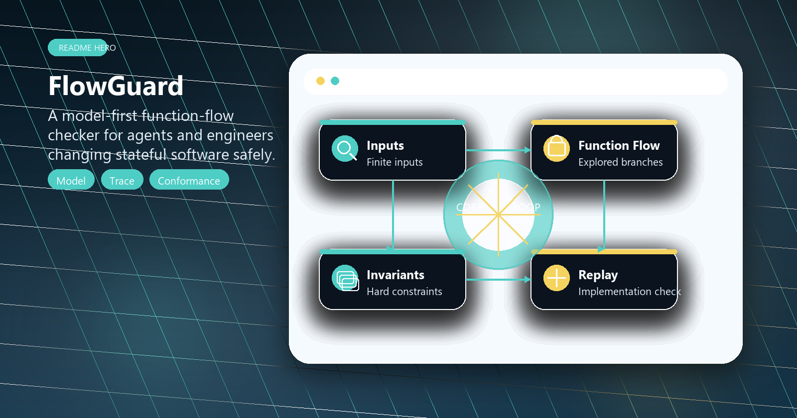
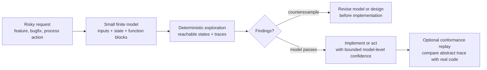
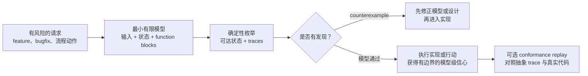

# FlowGuard

<!-- README HERO START -->
<p align="center">
  
</p>

<p align="center">
  <strong>A lightweight finite-state workflow simulator for checking risky AI-agent workflow changes before action.</strong>
</p>
<!-- README HERO END -->

| Public release | Schema | Runtime | License |
| --- | --- | --- | --- |
| `v0.3.1` | `1.0` | Python standard library only | MIT |

English lead content comes first; a full Chinese mirror follows below.

In one sentence: FlowGuard is a lightweight architecture and process-flow
simulator for AI agents. It helps agents turn the risky part of a planned
software workflow or high-impact process into a small finite-state, executable
model before action, then reports reachable paths and counterexample traces.

FlowGuard is not an LLM wrapper, does not call model APIs, does not estimate
probabilities, and does not run Monte Carlo. It performs finite, deterministic,
reviewable workflow simulation.

## English

### What FlowGuard Is

FlowGuard is an architecture simulator and workflow simulator used before code
is written or before a high-impact process is executed. It does not make an AI
agent write more code directly. It gives the agent an environment for simulating
the workflow path it is about to create, change, or act on.

When an agent is about to build a workflow, refactor module boundaries, or
change retry, cache, deduplication, or idempotency behavior, FlowGuard does not
ask it to formalize the whole architecture upfront. It asks the agent to
compress the risky boundary in front of it into a finite, executable,
enumerable model. FlowGuard then runs that model, keeps every trace, and checks
invariants, scenario expectations, loop/progress behavior, contracts, and
implementation conformance. The useful part is that workflow defects can appear
before the real code exists.

The same model-first idea also applies outside code when a process has
meaningful state, ordering constraints, external dependencies, irreversible or
costly actions, privacy/reputation risk, payment or reservation side effects,
publication side effects, or rollback concerns. In that mode FlowGuard is a
process blindspot preflight: it can expose risky paths before the action is
taken, but it does not prove that live real-world prices, availability, policies,
or vendor behavior are safe.

### Task Modes

FlowGuard is not only a checker for finished code. The same finite model can
support several agent tasks:

- **Workflow designer:** turn a proposed process into finite inputs, abstract
  state, named function blocks, possible outputs, and hard invariants before
  production code exists.
- **Pre-change experimenter:** compare candidate designs against repeated
  inputs, ordering changes, retries, cache/source-of-truth choices, and side
  effect rules before choosing an implementation.
- **Workflow bug checker:** surface counterexamples for duplicate side effects,
  stale caches, contradictory decisions, stuck loops, missing progress, or wrong
  state ownership.
- **Implementation guardrail:** replay or compare representative model traces
  against real code when production code exists, and treat skipped checks as
  confidence boundaries rather than hidden passes.
- **Adoption reviewer:** keep lightweight evidence about why FlowGuard was
  used, which checks ran, what was skipped, and what changed after inspecting
  the model.

### Why It Is Interesting

- It turns architecture reasoning into a runnable simulation instead of a prose
  discussion.
- It keeps the math lightweight: model the current risky boundary first, not
  the entire system.
- It can compound over time: repeated use leaves behind an inspectable library
  of project-specific workflow models.
- It turns "remember dedup / retry / cache / idempotency" into executable
  invariants instead of reminders for the agent.
- It checks the state transitions of the modeled workflow, not only whether one
  local function runs.
- It enumerates repeated inputs, branches, dead paths, loops, and state drift,
  then reports a reproducible counterexample trace.
- It fits naturally into Codex or another AI agent workflow: simulate first,
  then write code, revise the process, or take the high-impact action.

### Mathematical Simulation: A Finite-State Automaton

FlowGuard's core method is close to an engineering-oriented finite-state
automaton / finite-state transition system. You define four things:

- External inputs: events, objects, retry requests, queued tasks, or user
  actions entering the workflow.
- Abstract state: the finite state needed to expose risk, such as records,
  cache entries, attempts, side effects, decisions, and owners.
- State transitions: how each function block turns the current input and state
  into output and new state.
- Check rules: invariants, scenario oracles, loop/progress rules, contracts,
  and conformance adapters.

Mathematically, each function block is modeled as:

```text
F: Input x State -> Set(Output x State)
```

This means a block receives an input and the current state, then returns every
possible `(output, new_state)` pair. One result is a deterministic transition.
Multiple results are explicit branching. Zero results mean a dead path that
should be reported. FlowGuard does not sample and does not assign probability.
It enumerates the outcomes you modeled.

Function blocks compose into workflows:

```text
Workflow = F_C o F_B o F_A
```

Because every block may branch, a workflow becomes an execution tree or
reachable state graph:

```text
(input sequence, initial state)
  -> reachable states
  -> traces
  -> invariant / scenario / loop / contract findings
  -> counterexample trace
```

That is the "architecture simulation" in FlowGuard: within finite bounds, it
enumerates the state machine paths and checks whether any path violates
invariants, scenario expectations, state ownership, idempotency, termination, or
real-code conformance.

### Lightweight, Incremental Modeling

FlowGuard's advantage is not a new branch of mathematics. It applies classic
finite-state modeling, invariant checking, and counterexample traces at the
scale where an AI coding agent can actually use them during everyday work.

Instead of requiring a complete formal model of the whole product, FlowGuard
lets the agent model one behavior boundary at a time:

- local: one function flow, retry path, cache refresh, or side-effect write;
- mid-level: several modules passing state, ownership, or idempotency rules
  across a boundary;
- higher-level: a release flow, maintenance flow, process preflight, or
  multi-agent coordination loop.

This makes the method progressive. A project can start with the smallest model
that can expose the current risk, inspect the counterexamples, revise the
design, and only grow or connect models when the workflow boundary grows.
FlowGuard therefore gives bounded evidence for the modeled slice; it does not
claim one command can prove an entire production system correct.

When FlowGuard grows with a project, the small models do not have to stay
isolated. Feature-level models, module-boundary models, Skill-triggered models,
release/process models, and conformance adapters can accumulate into a
project-specific model library. Over time, that library can become an
inspectable simulation network: local models explain individual changes,
mid-level models explain cross-module state movement, and higher-level models
explain process or agent coordination behavior.

That long-term model library is still bounded and explicit. It is powerful
because each piece remains small enough to review, rerun, revise, and connect
when the project evolves.

### Why It Exists

AI coding agents often fix a local bug while damaging the global workflow. For
example, an agent may accidentally:

- score the same object twice;
- append duplicate records for the same item;
- forget deduplication;
- retry a side effect twice;
- let cache drift from the source of truth;
- let the wrong module mutate state it does not own;
- produce an output the downstream block cannot consume;
- create a record without a final decision;
- assign both apply and ignore to the same object;
- create a workflow that has an exit but no progress guarantee;
- write production code that runs but no longer matches the abstract design.

FlowGuard is not a replacement for unit tests. It is a pre-production modeling
layer for exposing workflow-level and side-effect-level defects before the code
change lands.

### With FlowGuard vs Without It

| Without FlowGuard | With FlowGuard |
| --- | --- |
| The agent usually moves from a natural-language request directly into code edits. | The agent first models the risky part of the architecture change as a small finite function flow. |
| Risks often appear only after code is written, tests fail, or review catches the issue. | Repeated inputs, branches, state transitions, and side effects are enumerated and checked in the model first. |
| "Remember dedup / retry / cache" is only a reminder the agent may miss. | Deduplication, idempotency, state ownership, loops, and contracts become executable invariants or scenarios. |
| Architecture quality depends mostly on intuition and after-the-fact debugging. | Failed paths appear as counterexample traces, so the agent can revise the local or mid-level workflow design before implementation. |

The practical benefit is not that FlowGuard writes the production code for you.
It gives the agent a design-time simulation layer, so architectural defects and
workflow risks can be found before the implementation becomes harder to change.

### How FlowGuard Differs From Spec-Driven / Plan-Driven Methods

FlowGuard focuses on a different problem from spec-driven or plan-driven AI
coding methods.

Many existing methods help AI coding agents turn natural-language requests into
clearer specifications, acceptance criteria, technical plans, task lists, or
implementation workflows. Their main value is to make intent, planning, and task
structure more explicit before the agent edits code.

FlowGuard follows a different validation path. It does not primarily check
whether the requirement text is complete, and it does not primarily manage
project plans or task lists. Instead, it turns a stateful workflow into a finite
executable function-flow model and checks the behavior of that model directly.

This difference makes the methods suitable for cross-validation.

Spec-driven or plan-driven methods usually ask:

```text
Are the requirements clear?
Is the plan complete?
Do the tasks cover the requirements?
Is the implementation workflow organized?
```

FlowGuard asks:

```text
If the same input is processed twice, can it create duplicate side effects?
If a retry happens after a partial failure, can it corrupt state?
If cache and source of truth both exist, can they drift apart?
If the workflow contains a loop, can it get stuck?
If multiple modules write the same state, does that violate ownership boundaries?
```

This is not a replacement claim. It is a methodological difference. Text-level
and planning-level checks can reveal issues in requirements, tasks, and workflow
organization. FlowGuard's executable model can reveal behavioral issues related
to state transitions, repeated inputs, idempotency, side effects, cache
consistency, loops, and ownership boundaries.

FlowGuard can therefore be used as an independent cross-checking method: after a
design has been structured at the specification or planning level, FlowGuard can
further test whether the proposed workflow is safe within a finite abstract
behavior space.

### What It Checks Today

| Capability | What FlowGuard does |
| --- | --- |
| Finite-state simulation | Expands input sequences, abstract state, and transitions into reachable state graphs and traces |
| Function-flow model | Represents blocks as `Input x State -> Set(Output x State)` |
| Workflow exploration | Expands branching workflows and keeps every trace |
| Invariant checking | Detects duplicate records, repeated processing, contradictions, cache mismatch |
| Repeated input | Explores sequences such as `[A]`, `[A, A]`, and `[A, B, A]` |
| Scenario sandbox | Compares human oracle expectations with observed results |
| Counterexample trace | Emits a readable path explaining a failure |
| Trace export | Exports traces and reports as JSON-compatible structures |
| Mermaid diagram export | Exports copyable Mermaid source for traces and reachable state graphs when a diagram helps explain the model |
| Conformance replay | Replays abstract traces against real code through an adapter |
| Loop / stuck review | Finds stuck states, bottom SCCs, and unreachable success |
| Progress checks | Flags cycles with escape edges but no progress guarantee |
| Contract checks | Checks preconditions, postconditions, read/write ownership, forbidden writes, traceability |
| Agent helper layer | Provides property factories, RiskProfile, check plans, summary reports, and domain packs |
| Codex Skill | Provides a `model-first-function-flow` Skill for model-first coding and process-preflight work |

### Mermaid Diagram Export In v0.3.1

`v0.3.1` adds opt-in Mermaid source export. FlowGuard can now generate
copyable diagram text for representative traces, generic state graphs, and loop
review graphs through `trace_to_mermaid_text(...)`,
`graph_to_mermaid_text(...)`, and `loop_report_to_mermaid_text(...)`.

This is intentionally not part of the default report. Use it when a user asks
for a diagram, when a counterexample needs a visual explanation, or when a
reachable state graph makes the architecture easier to discuss. The output is
text source that can be pasted into GitHub Markdown, docs tools, Mermaid
renderers, or other software without OCR.



Minimal use:

```python
from flowguard import check_loops, loop_report_to_mermaid_text

report = check_loops(config)
mermaid_source = loop_report_to_mermaid_text(report)
```

Runnable example:

```powershell
python examples/mermaid_export_example.py
```

### Lightweight Helpers In v0.2.0

`v0.2.0` does not change the core mathematical model. The minimum useful path
is still:

```text
State + FunctionBlock + Invariant + Explorer
```

The new surface is a helper layer for AI coding agents:

- standard invariant factories for duplicate records, source traceability,
  cache/source consistency, state ownership, and label ordering;
- `RiskProfile`, `FlowGuardCheckPlan`, and `run_model_first_checks()` for a
  low-friction path through audit, exploration, scenario review, minimized
  counterexamples, and summary reporting;
- `ScenarioMatrixBuilder` and optional domain packs for repeated input, retry,
  deduplication, cache, and side-effect risks;
- `ModelQualityAudit` and `FlowGuardSummaryReport` so skipped checks, warnings,
  and `pass_with_gaps` stay visible;
- optional adoption evidence review, state write inventory guidance, and a
  maintenance workflow scaffold.

These helpers are not mandatory gates. `pass_with_gaps` means the model result
is useful but bounded. Without conformance replay or equivalent real-code
evidence, do not report model-level confidence as production confidence.

### Process Preflights In v0.3.0

`v0.3.0` expands the Codex Skill trigger from coding/repository work to
process-design work. Use `process_preflight` when a non-code or mixed workflow
needs validation, adjustment, observation, or loss-prevention review before
action.

Good process-preflight candidates have meaningful state or side effects:
approvals, confirmations, reservations, payments, published artifacts, user
commitments, vendor dependencies, deadlines, cancellation windows, or rollback
options. Trivial reversible tasks should still skip FlowGuard with a short
reason.

### Typical Workflow

```text
feature, bugfix, or process-preflight request
  -> choose the smallest risky boundary worth modeling
  -> define external inputs
  -> define finite abstract state
  -> define function blocks
  -> define state transitions
  -> define possible outputs
  -> define invariants
  -> run workflow exploration
  -> inspect reachable state graph
  -> run scenario review
  -> inspect counterexample traces
  -> implement or modify production code, or perform the modeled process action
  -> replay representative traces against real code or compare against observed process evidence
  -> grow or connect the model when the workflow boundary grows
```

FlowGuard is especially useful for:

- stateful workflows;
- deduplication;
- idempotency;
- retry;
- cache;
- queue;
- human review loops;
- abstract modeling of AI/LLM decision outputs;
- module boundaries and state ownership;
- checking whether real code still conforms to an abstract model;
- high-impact process preflights such as booking, purchase, publication
  handoff, operational runbook, data migration, support escalation, and
  multi-agent coordination flows.

### Quick Start

FlowGuard is currently source-install only. It is not published on PyPI yet.

#### Easiest Path For Regular Users: Let An AI Agent Install It

If you use Codex, or another AI coding agent that can read GitHub repositories,
work with local files, and run commands, the easiest path is to give the
repository URL or a repository checkout to the agent:

```text
https://github.com/liuyingxuvka/FlowGuard
```

Then tell the agent:

```text
Install this GitHub repository as the FlowGuard tool source and use the
model-first-function-flow skill. Before changing stateful workflow, retry,
cache, deduplication, idempotency, or module-boundary code, or before executing
a high-impact process with state and side effects, use it to simulate the
architecture or process and check the flow.
```

A capable AI coding agent can usually read `.agents/skills/`, clone or use the
local checkout, connect the `flowguard` package, run the import/schema
preflight, then use the Skill in the target project to model, check
counterexamples, and only then edit real code or perform the high-impact
process action.

#### Manual Developer Install

```powershell
git clone https://github.com/liuyingxuvka/FlowGuard.git
cd FlowGuard
python -m pip install -e .
python -m flowguard schema-version
```

Run tests:

```powershell
python -m unittest discover -s tests
```

If `flowguard.exe` is not on `PATH`, prefer:

```powershell
python -m flowguard schema-version
```

### Run Examples

The looping workflow example shows stuck states, bottom SCCs, unreachable
success, and progress issues:

```powershell
python examples/looping_workflow/run_loop_review.py
```

For more runnable examples, see [examples/](examples/).

### Minimal Python Sketch

```python
from dataclasses import dataclass

from flowguard import FunctionResult, Invariant, InvariantResult, Workflow, Explorer


@dataclass(frozen=True)
class State:
    records: tuple[str, ...] = ()


class RecordItem:
    name = "RecordItem"
    accepted_input_type = str
    reads = ("records",)
    writes = ("records",)
    input_description = "item id"
    output_description = "record status"
    idempotency = "same item is recorded once"

    def apply(self, input_obj, state):
        if input_obj in state.records:
            yield FunctionResult("already_exists", state, "record_already_exists")
            return
        yield FunctionResult(
            "added",
            State(records=state.records + (input_obj,)),
            "record_added",
        )


def no_duplicate_records():
    def check(state, trace):
        if len(state.records) != len(set(state.records)):
            return InvariantResult.fail("duplicate records")
        return InvariantResult.ok()

    return Invariant("no_duplicate_records", "records are unique", check)


workflow = Workflow((RecordItem(),))
report = Explorer(
    initial_states=(State(),),
    external_inputs=("item-1",),
    workflow=workflow,
    invariants=(no_duplicate_records(),),
    max_sequence_length=2,
).run()

print(report.format_text())
```

### Use With Codex Or Another AI Agent

This repository includes the `model-first-function-flow` Skill. Codex is the
most direct current host; other AI agents can use the same workflow if they can
read repository files, run local commands, and follow Skill/AGENTS.md
instructions.

```text
.agents/skills/model-first-function-flow/
```

In another project, ask Codex or another AI coding agent:

```text
Use the model-first-function-flow skill before changing this workflow or
preflighting this high-impact process.
```

You can also copy this rule into the target project's `AGENTS.md`:

```text
For non-trivial tasks involving behavior, workflows, state, module boundaries,
retries, deduplication, idempotency, caching, repeated inputs, repeated bugs, or
meaningful process validation/adjustment/observation with side effects, use the
model-first-function-flow skill before editing production code or performing the
high-impact action.
```

See the full rule in [docs/agents_snippet.md](docs/agents_snippet.md).

The Skill includes:

- modeling protocol;
- invariant examples;
- minimal model template;
- run checks template;
- toolchain preflight helper;
- lightweight run log template.

### Who It Is For

FlowGuard is for:

- people who want AI coding agents to model behavior before editing code;
- people who want AI agents to preflight high-impact process flows before
  costly or irreversible action;
- teams that often deal with duplicate side effects, retry, cache, dedup, or state ownership;
- engineers who want executable architecture checks instead of prose-only reminders;
- projects that need workflow review before implementation.

FlowGuard is not for:

- prompt tools that directly call LLM APIs;
- random property-based testing;
- replacing all unit tests, integration tests, or formal verification;
- proving an entire production system correct with one command;
- projects that are unwilling to write abstract state, function blocks, and invariants.

### What The Public Repository Includes

| Path | Content |
| --- | --- |
| [flowguard/](flowguard/) | Core Python package |
| [.agents/skills/model-first-function-flow/](.agents/skills/model-first-function-flow/) | Codex Skill |
| [docs/](docs/) | Concept, modeling, conformance, scenario, loop, progress, and contract docs |
| [examples/](examples/) | Runnable public examples |
| [tests/](tests/) | Public test suite |
| [ROADMAP.md](ROADMAP.md) | Roadmap |

### What The Public Repository Does Not Include

This public repository intentionally excludes the local maintenance system:

- local maintenance records;
- experiment process notes;
- machine-specific paths or configuration;
- authentication material, access tokens, or other sensitive configuration;
- large internal experiment outputs.

The public surface is the minimal usable product: core library, docs, Skill,
examples, and tests.

### Documentation Map

- [docs/concept.md](docs/concept.md): worldview and mathematical model.
- [docs/modeling_protocol.md](docs/modeling_protocol.md): modeling process.
- [docs/productized_helpers.md](docs/productized_helpers.md): lightweight helpers, audit, and summary reporting.
- [docs/check_plan.md](docs/check_plan.md): `RiskProfile`, `FlowGuardCheckPlan`, runner, and packs.
- [docs/api_surface.md](docs/api_surface.md): core, helper, reporting, and evidence API layers.
- [docs/state_write_inventory.md](docs/state_write_inventory.md): state writer checklist for invariant fields.
- [docs/invariant_examples.md](docs/invariant_examples.md): invariant patterns.
- [docs/scenario_sandbox.md](docs/scenario_sandbox.md): expected-vs-observed scenario review.
- [docs/conformance_testing.md](docs/conformance_testing.md): replay abstract traces against real code.
- [docs/loop_detection.md](docs/loop_detection.md): stuck states and bottom SCCs.
- [docs/progress_properties.md](docs/progress_properties.md): progress and escape-edge cycles.
- [docs/contract_composition.md](docs/contract_composition.md): function contracts and ownership.
- [docs/refinement.md](docs/refinement.md): projection from real state to abstract state.
- [docs/project_integration.md](docs/project_integration.md): connect FlowGuard to another repository.
- [docs/framework_upgrade_checks.md](docs/framework_upgrade_checks.md): FlowGuard framework upgrade and benchmark checks.

### Current Limits

- Deterministic finite exploration only.
- No random testing.
- No Hypothesis dependency.
- No probability model.
- No Monte Carlo.
- No complete formal proof claim.
- Not a replacement for unit tests.
- Conformance replay requires a user-written adapter.
- No PyPI release yet.
- No full stable CLI yet, only a lightweight `python -m flowguard` entry.

### License

MIT. See [LICENSE](LICENSE).

## 中文说明

### FlowGuard 是什么

FlowGuard 是一个在写代码前，或在执行高影响流程前使用的轻量架构模拟器 /
工作流模拟器。它不是让 AI 直接多写一点代码，而是给 AI agent 一个先模拟流程路径的
环境。

当 agent 要新建 workflow、重构模块边界，或者修改 retry、cache、
deduplication、idempotency 这类容易出全局问题的逻辑时，FlowGuard 不要求它一次性
形式化整个架构，而是要求它先把眼前最有风险的边界压缩成一个有限、可执行、可枚举的
模型。然后 FlowGuard 会跑这个模型，保留每条 trace，检查不变量、场景预期、
loop/progress、contract 和真实实现一致性。真正有价值的地方在于：如果流程有漏洞，
反例会在代码写出来之前出现。

同样的 model-first 思路也可以用在代码以外的流程上：只要流程有明确状态、顺序约束、
外部依赖、不可逆或高成本动作、隐私/声誉风险、付款/预订/发布副作用，或者回滚问题，
就可以先把它建成有限模型做盲点检查。在这个模式下，FlowGuard 是流程风险预演工具；
它能暴露危险路径，但不能证明现实世界价格、库存、政策或供应商行为一定安全。

### 任务模式

FlowGuard 不只是用来检查已经写完的代码。同一个有限模型可以支持几类 agent 任务：

- **流程设计者：** 在生产代码出现之前，把一个拟议流程整理成有限输入、抽象状态、
  命名 function blocks、可能输出和硬性不变量。
- **改动前实验者：** 在选择实现方案之前，用重复输入、顺序变化、retry 路径、
  cache/source-of-truth 选择和副作用规则去比较候选设计。
- **流程错误检查者：** 找出重复副作用、陈旧缓存、矛盾决策、卡住的循环、缺失进展、
  错误状态所有权等问题的 counterexample。
- **实现护栏：** 当生产代码已经存在时，把代表性模型 trace replay 到真实代码，
  或与真实行为对照；没有运行的检查要报告成可信边界，而不是偷偷当成通过。
- **采用审阅者：** 保留轻量证据，说明为什么使用 FlowGuard、跑了哪些检查、跳过了
  什么，以及看完模型后改了什么。

### 核心吸引点

- 它把“先想清楚架构”变成可以运行的模拟，而不是停留在自然语言讨论。
- 它保持数学方法轻量：先建模当前有风险的边界，而不是一上来证明整个系统。
- 它有长期复利：反复使用后，会留下一个可检查的项目专属 workflow model library。
- 它把“注意 dedup / retry / cache / 幂等性”变成可执行 invariant，而不是给
  agent 的一句提醒。
- 它看的是已建模 workflow 的状态转移，不只是某个函数局部能不能跑。
- 它会枚举重复输入、分支、死路、循环和状态漂移，输出能复现问题的
  counterexample trace。
- 它适合放进 Codex 或其他 AI agent 的工作流里，让 agent 先模拟，再写码、调整流程
  或执行高影响动作。

### 数学模拟方法：有限状态自动机

FlowGuard 的核心方法接近一个工程化的有限状态自动机 / 有限状态转移系统。你先
定义四类东西：

- 外部输入：进入 workflow 的事件、对象、重试请求、队列任务或用户动作。
- 抽象状态：只保留能暴露风险的有限状态，例如记录、缓存、attempt、side effect、
  decision、owner。
- 状态转移：每个 function block 如何从当前输入和当前状态，产生输出和新状态。
- 检查规则：invariant、scenario oracle、loop/progress 规则、contract 和
  conformance adapter。

在数学上，每个 function block 都表达成：

```text
F: Input x State -> Set(Output x State)
```

意思是：一个功能块接收输入和当前状态，返回所有可能的 `(输出, 新状态)`。如果
只有一个结果，它就是确定性转移；如果有多个结果，它就是显式分支；如果没有结果，
它就是一条需要报告的死路。FlowGuard 不会抽样，也不会算概率，而是把你建模出来
的可能结果全部列出来。

多个 function blocks 可以组合成 workflow：

```text
Workflow = F_C o F_B o F_A
```

因为每个功能块都可能分支，workflow 会形成一棵执行树或一个可达状态图：

```text
(input sequence, initial state)
  -> reachable states
  -> traces
  -> invariant / scenario / loop / contract findings
  -> counterexample trace
```

这就是 README 里说的“架构模拟”：FlowGuard 在有限边界内穷举这个状态机的路径，
看每条路径是否违反不变量、场景预期、状态所有权、幂等性、终止性或真实代码一致性。

### 轻量、渐进的建模方式

FlowGuard 的优势不是发明了一套全新的数学。它把经典的有限状态建模、不变量检查和
counterexample trace 放到 AI coding agent 在日常工作中真的能用起来的尺度上。

它不要求项目先建立完整系统的形式化模型，而是让 agent 一次只建模一个行为边界：

- 局部：一个 function flow、retry 路径、cache refresh 或 side-effect write；
- 中层：几个模块之间的状态传递、ownership、idempotency 规则；
- 更高层：release flow、maintenance flow、流程预演或多 agent 协作循环。

这种方式是渐进的。项目可以从“能暴露当前风险的最小模型”开始，先看反例、修设计，
然后只在 workflow 边界变大时再扩展或连接模型。因此 FlowGuard 给出的是对已建模
切片的有限证据；它不声称一个命令就能证明整个生产系统正确。

当 FlowGuard 跟着一个项目长期使用时，这些小模型不必彼此孤立。feature-level
model、module-boundary model、Skill 触发产生的 model、release/process model 和
conformance adapter 可以逐渐积累成一个项目专属的模型库。时间久了，这个模型库会
变成一个可检查的模拟网络：局部模型解释单个改动，中层模型解释跨模块状态流动，更高
层模型解释流程或 agent 协作行为。

这个长期模型库仍然是有限、显式、有边界的。它强在每一块都足够小，可以被 review、
rerun、revision，并在项目演进时继续连接起来。

### 为什么需要它

AI coding agent 很容易在局部修 bug 时破坏全局流程，例如：

- 给同一个对象重复打分；
- 给同一个 item 追加两条记录；
- 忘记 deduplication；
- retry 时重复发送副作用；
- cache 和 source of truth 不一致；
- 一个模块修改了另一个模块拥有的状态；
- 下游函数无法消费上游输出；
- 记录已经产生，但决策没有产生；
- 同一个对象同时出现 apply 和 ignore；
- workflow 有出口，但没有进展保证；
- 真实代码看起来能跑，但偏离了抽象设计。

FlowGuard 的目标不是替代单元测试，而是在写生产代码前，把这些 workflow-level
和 side-effect-level 问题先暴露出来。

### 用了它和不用它的区别

| 不用 FlowGuard | 用 FlowGuard |
| --- | --- |
| Agent 通常从自然语言需求直接进入代码修改。 | Agent 先把架构改动中最有风险的部分写成一个小的有限 function-flow 模型。 |
| 风险往往要到代码写完、测试失败或人工 review 时才暴露。 | 重复输入、分支、状态变化和副作用会先在模型里被枚举和检查。 |
| “注意 dedup / retry / cache” 只是提示，agent 可能会忘。 | dedup、幂等性、状态所有权、loop、contract 等规则变成可执行 invariant 或 scenario。 |
| 架构方案是否安全，主要靠直觉和事后调试。 | 失败路径会以 counterexample trace 的形式出现，agent 可以先修正局部或中层流程设计再写代码。 |

所以 FlowGuard 的实际收益不是“替 AI 写代码”，而是让 AI 在设计阶段就能模拟
一个流程方案，提前看到架构漏洞和潜在风险，并把更稳的流程带入实现阶段。

### 与现有 spec-driven / plan-driven 方法的区别

FlowGuard 和现有的 spec-driven / plan-driven AI 编程方法关注的问题不同。

许多现有方法主要帮助 AI coding agent 把自然语言需求整理成更清晰的
specification、acceptance criteria、technical plan、task list 或 implementation
workflow。它们的主要作用是让需求、计划和任务更加明确，减少 agent 直接从模糊
描述跳到代码修改的风险。

FlowGuard 走的是另一条验证路径。它不主要检查需求文字是否完整，也不主要管理项目
计划或任务列表。它把一个有状态 workflow 抽象成有限的 function-flow model，并
通过可执行模拟来检查行为本身。

因此，两类方法可以形成交叉验证。

spec-driven / plan-driven 方法通常检查：

```text
需求是否清楚？
计划是否完整？
任务是否覆盖需求？
实现步骤是否有序？
```

FlowGuard 检查的是：

```text
如果同一个输入被处理两次，会不会产生重复副作用？
如果 retry 发生在部分失败之后，状态会不会被破坏？
如果 cache 和 source of truth 同时存在，会不会发生 drift？
如果 workflow 有循环，它会不会卡在 stuck state？
如果多个模块写同一个状态，是否违反 ownership boundary？
```

这种差异不是替代关系，而是方法层面的差异。文本和计划层面的检查可以发现需求、
任务和流程组织问题；FlowGuard 的可执行模型可以发现状态转移、重复输入、幂等性、
side effect、cache consistency、loop 和 ownership 相关的行为问题。

因此，FlowGuard 可以作为一种独立的交叉验证方法：当一个方案已经通过
specification 或 planning 层面的整理后，FlowGuard 可以进一步检查这个方案在有限
抽象行为空间中是否安全。

### 它现在能检查什么

| 能力 | FlowGuard 做什么 |
| --- | --- |
| Finite-state simulation | 把输入序列、抽象状态和状态转移展开成可达状态图与 trace |
| Function-flow model | 用 `Input x State -> Set(Output x State)` 表达功能块 |
| Workflow exploration | 展开多分支 workflow，保留每条 trace |
| Invariant checking | 检查重复记录、重复处理、矛盾决策、缓存不一致等硬约束 |
| Repeated input | 明确探索 `[A]`、`[A, A]`、`[A, B, A]` 这类重复输入 |
| Scenario sandbox | 把人工预期 oracle 和实际观察结果并排比较 |
| Counterexample trace | 输出能解释问题的失败路径 |
| Trace export | 把 trace / report 导出为 JSON-compatible 结构 |
| Mermaid diagram export | 在需要解释模型时，把 trace 和可达状态图导出为可复制的 Mermaid 源码 |
| Conformance replay | 把抽象 trace replay 到真实实现，通过 adapter 比较行为 |
| Loop / stuck review | 检查 stuck state、bottom SCC、unreachable success |
| Progress checks | 检查有 escape edge 但没有进展保证的循环 |
| Contract checks | 检查前置条件、后置条件、读写边界、禁止写入和 traceability |
| Agent helper layer | 提供 property factories、RiskProfile、check plan、summary report 和 domain packs |
| Codex Skill | 提供 `model-first-function-flow` Skill，让 Codex 在改代码前或做流程预演前先建模 |

### v0.3.1 的 Mermaid 流程图导出

`v0.3.1` 新增了可选的 Mermaid 源码导出。FlowGuard 现在可以通过
`trace_to_mermaid_text(...)`、`graph_to_mermaid_text(...)` 和
`loop_report_to_mermaid_text(...)`，把代表性 trace、通用状态图和 loop review 图导出成
可复制的 Mermaid 文本。

这个功能默认不出现在普通报告里。只有当用户明确要图、反例需要可视化解释，或者可达
状态图能帮助说明架构时，才适合生成。因为输出的是文本源码，所以可以直接粘贴到
GitHub Markdown、文档工具、Mermaid renderer 或其他软件里，不需要 OCR。



最小用法：

```python
from flowguard import check_loops, loop_report_to_mermaid_text

report = check_loops(config)
mermaid_source = loop_report_to_mermaid_text(report)
```

可运行示例：

```powershell
python examples/mermaid_export_example.py
```

### v0.2.0 里的轻量 helper

`v0.2.0` 没有改变核心数学模型。最小路径仍然是：

```text
State + FunctionBlock + Invariant + Explorer
```

新增内容是给 AI coding agent 减少手写样板的辅助层：

- 常见 invariant 工厂，例如 duplicate、source trace、cache/source
  consistency、状态写入 owner 和 label 顺序检查；
- `RiskProfile`、`FlowGuardCheckPlan` 和 `run_model_first_checks()`，把
  audit、探索、场景 review、反例缩短和 summary report 组织成一个低摩擦入口；
- `ScenarioMatrixBuilder` 和四个可选 domain packs，帮助覆盖 repeated input、
  retry、deduplication、cache 和 side effect 风险；
- `ModelQualityAudit` 和 `FlowGuardSummaryReport`，把 skipped/not_run/warning
  显示为可信边界，而不是把它们当作通过；
- 可选的 adoption evidence review、状态写入点清单和 maintenance workflow
  scaffold。

这些 helper 都不是强制门槛。`pass_with_gaps` 表示模型检查有用但覆盖有限；没有
conformance replay 时，不能把模型级信心说成生产级信心。

### v0.3.0 的流程预演范围

`v0.3.0` 把 Codex Skill 的触发范围从 coding/repository work 扩展到
process-design work。当非代码或混合 workflow 需要在行动前做验证、调整、观察或
防损检查时，使用 `process_preflight`。

适合做流程预演的任务通常有明确状态或副作用：审批、确认、预订、付款、已发布内容、
用户承诺、供应商依赖、截止时间、取消窗口或回滚选项。完全可逆、没有明显状态和副作用
的小事仍然应该用一句理由跳过 FlowGuard。

### 典型工作流

```text
feature, bugfix, or process-preflight request
  -> choose the smallest risky boundary worth modeling
  -> define external inputs
  -> define finite abstract state
  -> define function blocks
  -> define state transitions
  -> define possible outputs
  -> define invariants
  -> run workflow exploration
  -> inspect reachable state graph
  -> run scenario review
  -> inspect counterexample traces
  -> implement or modify production code, or perform the modeled process action
  -> replay representative traces against real code or compare against observed process evidence
  -> grow or connect the model when the workflow boundary grows
```

这套流程特别适合：

- 有状态 workflow；
- deduplication；
- idempotency；
- retry；
- cache；
- queue；
- human review loop；
- AI/LLM decision pipeline 的抽象输出建模；
- 模块边界和状态所有权；
- 真实代码和抽象模型之间的一致性检查；
- 订酒店、购买、发布交接、运营 runbook、数据迁移、支持升级、多 agent 协作等高影响
  流程预演。

### 快速开始

FlowGuard 当前发布的是源码安装版本，还没有 PyPI 包。

#### 普通用户最简单的方式：让 AI Agent 安装

如果你使用的是 Codex，或者其他能够读取 GitHub 仓库、操作本地文件并运行命令的
AI coding agent，最简单的方式不是手动拷贝文件，而是把仓库 URL 或仓库副本交给
agent：

```text
https://github.com/liuyingxuvka/FlowGuard
```

然后对 agent 说：

```text
请把这个 GitHub 仓库作为 FlowGuard 工具源安装，并使用
model-first-function-flow skill。在修改有状态 workflow、retry、cache、
deduplication、idempotency 或模块边界代码之前，或者执行有状态和副作用的高影响流程
之前，先用它做架构模拟或流程预演。
```

支持这类能力的 AI coding agent 通常会自动读取仓库里的 `.agents/skills/`、
克隆或使用本地仓库副本、连接 `flowguard` 包、运行 import/schema 预检，然后在
目标项目里按 Skill 先建模、检查反例，再改真实代码。
如果任务是非代码流程，它也可以先建模、检查反例，再执行高影响动作。

#### 开发者手动安装

```powershell
git clone https://github.com/liuyingxuvka/FlowGuard.git
cd FlowGuard
python -m pip install -e .
python -m flowguard schema-version
```

运行测试：

```powershell
python -m unittest discover -s tests
```

如果 `flowguard.exe` 不在 `PATH` 中，优先使用：

```powershell
python -m flowguard schema-version
```

### 运行示例

Looping workflow 示例展示 stuck state、bottom SCC、unreachable success 和
progress 问题：

```powershell
python examples/looping_workflow/run_loop_review.py
```

更多可运行示例见 [examples/](examples/)。

### 最小代码示例

```python
from dataclasses import dataclass

from flowguard import FunctionResult, Invariant, InvariantResult, Workflow, Explorer


@dataclass(frozen=True)
class State:
    records: tuple[str, ...] = ()


class RecordItem:
    name = "RecordItem"
    accepted_input_type = str
    reads = ("records",)
    writes = ("records",)
    input_description = "item id"
    output_description = "record status"
    idempotency = "same item is recorded once"

    def apply(self, input_obj, state):
        if input_obj in state.records:
            yield FunctionResult("already_exists", state, "record_already_exists")
            return
        yield FunctionResult(
            "added",
            State(records=state.records + (input_obj,)),
            "record_added",
        )


def no_duplicate_records():
    def check(state, trace):
        if len(state.records) != len(set(state.records)):
            return InvariantResult.fail("duplicate records")
        return InvariantResult.ok()

    return Invariant("no_duplicate_records", "records are unique", check)


workflow = Workflow((RecordItem(),))
report = Explorer(
    initial_states=(State(),),
    external_inputs=("item-1",),
    workflow=workflow,
    invariants=(no_duplicate_records(),),
    max_sequence_length=2,
).run()

print(report.format_text())
```

### 和 Codex 或其他 AI Agent 一起使用

仓库内置 `model-first-function-flow` Skill。Codex 是当前最直接的使用路径；其他
AI Agent 只要能读取仓库文件、运行本地命令，并遵守 Skill/AGENTS.md 指令，也可以
使用同一套流程。

```text
.agents/skills/model-first-function-flow/
```

在另一个项目中，你可以让 Codex 或其他 AI coding agent 使用这个 Skill：

```text
Use the model-first-function-flow skill before changing this workflow or
preflighting this high-impact process.
```

也可以把下面规则复制到目标项目的 `AGENTS.md`：

```text
For non-trivial tasks involving behavior, workflows, state, module boundaries,
retries, deduplication, idempotency, caching, repeated inputs, repeated bugs, or
meaningful process validation/adjustment/observation with side effects, use the
model-first-function-flow skill before editing production code or performing the
high-impact action.
```

完整规则见：[docs/agents_snippet.md](docs/agents_snippet.md)。

Skill 里包含：

- 建模协议；
- invariant 示例；
- 最小 model template；
- run checks template；
- toolchain preflight helper；
- lightweight run log template。

### 适合谁

FlowGuard 适合：

- 想让 AI coding agent 改代码前先证明功能流设计的人；
- 想让 AI agent 在高成本或不可逆流程执行前先做流程预演的人；
- 经常遇到重复 side effect、retry、cache、dedup、状态边界问题的工程团队；
- 想把架构讨论从自然语言提醒推进到可执行模型的人；
- 需要在真实实现前审查 workflow 行为的人。

FlowGuard 不适合：

- 想直接调用 LLM API 的 prompt tool；
- 想做随机 property-based testing 的工具；
- 想替代所有 unit tests、integration tests 或 formal verification；
- 想一键证明完整生产系统正确性；
- 不愿意手写抽象状态、function block 和 invariants 的项目。

### 公开仓库包含什么

| 路径 | 内容 |
| --- | --- |
| [flowguard/](flowguard/) | 核心 Python package |
| [.agents/skills/model-first-function-flow/](.agents/skills/model-first-function-flow/) | Codex Skill |
| [docs/](docs/) | 概念、建模协议、conformance、scenario、loop、progress、contract 文档 |
| [examples/](examples/) | Runnable public examples |
| [tests/](tests/) | 公开测试 |
| [ROADMAP.md](ROADMAP.md) | 后续路线图 |

### 公开仓库不包含什么

这个公开仓库刻意不包含本地维护系统：

- 本地维护记录；
- 实验过程记录；
- 机器特定路径或配置；
- 认证材料、访问令牌或其他敏感配置；
- 大型内部实验输出。

公开版保留的是最小可用产品面：核心库、文档、Skill、示例和测试。

### 文档入口

- [docs/concept.md](docs/concept.md): 世界观和数学模型。
- [docs/modeling_protocol.md](docs/modeling_protocol.md): 建模流程。
- [docs/productized_helpers.md](docs/productized_helpers.md): 轻量 helper、audit、summary report。
- [docs/check_plan.md](docs/check_plan.md): `RiskProfile`、`FlowGuardCheckPlan`、runner 和 packs。
- [docs/api_surface.md](docs/api_surface.md): 核心 API、helper API、reporting API 和 evidence API 分层。
- [docs/state_write_inventory.md](docs/state_write_inventory.md): invariant 字段的状态写入点清单。
- [docs/invariant_examples.md](docs/invariant_examples.md): invariant 模式。
- [docs/scenario_sandbox.md](docs/scenario_sandbox.md): expected vs observed 场景审查。
- [docs/conformance_testing.md](docs/conformance_testing.md): 抽象 trace replay 到真实代码。
- [docs/loop_detection.md](docs/loop_detection.md): stuck state 和 bottom SCC。
- [docs/progress_properties.md](docs/progress_properties.md): progress 和 escape-edge cycle。
- [docs/contract_composition.md](docs/contract_composition.md): function contract 和 ownership。
- [docs/refinement.md](docs/refinement.md): real state 到 abstract state 的 projection。
- [docs/project_integration.md](docs/project_integration.md): 在其他项目中接入 FlowGuard。
- [docs/framework_upgrade_checks.md](docs/framework_upgrade_checks.md): FlowGuard 自身升级和 benchmark 检查。

### 当前限制

- 只做确定性的有限枚举。
- 不做随机测试。
- 不依赖 Hypothesis。
- 不做概率模型。
- 不做 Monte Carlo。
- 不声称完整形式化证明。
- 不替代单元测试。
- conformance replay 需要用户手写 adapter。
- 当前没有 PyPI 发布。
- 当前没有稳定完整 CLI，只保留轻量 `python -m flowguard` 入口。

### License

MIT. See [LICENSE](LICENSE).
