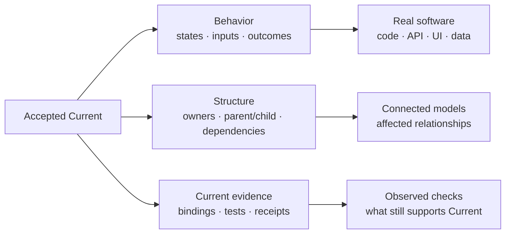
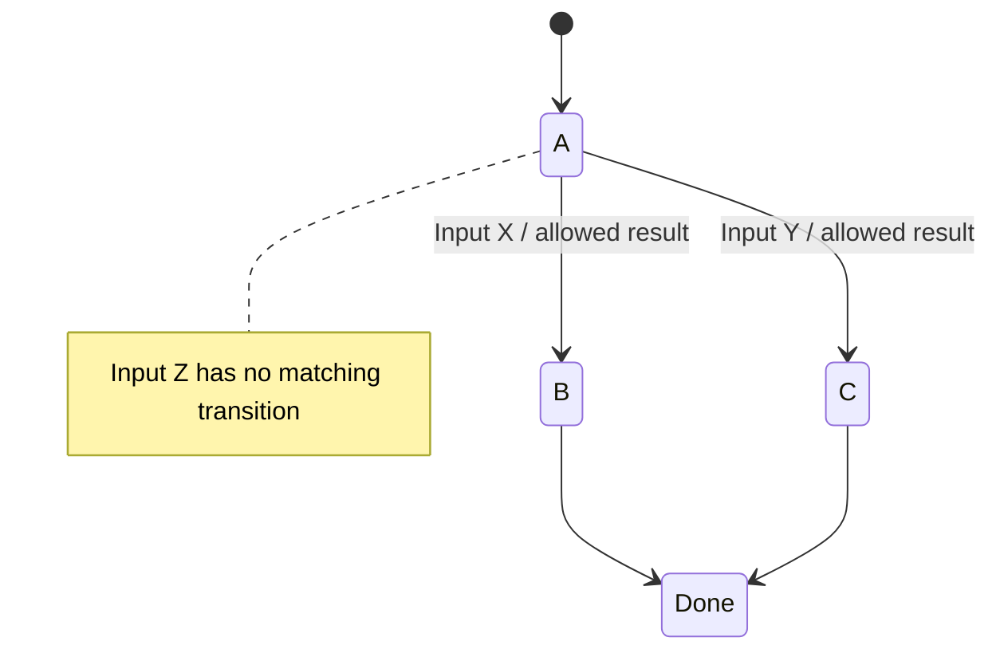
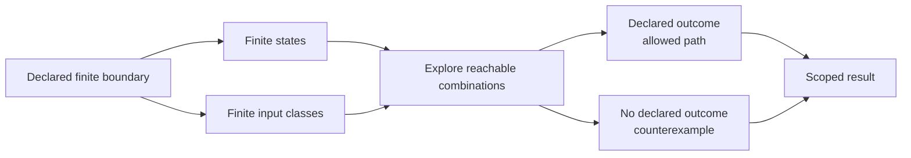
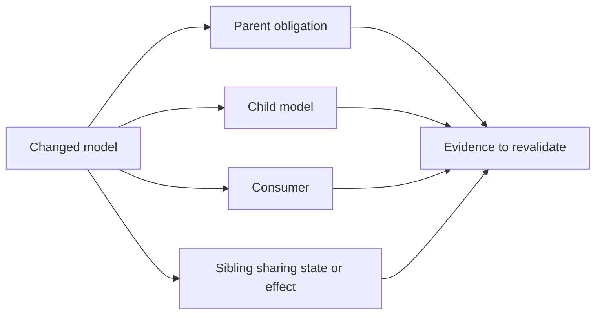
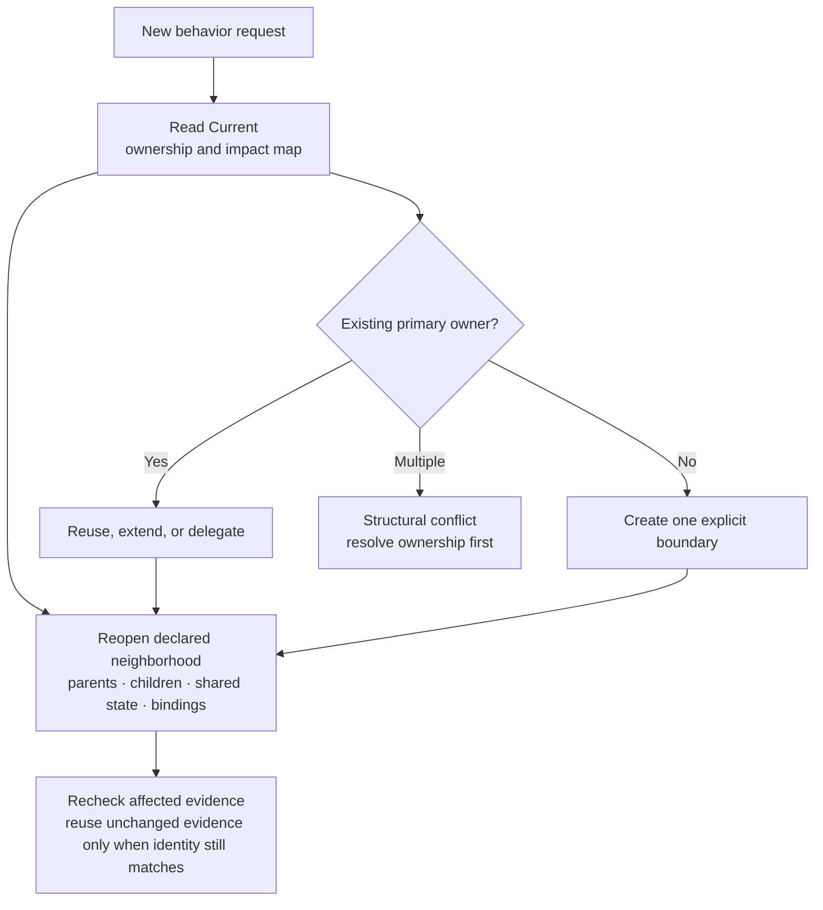
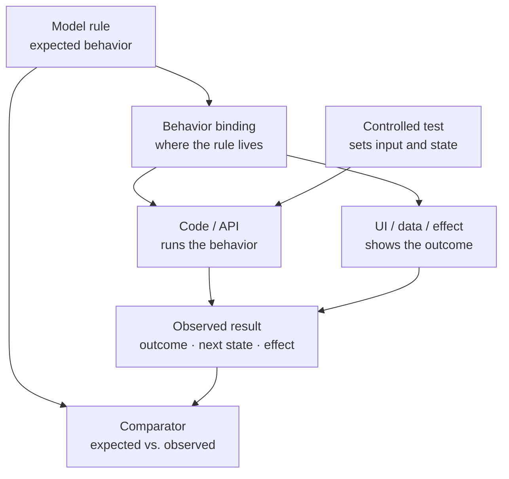
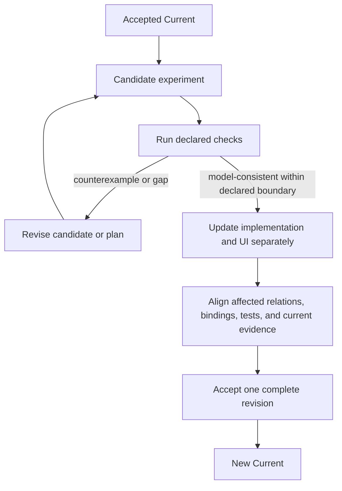

# FlowGuard

<!-- README HERO START -->
<p align="center">
  
</p>

<p align="center">
  
</p>

<p align="center">
  <strong>An AI-agent skill suite powered by an executable check engine.</strong>
</p>

<p align="center">
  FlowGuard keeps an executable model of what current evidence supports inside the declared software boundary,
  searches its declared behavior and structure, and checks a proposed change before it becomes the new Current.
</p>
<!-- README HERO END -->

| Public release | Schema | Runtime | License |
| --- | --- | --- | --- |
| `v0.68.14` | `1.0` | Python standard library only | MIT |

[中文说明](./README.zh-CN.md) · [Quick Start](#quick-start) · [Concept](./docs/concept.md) · [Documentation](#documentation-map)

## What FlowGuard Is

FlowGuard is a model-first preflight layer for AI-assisted software work.

Its primary agent surface is `.agents/skills/`: start with
`.agents/skills/flowguard/SKILL.md`, and keep the sibling FlowGuard skills
available so the kernel can select the smallest matching route.

The suite includes executable check scripts. The Python package is the check
engine used by those skills; it is not the skill installation itself.

FlowGuard does not merely save another specification file. It maintains a
current, executable map of the modeled software:

- what behaviors exist now;
- which states and transitions those behaviors allow;
- which code owns each behavior, or where ownership remains unresolved;
- which UI, API, CLI, field, resource, and side-effect boundaries realize it;
- which tests or checks currently support the model;
- how parent, child, producer, consumer, and sibling models are connected.

That map is the software's **FlowGuard DNA**.

The DNA says what the maintained model contains. **Current** says which exact
version of that DNA is accepted now.

The v0.68.14 candidate self-model contains an exact inventory of 51 current
owners. Fourteen historical, task-local, or completed construction routes were removed from current
authority after their still-useful protections were reattached: Model Angle
Deliberation, Maintenance Scan Router, standalone Model Similarity
Consolidation, Legacy Compatibility Cleanup, the dedicated Template Harvest
Closure self-model, OpenSpec Archive Cleanup, README Positioning 20260602,
Release Visibility Process, Risk Purpose Header, AI Surface Streamlining,
Reduce Architecture Surface, Simplify FlowGuard Structure, Structure Surface
Simplification, and Simplify Field Schema. Bug back-propagation now
follows one bounded chain from the exact commitment and behavior block through
canonical affected relations, finite ContractExhaustion cases,
ModelMaturation, and current model/code/test evidence. Explicit risk-template
reuse and publication remain available when requested; they are not a
universal completion gate. Old public route names are errors rather than
aliases or fallbacks.

FlowGuard then gives an AI agent three capabilities that plain repository
search does not provide by itself:

1. search the declared finite behavior space for missing or rule-violating
   paths and, when path-quality review is triggered, surface unreachable or
   duplicated structure;
2. search the affected model neighborhood to see what else a change can make
   stale or inconsistent;
3. search the current structure for an existing owner or reusable path before
   adding another handler, module, screen flow, facade, or fallback.

The native model directory is the DNA. It stays beside the software it
describes and contains the versioned models, parent/child interfaces,
code/test bindings, and their current evidence. FlowGuard audits that directory
in place and reports ownership, fingerprints, readiness, gaps, and freshness.
A model can be lightweight or deep, but it remains the same native directory
and the same source of truth. The public action surface is the current
model/check/impact/update path, with one clear route and no second DNA
authority.

## Why FlowGuard Exists

AI coding agents are good at local edits. They can find a nearby function,
change it, and make a visible test pass.

The harder problem is knowing whether that local edit still fits the whole
software system.

A repository may contain years of specifications, code, tests, changelogs, and
design discussions. That history does not automatically give an agent one
maintained answer to these questions:

- What does the software do **now**?
- Which component owns this behavior **now**?
- Which paths are legal, missing, or obsolete **now**?
- Which tests still support that answer after the last change?
- If this part changes, what other parts must be reconsidered?

Without a maintained current model, every new agent session must search and
reconstruct those answers again. The reconstruction may miss a branch, select
an outdated rule, or build a second path beside an existing one.

For example:

1. an agent is asked to fix retry handling;
2. it changes the function nearest the visible failure;
3. the visible test passes;
4. the same job is processed again later;
5. a side effect happens twice because repeated input was never modeled.

FlowGuard replaces "please be careful" with explicit questions about state,
paths, ownership, side effects, current evidence, and completion.

## What FlowGuard Builds: Current Software DNA

The native model directory is the DNA. It stays beside the software it
describes and contains the versioned models, parent/child interfaces,
code/test bindings, and their current evidence.

FlowGuard audits that directory in place. It does not create a second DNA
envelope, a copied authority directory, or an isolated reconstruction that can
silently drift from the real current model.

A useful Current model answers five connected questions.

| Question | What the DNA records |
| --- | --- |
| What behavior exists? | finite behavior blocks, inputs, states, outputs, errors, decisions, retries, timeouts, and completion |
| Who owns it? | one current model owner and the relevant code or external-system boundary |
| How is it reached? | UI, API, CLI, event, field, resource, producer-consumer, and parent-child relations |
| What proves it today? | exact tests, checkers, oracles, receipts, fingerprints, and freshness |
| What remains unknown? | omitted, stale, unresolved, blocked, or explicitly scoped gaps |


```mermaid
flowchart LR
    CURRENT["Accepted Current"] --> BEHAVIOR["Behavior<br/>states · inputs · outcomes"]
    CURRENT --> STRUCTURE["Structure<br/>owners · parent/child · dependencies"]
    CURRENT --> EVIDENCE["Current evidence<br/>bindings · tests · receipts"]
    BEHAVIOR --> SOFTWARE["Real software<br/>code · API · UI · data"]
    STRUCTURE --> NEIGHBORS["Connected models<br/>affected relationships"]
    EVIDENCE --> CHECKS["Observed checks<br/>what still supports Current"]
```

This is an information map, not merely a file index. Each relation states why
two things are connected: owns, implements, reads, writes, calls, displays,
validates, delegates, or affects. A missing or stale connection stays visible
as unknown instead of being filled in because two names look similar.

The Current model is not simply the newest file named `current`. Current
authority belongs only to the observed snapshot reached through the accepted
revision, activation receipt, and single pointer in `.flowguard/project.toml`.
Its complete current-intent view (`CurrentEffectiveIntentView`) states the
intent that remains active.

That view states the behavior that remains active after all accepted changes.
A revision delta says only what changed in one revision; history is never a
substitute for the maintained current meaning.

## The Core Model, in Plain Language

The smallest FlowGuard model has this shape:

```text
Input x State -> Set(Output x State)
```

In plain language:

- `Input` is an incoming event, such as a retry, click, payload, job, or release action.
- `State` is what the system remembers before the event.
- `Output` is what the step says happened.
- the new `State` is what the system remembers afterward.
- `Set(...)` means one input may have several legal branches; the model must say what they are.

The model is useful because it makes paths executable rather than leaving them
as prose that an agent may interpret differently each time.


```mermaid
stateDiagram-v2
    [*] --> A
    A --> B: Input X / allowed result
    A --> C: Input Y / allowed result
    B --> Done
    C --> Done
    note right of A
      Input Z has no matching transition
    end note
```

The diagram is intentionally abstract. FlowGuard does not need to invent a
business story to show the important fact: inside the declared finite boundary,
`Input Z` has no matching transition or declared outcome from state `A`.

The checker then explores the combinations that this finite boundary enables,
within the declared finite sequence bounds:


```mermaid
flowchart LR
    BOUNDARY["Declared finite boundary"] --> STATES["Finite states"]
    BOUNDARY --> INPUTS["Finite input classes"]
    STATES --> SEARCH["Explore reachable combinations"]
    INPUTS --> SEARCH
    SEARCH --> ALLOWED["Declared outcome<br/>allowed path"]
    SEARCH --> GAP["No declared outcome<br/>counterexample"]
    ALLOWED --> RESULT["Scoped result"]
    GAP --> RESULT
```

FlowGuard exhaustively explores those reachable traces only when the declared
inputs, states, and sequence bounds are finite and exploration completes. A
truncated exploration is a visible non-pass or blocked result, never a clean
pass.

This is why the model can reveal a case that neither the developer nor the AI
thought to ask about explicitly: the checker enumerates the reachable
combinations in the declared model instead of sampling only the most likely
story. It cannot reveal states, inputs, or dependencies that were never placed
inside that boundary.

The counterexample is not automatically proof of a production code bug. It is
evidence that the model, intended behavior, implementation binding, or test
coverage needs a specific review.

## Three Searches over One Current Model

FlowGuard's searches have different jobs. Keeping them separate prevents a
strong structural result from being overstated as production truth.

### 1. Behavior-path search

For a declared finite model, FlowGuard explores the stated transitions and
checks the supplied invariants, scenarios, safety rules, temporal obligations,
and known-bad cases.

It can make these structural problems visible:

- an input with no declared result;
- a branch that violates an invariant;
- an unreachable, duplicated, or non-terminal structure when the corresponding
  path-quality review is triggered;
- a retry that repeats a side effect;
- two branches that violate a declared conflict rule, invariant, oracle, or
  observable contract;
- truncated exploration, which is reported as a visible non-pass rather than a
  clean result.

The result applies only to the declared model boundary and the checks that ran.

### 2. Affected-neighborhood search

A local model can be green while a broader claim is no longer supported.

FlowGuard follows declared relations from the changed model to affected:

- ancestors and parent obligations;
- child models and their reattachment points;
- producers and consumers;
- delegated owners;
- siblings that share state, fields, resources, or side effects;
- tests and receipts whose input identity has changed.


```mermaid
flowchart LR
    Changed[Changed model] --> Parent[Parent obligation]
    Changed --> Child[Child model]
    Changed --> Consumer[Consumer]
    Changed --> Sibling[Sibling sharing state or effect]
    Parent --> Evidence[Evidence to revalidate]
    Child --> Evidence
    Consumer --> Evidence
    Sibling --> Evidence
```

Ordinary work loads the affected neighborhood, not the entire repository.
Whole-target claims require an explicit whole-target scope.

Affected-only reading avoids reconstructing the whole blueprint and can keep
the verified model/context projection proportional to the declared change.
Search still happens, and FlowGuard does not promise a fixed token saving.

### 3. Structural reuse and reduction search

Before adding a new path, FlowGuard can query Current DNA for the existing
behavior owner and related surfaces.

For a whole-target structure claim, FlowGuard also starts from an independently
discovered implementation inventory and checks both directions: every modeled
obligation should point to its implementation, and every in-scope
behavior-bearing implementation surface should lead to a model obligation, an
owner contract, or an explicit non-behavior disposition. That comparison can
expose an unbound implementation, an ownerless rule, or two structures claiming
the same responsibility. It does not infer every dependency in an unmodeled
repository.

This supports **reuse before growth**:

- reuse the existing state or side-effect owner;
- delegate a new UI, API, or CLI surface to the current behavior path;
- avoid a parallel handler that makes the same external promise;
- identify repeated validation or compatibility layers;
- propose a smaller structure when current obligations can still be preserved.


```mermaid
flowchart TB
    REQUEST["New behavior request"] --> LOOKUP["Read Current<br/>ownership and impact map"]
    LOOKUP --> OWNER{"Existing primary owner?"}
    LOOKUP --> AFFECTED["Reopen declared neighborhood<br/>parents · children · shared state · bindings"]
    OWNER -->|Yes| REUSE["Reuse, extend, or delegate"]
    OWNER -->|No| NEW["Create one explicit boundary"]
    OWNER -->|Multiple| CONFLICT["Structural conflict<br/>resolve ownership first"]
    REUSE --> AFFECTED
    NEW --> AFFECTED
    AFFECTED --> CHECK["Recheck affected evidence<br/>reuse unchanged evidence only when identity still matches"]
```

One primary owner means one authoritative implementation responsibility for a
behavior. It does **not** mean one global controller for the entire application.

FlowGuard does not remove code because it looks old, duplicated, or expensive.
A reduction must preserve the observable contract and account for callers,
consumers, owners, tests, oracles, topology, and every active responsibility.

The only safe outcomes are bounded classifications:

- `retain`;
- `contract-equivalent`;
- `retire-behavior-with-complete-current-proof`;
- `unresolved`.

If proof is missing or stale, the correct result is `unresolved`, not deletion.

| Candidate structure | Safe bounded outcomes |
| --- | --- |
| two owners or parallel paths for the same behavior | prove distinct responsibilities and retain separately; otherwise delegate, contract with observable-equivalence proof, or remain unresolved |
| fallback or compatibility surface | retain or delegate; retire only with complete current caller and responsibility proof |
| facade, adapter, or old entrypoint | keep the public boundary, or remove it only after callers, effects, and parity are proved |
| missing ownership, binding, consumer, or test evidence | `unresolved` |

## How the Model Stays Bound to the Software

A model is not useful merely because a diagram and some code both exist.
FlowGuard binds the same obligation across several evidence layers.


```mermaid
flowchart TB
    RULE["Model rule<br/>expected behavior"] --> BINDING["Behavior binding<br/>where the rule lives"]
    BINDING --> CODE["Code / API<br/>runs the behavior"]
    BINDING --> SURFACE["UI / data / effect<br/>shows the outcome"]
    TEST["Controlled test<br/>sets input and state"] --> CODE
    CODE --> OBSERVED["Observed result<br/>outcome · next state · effect"]
    SURFACE --> OBSERVED
    RULE --> COMPARE["Comparator<br/>expected vs. observed"]
    OBSERVED --> COMPARE
```

### Code binding

Each affected obligation should resolve to one current owner, one relevant code
contract, and exact implementation references.

Paths and symbol names prove traceability, not semantics. FlowGuard keeps the
plain-language behavior meaning separate from the source location so a renamed
function does not silently redefine the obligation.

### UI and external-surface binding

A screen, API endpoint, command, alias, adapter, or facade is a surface, not
automatically a new behavior.

When surfaces have the same actor, preconditions, terminal result, failure
boundary, material state writes, and side effects, they should map to the same
stable intent and selected current path. Extra surfaces can delegate instead of
growing a second implementation.

UI modeling also records reachable journeys, visible controls, disabled
reasons, cancel/recovery paths, terminal states, feedback, and implementation
evidence. A visible button alone does not prove that the user can complete or
recover from the workflow.

### Tests as sensors

Tests are not the model, and the model is not a replacement for tests.

Tests act like sensors attached to model obligations:

- the model says what must remain true;
- the code binding says where the behavior is realized;
- the test or checker observes a specific part of that behavior;
- the execution receipt says whether that sensor ran against current inputs.

A test counts as a current sensor only when it binds the same obligation and
owner contract, has the required assertion scope, and carries current execution
evidence.

If the model, code, test source, fixture, dependency, or covered input changes,
the old sensor reading may become stale. A previously passing test is not
silently carried forward as current proof.

Test design stays separate from current execution evidence. A well-designed
case that did not run is still `not_run`, not a pass.

## Current, Target, and Candidate Experiment Models

FlowGuard separates three meanings that are easy to confuse:

| Model | Meaning | Authority |
| --- | --- | --- |
| **Current / observed** | what the accepted evidence says exists now | may support current-system claims within its proven boundary |
| **Target / normative** | the intended replacement | a proposal, not current fact |
| **Candidate experiment** | a counterfactual change used for simulation | may reveal conflicts, but changes no current authority |

A filename, prompt statement, discovery hit, or passing Candidate check does
not make that Candidate current.

FlowGuard can run the Candidate against declared obligations before code is
accepted:

1. freeze the exact Current base and materialize a separate Candidate revision
   over the declared affected closure;
2. change the proposed transitions, ownership, structure, or relations;
3. run model checks and known-bad cases;
4. inspect counterexamples and affected-neighborhood gaps;
5. implement and collect current code/test evidence separately;
6. accept one complete revision set only when the required evidence matches;
7. move the single Current pointer last.


```mermaid
flowchart TB
    Current[Accepted Current] --> Candidate[Candidate experiment]
    Candidate --> Simulate[Run declared checks]
    Simulate -->|counterexample or gap| Revise[Revise candidate or plan]
    Revise --> Candidate
    Simulate -->|model-consistent within declared boundary| Implement[Update implementation and UI separately]
    Implement --> Rebind[Align affected relations, bindings, tests, and current evidence]
    Rebind --> Accept[Accept one complete revision]
    Accept --> Current2[New Current]
```

The first cumulative v5 revision has one direct main line. Produce exact
native-owner evidence before the intent bootstrap:

```powershell
python -m flowguard model-revision-owner-evidence --root . --model-parent-receipt <model-parent.json> --snapshot-id <snapshot-id> --output <owner-evidence.json> --json
python -m flowguard model-revision-intent-bootstrap --root . --model-parent-receipt <model-parent.json> --native-owner-evidence <owner-evidence.json> --revision-set-id <revision-id> --task-id <task-id> --snapshot-id <snapshot-id> --intent-bootstrap-input <bootstrap-input.json> --json
```

See [Modeling Protocol](./docs/modeling_protocol.md) and
[Implementation Blueprint](./docs/implementation_blueprint.md) for authority,
revision, rollback, and parent/child output-to-input relations; test design stays
separate from current execution evidence throughout that process.

## Co-evolution: Software and Model Change Together

FlowGuard is designed for a repeated loop, not a one-time modeling workshop.

```text
read and audit Current
-> resolve observed-current drift through its own accepted revision
-> select the affected model neighborhood
-> search paths and existing owners
-> build a Target or Candidate
-> run declared model checks
-> implement the admitted change
-> run affected code, UI, and test evidence
-> accept the new Current
```

When software gains an accepted behavior, state, relationship, or
responsibility, the next accepted Current must account for it. The model can
shrink when complete current evidence proves
that two surfaces are equivalent or one responsibility has been fully retired.

This co-evolution reduces repeated reconstruction. It does not eliminate the
need to observe code, tests, runtime behavior, or production telemetry when a
claim depends on them.

## What It Helps Catch

| Situation | What can go wrong | What FlowGuard makes visible |
| --- | --- | --- |
| Missing behavior path | an input has no legal outcome or recovery | a finite counterexample ending at the undeclared branch |
| Retry or repeated job | the same input creates another side effect | repeated-input traces and an idempotency invariant |
| Conflicting branches | two paths violate a declared conflict rule, invariant, oracle, or observable contract | the exact state and transition where the declared rules diverge |
| Unreachable or unfinished structure | a state cannot be entered, exited, or completed | unreachable nodes, missing terminals, and blocked journeys |
| Repeated functional paths | each page, API, command, alias, or wrapper grows a separate handler | one stable intent, one current owner, one selected path, and explicit delegation |
| Structure growth | a local change adds a new layer instead of using the existing architecture | reusable owners, duplicate boundaries, and bounded reduction candidates |
| UI workflow | controls exist but the user cannot recover, cancel, or reach a terminal state | launch-to-terminal journeys, controls, disabled reasons, feedback, and recovery paths |
| Refactor | a module split loses the real state or side-effect owner | facade boundaries, owner maps, parity obligations, and affected callers |
| Cache or refresh | old state is reused after it should be invalid | state fields, writers, readers, and freshness rules |
| Model-code-test drift | artifacts exist but no longer prove the same behavior | exact obligation-to-owner-to-test alignment rows and open gaps |
| Parent and child models | one local green check is treated as whole-system confidence | reattachment points, sibling impact, and scoped parent confidence |
| Tests and releases | old evidence is treated as proof after relevant inputs changed | receipt identity, freshness, and minimum revalidation |
| Public claims | a README, release note, or "done" message exceeds current evidence | the exact claim boundary and missing proof |

FlowGuard can expose a **structural error** in the declared model even when no
production failure has yet been observed. A structural counterexample becomes
a code-bug claim only after current model-code-test or runtime evidence binds it
to the implementation.

## Quick Start

Clone or open the repository:

```powershell
git clone https://github.com/liuyingxuvka/FlowGuard.git
cd FlowGuard
```

For AI agents, complete setup means:

1. read `AGENTS.md`;
2. load or copy every skill under `.agents/skills/` according to the host
   agent's skill mechanism;
3. start from `.agents/skills/flowguard/SKILL.md`;
4. keep the sibling FlowGuard skills available so the kernel can route to them;
5. run executable check scripts only when current evidence is needed.

Run a small check that compares a correct model with broken variants:

```powershell
python examples/job_matching/run_checks.py
```

The example should report:

- the correct model is `OK`;
- the broken duplicate-record model has invariant violations;
- the broken repeated-scoring model has invariant violations;
- the report includes counterexample traces showing the repeated-input path.

The example is intentionally abstract. It does not search real jobs or call an
AI model. It demonstrates repeated inputs, state writes, invariants, and
counterexamples.

Run `python -m flowguard --help` for the current command list. The command
executes checks and helpers; it is not the AI-agent skill installation surface.

## Use It in Another Project

First make the FlowGuard skill suite available to the AI agent working in the
target project. An ordinary target project uses the single clean consumer
projection under `$CODEX_HOME/skills/`; it does not copy the FlowGuard suite
into its local project and create a second suite authority.

When executable project records are useful, run:

```powershell
python -m flowguard project-adopt --root <target-project>
python -m flowguard project-audit --root <target-project>
python -m flowguard project-upgrade --root <target-project>
```

Then start with one risky boundary:

```text
choose one risky boundary
-> name the failure class to prevent
-> query the existing Current owner
-> describe Input, State, Output, effects, owners, and completion evidence
-> add one invariant or scenario
-> add one known-bad case
-> run the check
-> inspect the counterexample
-> revise the model, plan, code, tests, UI, or claim
```

External requirements, plans, designs, tasks, and status enter through
provider-neutral read-only `WorkContext` adapters. OpenSpec, Spec Kit,
Superpowers, Spark/OpenSpark, changelog/history, custom skills, declared files,
or no specification provider are peers. Their native status does not become
FlowGuard execution or test evidence.

For broad external behavior claims, the Behavior Commitment Ledger freezes the
expected source inventory, gives each modeled promise one primary owner, and
hands path-sensitive behavior to Primary Path Authority.

Its read-only lookup does not force every ordinary action through FlowGuard and
cannot guarantee that a future AI agent will follow the retrieved guidance.

## Minimal Runnable Model Sketch

The complete runnable version is in
[`examples/job_matching`](./examples/job_matching). Its core is small:

```python
@dataclass(frozen=True)
class State:
    processed: tuple[str, ...] = ()
    side_effects: int = 0


@dataclass(frozen=True)
class Input:
    job_id: str


class ProcessJob:
    accepted_input_type = Input
    reads = ("processed", "side_effects")
    writes = ("processed", "side_effects")

    def apply(self, input_obj: Input, state: State):
        if input_obj.job_id in state.processed:
            return [
                FunctionResult(
                    "already_processed",
                    state,
                    label="deduplicated_retry",
                )
            ]
        return [
            FunctionResult(
                "processed",
                replace(
                    state,
                    processed=state.processed + (input_obj.job_id,),
                    side_effects=state.side_effects + 1,
                ),
                label="first_processing",
            )
        ]
```

The model is useful only when it also includes a bad case and a rule worth
checking, such as: "the same job may not create duplicate side effects."

## When to Use It

Use FlowGuard when the next action depends on workflow state, ownership,
relationships, side effects, order, or evidence freshness—not only on nearby
code text.

Good fits:

- AI-agent coding work with multiple stages, handoffs, or validation gates;
- retries, deduplication, cache refresh, queues, ingestion, and repeated jobs;
- changes that may reuse or duplicate existing handlers, screens, APIs, or fields;
- UI flows with recovery, cancellation, disabled, terminal, or feedback states;
- refactors where public entrypoints and side effects must remain compatible;
- tests or releases where old evidence may be mistaken for current proof;
- parent/child model chains where local evidence must be reattached;
- explicit architecture contraction where behavior equivalence must be proven.

Bad fits:

- one-line typo fixes;
- formatting-only changes;
- tasks with no meaningful state, effect, order, ownership, or evidence boundary;
- claims that need statistical truth, business truth, or production telemetry
  rather than structural model checks.

## Advanced Agent Workflows

You can skip this section if you are only trying the first example.

FlowGuard has one model-first kernel and fourteen public satellite skills.
The table remains the canonical 15-member public inventory.

<details>
<summary><strong>Show all 15 FlowGuard skills</strong></summary>

<!-- FLOWGUARD SKILL TABLE EN START -->
| Skill | Use it when |
| --- | --- |
| `flowguard` | ordinary behavior/state modeling is enough, ownership is unclear, or several FlowGuard routes need coordination |
| `flowguard-existing-model-preflight` | an existing modeled system should be queried before adding another boundary |
| `flowguard-development-process-flow` | staged work, multi-skill order, freshness, installation, archive, publish, or release needs lifecycle governance |
| `flowguard-behavior-commitment-ledger` | broad behavior promises need source coverage, one primary owner, and Primary Path Authority handoff |
| `flowguard-field-lifecycle-mesh` | fields, schema keys, flags, defaults, aliases, migrations, replacements, or fallbacks need lifecycle ownership |
| `flowguard-contract-exhaustion-mesh` | a declared finite boundary needs canonical bad cases, combinations, or coverage receipts |
| `flowguard-ui-flow-structure` | UI content, controls, journeys, recovery, operability, transitions, and implementation evidence need modeling |
| `flowguard-code-structure-recommendation` | a model should drive pre-code modules, owners, facades, adapters, or validation boundaries |
| `flowguard-structure-mesh` | an existing large module, package, command, facade, or public API split needs parity and compatibility evidence |
| `flowguard-test-mesh` | validation is large, slow, stale, skipped, layered, release-only, or distributed across child suites |
| `flowguard-model-test-alignment` | model obligations, code contracts, bindings, or test evidence need direct comparison |
| `flowguard-model-mesh` | affected topology crosses model boundaries, child evidence is stale, or sibling/parent reattachment matters |
| `flowguard-model-topology-hazard-review` | a locally green model still needs topology-grounded future-use hazard review |
| `flowguard-architecture-reduction` | current DNA may support retention, equivalent contraction, proven retirement, or an unresolved result |
| `flowguard-model-miss-review` | runtime, tests, replay, logs, or manual checks fail after a FlowGuard model was green |
<!-- FLOWGUARD SKILL TABLE EN END -->

</details>

The suite table is parity-checked against
`.skillguard/flowguard-suite/suite-map.json`. Check-engine helpers are not
separate Codex skills.

## Evidence Has Three Different Meanings

FlowGuard deliberately separates three kinds of green result:

| Layer | What passed | What it does not prove |
| --- | --- | --- |
| Prompt and contract structure | the skill prompt, generated contract, references, and static/depth rules agree | the route's executable check did not necessarily run |
| Native evidence receipt | the route-owned command ran against declared current inputs and produced a freshness-verifiable terminal receipt | one receipt does not close every other required route or the parent claim |
| Self-governance parent closure | the parent consumed current exact-pass receipts for all required members and checked inventory, freshness, and distribution boundaries | it still proves only the declared suite obligations, not future AI behavior or production correctness |

If a prompt, contract, checker, model, code binding, test, fixture, or covered
input changes, older evidence may become stale.

Model regressions use three tiers:

- `fast` for narrow development feedback;
- `focused` for a wider selected surface;
- `full` for every required non-excluded model.

Only a current, terminal full-tier pass can contribute to a release claim.

For normal use, the simulator audits the manifest and delegates each selected
model to its native runner:

```powershell
python -m flowguard simulator --root . --list
python -m flowguard simulator --root . --model architecture_reduction
python -m flowguard simulator --root . --model "ui_*" --tier focused --json
python -m flowguard simulator --root . --all --tier full --jobs 1 --timeout 900
```

See [Validation and Distribution](./docs/validation_and_distribution.md) for
regression commands, background progress, evidence locations, cleanup,
installation, parity, and release verification.

```powershell
python scripts/run_flowguard_model_regressions.py --audit-only --json
python scripts/run_flowguard_model_regressions.py --tier fast --output-dir .flowguard/evidence/model-regressions/fast-local
python scripts/run_flowguard_model_regressions.py --tier focused --model "ui_*" --shard 1/2 --jobs 1 --output-dir .flowguard/evidence/model-regressions/focused-1 --json
python scripts/run_flowguard_model_regressions.py --tier full --jobs 1 --timeout 900 --output-dir .flowguard/evidence/model-regressions/full-local --full
```

Default human output is concise. `--json` emits the canonical machine result, while `--full` expands human-readable child details; neither option upgrades the evidence scope. Complete stdout/stderr are retained once as deterministic gzip objects with logical and storage hashes. Child and parent JSON keep bounded diagnostics and references rather than nested full payload copies. During a long foreground or background run, progress events show liveness only. Completion requires the final `report.json`, `evidence-run.json`, current-head binding, and terminal child receipts in the selected output directory.

Persistent evidence cleanup is always explicit:

```powershell
python -m flowguard evidence-audit --root .flowguard/evidence --json
python -m flowguard evidence-gc-plan --root .flowguard/evidence --keep 2 --preserve skill-suite --output .flowguard/evidence-gc-plan.json --json
python -m flowguard evidence-gc-apply --root .flowguard/evidence --plan .flowguard/evidence-gc-plan.json --json
python -m flowguard evidence-gc-restore --root .flowguard/evidence --quarantine-id <id> --json
python -m flowguard evidence-gc-purge --root .flowguard/evidence --quarantine-id <id> --json
```

Audit and planning do not modify evidence. Apply revalidates the frozen plan
and moves only unreachable runs into quarantine. Restore is available before
purge; purge accepts only one exact quarantine after current and pinned runs
still validate. Store plans outside the retained evidence root, repeat
`--preserve` for exact externally bound legacy roots, and require zero
unclassified bytes before cleanup. Ordinary validation never invokes
persistent cleanup.

The skill installer keeps the complete 15-member author and consumer
projections separate and records exactly which files it owns. Point
`FLOWGUARD_AUTHOR_SHADOW_SKILLS` at an explicit maintainer workspace's
`.agents/skills` directory; `author-sync` never targets `CODEX_HOME` and never
copies the surrounding repository:

```powershell
python scripts/install_flowguard_skills.py author-sync --source . --target $env:FLOWGUARD_AUTHOR_SHADOW_SKILLS --dry-run --json
python scripts/install_flowguard_skills.py author-sync --source . --target $env:FLOWGUARD_AUTHOR_SHADOW_SKILLS --json
python scripts/install_flowguard_skills.py install --source . --codex-home $env:CODEX_HOME --dry-run --json
python scripts/install_flowguard_skills.py install --source . --codex-home $env:CODEX_HOME --json
python scripts/install_flowguard_skills.py check --source . --codex-home $env:CODEX_HOME --json
python scripts/install_flowguard_skills.py parity --source . --formal .agents/skills --shadow $env:FLOWGUARD_AUTHOR_SHADOW_SKILLS --installed $env:CODEX_HOME\skills --json
python scripts/install_flowguard_skills.py uninstall --codex-home $env:CODEX_HOME --dry-run --json
python scripts/install_flowguard_skills.py uninstall --codex-home $env:CODEX_HOME --json
```

`author-sync` atomically maintains only the declared author members and their
ownership record. `install` independently builds the clean consumer
distribution. `check` and `parity` are read-only, so they do not accept
`--dry-run`. Uninstall removes only unchanged installer-owned files and
preserves modified or unowned files as conflicts. Current receipts live under
`.flowguard/evidence/skill-suite`; model-run artifacts live in the chosen
regression `--output-dir`. Environment-local receipts are explicitly excluded
from the distributed skill tree and must be regenerated where claims are made.

See [`docs/validation_and_distribution.md`](./docs/validation_and_distribution.md) for the command contract, exit/status meanings, background-monitoring boundary, evidence locations, and safe install lifecycle.

Useful check and template commands:

```powershell
python -m flowguard project-template
python -m flowguard risk-intent-template
python -m flowguard risk-template-library-template
python -m flowguard development-process-flow-template
python -m flowguard ui-flow-structure-template
python -m flowguard code-structure-recommendation-template
python -m flowguard model-test-alignment-template
python -m flowguard test-mesh-template
python -m flowguard structure-mesh-template
python -m flowguard closure-contract-template
python -m flowguard topology-hazard-template
python -m flowguard risk-template-search "completion evidence"
```

Run `python -m flowguard --help` for the full current command list.

FlowGuard v0.68.14 is source-only: the immutable Git tag is the release
authority. A release must not contain a wheel, source distribution, or GitHub
Release asset.

Verify the frozen source candidate, immutable tag, and published release as
three separate identities:

```powershell
python scripts/verify_flowguard_release.py --root . --phase local-candidate --parent-receipt <parent-receipt-id> --receipt-root .flowguard/evidence/validation-owners --json
python scripts/verify_flowguard_release.py --root . --phase tag --tag v0.68.14 --parent-receipt <parent-receipt-id> --receipt-root .flowguard/evidence/validation-owners --json
python scripts/verify_flowguard_release.py --root . --phase published --tag v0.68.14 --parent-receipt <parent-receipt-id> --receipt-root .flowguard/evidence/validation-owners --repository liuyingxuvka/FlowGuard --json
```

## Relationship To The Guard Family

| Project | Focus |
| --- | --- |
| FlowGuard | stateful behavior, current software DNA, process flow, affected topology, and evidence freshness |
| LogicGuard | claims, evidence, warrants, assumptions, rebuttals, scope, and overclaiming in written reasoning |
| PhysicsGuard | low-fidelity residual checks and model-building blueprints for physical simulation debugging |
| FlowPilot | long-running project orchestration and route control for AI-agent software work |

## Documentation Map

### Start here

| File | Purpose |
| --- | --- |
| [`docs/concept.md`](./docs/concept.md) | short conceptual introduction |
| [`docs/modeling_protocol.md`](./docs/modeling_protocol.md) | core model-first protocol |
| [`docs/invariant_examples.md`](./docs/invariant_examples.md) | examples of useful invariants |
| [`docs/project_integration.md`](./docs/project_integration.md) | target-project adoption guidance |

### Current DNA, understanding, and authority

| File | Purpose |
| --- | --- |
| [`docs/flowguard_dna_directory.md`](./docs/flowguard_dna_directory.md) | native DNA directory and authority boundary |
| [`docs/model_understanding_readiness.md`](./docs/model_understanding_readiness.md) | task-derived understanding depth, receipts, and implementation admission |
| [`docs/flowguard_self_understanding_semantic_mesh.md`](./docs/flowguard_self_understanding_semantic_mesh.md) | whole-system semantic map and claim boundary |
| [`docs/implementation_blueprint.md`](./docs/implementation_blueprint.md) | independent inventory, bidirectional bindings, exact model/code/test qualification, and affected-only projection |

### Behavior, fields, UI, and code structure

| File | Purpose |
| --- | --- |
| [`docs/behavior_commitment_ledger.md`](./docs/behavior_commitment_ledger.md) | external behavior promises, source coverage, and primary ownership |
| [`docs/field_lifecycle_mesh.md`](./docs/field_lifecycle_mesh.md) | field, schema, alias, migration, replacement, and fallback lifecycle |
| [`docs/ui_flow_structure.md`](./docs/ui_flow_structure.md) | UI content, journeys, recovery, operability, and structure modeling |
| [`docs/code_structure_recommendation.md`](./docs/code_structure_recommendation.md) | model-derived code structure recommendations |
| [`docs/structure_mesh.md`](./docs/structure_mesh.md) | refactor, facade, and module-split governance |

### Models, tests, and topology

| File | Purpose |
| --- | --- |
| [`docs/model_test_alignment.md`](./docs/model_test_alignment.md) | model obligation, code contract, and test evidence alignment |
| [`docs/test_evidence_mesh.md`](./docs/test_evidence_mesh.md) | layered validation and evidence freshness |
| [`docs/model_mesh_protocol.md`](./docs/model_mesh_protocol.md) | parent/child model mesh governance |
| [`docs/model_topology_hazard_review.md`](./docs/model_topology_hazard_review.md) | topology-grounded future-use hazard review |
| [`docs/flowguard_model_miss_review.md`](./docs/flowguard_model_miss_review.md) | bounded diagnosis after a green model misses an observed failure |

### Process, evidence, and release

| File | Purpose |
| --- | --- |
| [`docs/development_process_flow.md`](./docs/development_process_flow.md) | staged development, validation freshness, archive, publish, and release gates |
| [`docs/risk_evidence_ledger.md`](./docs/risk_evidence_ledger.md) | risk-to-model-to-code-to-evidence confidence boundary |
| [`docs/flowguard_closure_contract.md`](./docs/flowguard_closure_contract.md) | closure contract for complete FlowGuard use |
| [`docs/validation_and_distribution.md`](./docs/validation_and_distribution.md) | validation tiers, evidence layers, monitoring, skill distribution, and release lifecycle |
| [`docs/github_release_checklist.md`](./docs/github_release_checklist.md) | source-only GitHub release checklist |

## Repository Layout

```text
flowguard/     Core library, review helpers, templates, mesh routes, CLI
examples/      Small executable models and public self-reviews
docs/          Protocols, API notes, examples, and adoption guidance
tests/         Focused regression tests for public helpers
assets/        README hero image, icon, and generation notes
```

## Public Boundary

This repository is a public starter and reference implementation. It includes
the FlowGuard skill suite, executable check scripts and check-engine code,
examples, protocol docs, public templates, and Codex-compatible AI-agent skill
material.

FlowGuard does not call an LLM API. It is not a prompt trick, an application's
database, a production telemetry system, or a replacement for tests, code
review, UI review, security review, or human judgment.

A FlowGuard pass means that the declared model obligations passed the checks
that actually ran against the stated current inputs. It does not mean:

- every unknown component was discovered;
- every production behavior was modeled;
- all code is correct;
- a structural counterexample is already a confirmed production bug;
- a Candidate is safe to promote without implementation evidence;
- the architecture is globally optimal;
- future AI agents will obey the model.

Missing, stale, skipped, truncated, scoped, unresolved, or blocked evidence
remains visible and cannot be renamed as a pass.

The repository does not include private project logs, credentials, customer
data, or a claim that every real system is fully covered.

## License

MIT. See [`LICENSE`](./LICENSE).

---

## 中文说明

FlowGuard 是一套由可执行检查引擎驱动的 AI-agent 技能套件，同时附带可执行检查脚本。它的主要 agent surface 是 `.agents/skills/`：里面的 `SKILL.md`、references、assets 和检查脚本会告诉 AI 什么时候该用 FlowGuard、该走哪个子技能、怎么拿到当前证据。

它的核心不是让 agent “小心一点”，而是让 agent 把危险路径写成一个小型可执行状态模型。模型跑起来以后，可以提前暴露重复副作用、过期证据、缺失恢复路径、或者 `done` / `release` 声明已经不成立这类问题。

从 v0.66.0 开始，已经“模型检查通过”却又在运行时暴露的问题，还可以得到一份有边界的最小诊断：它会把观察事实、模型预期、代码/测试位置和失败边界绑定起来，找出删除任何一项都会破坏解释的冲突集合。这个诊断只负责解释，不会取代原来的 Model-Miss Review；父级仍然阻塞时，它也必须阻塞，并且会拒绝那种靠删掉义务或牺牲所有正向行为来“修好”问题的空洞方案。

FlowGuard 不调用 LLM API，不是 prompt trick，也不是普通测试的替代品。它更像一个结构化预检层：当顺序、状态、重试、副作用、UI 路径、验证证据或发布信心会影响结果时，先把这些关系说清楚、跑一遍、看反例。仓库里的 Python 代码是技能使用的检查脚本/检查引擎，不是 AI-agent 技能安装本身。

现在 FlowGuard 不再让 AI 自己说“我已经理解够了”，而是要求它交出一条
可以检查的证据链：先把任务事实冻结下来，自动推导这个任务必须经过哪些
子模型和检查；每个被触发的负责人都要给出当前证据，或者明确写出还没解决
或已经阻塞；模型成熟度完成后生成正式收据，再由另一个边界独立验证，最后
才单独判断是否允许开始写代码。轻量任务仍然可以轻量走，但“显示得少”不能
把已经触发的义务删掉。详见
[`docs/model_understanding_readiness.md`](./docs/model_understanding_readiness.md)。

只读的 `model-understanding-status` 会把结果分成三个答案：当前任务理解到什么
深度、用户选择怎样执行、以及 FlowGuard 自己是否允许进入实现。它只读取明确
提供的 JSON 证据，不会补跑负责人、续跑验证、发布回执、切换模型权威或写文件。

FlowGuard 的整套语义网格，是这份持续生长蓝图内部的关系层。它会按具体任务
只加载受影响的负责人和证据，因此轻量任务仍然可以轻量走；需要整套理解时，
同一批当前身份会连接成完整视图，而且任何理解声明都不能超出当前模型和证据边界。详见
[`docs/flowguard_self_understanding_semantic_mesh.md`](./docs/flowguard_self_understanding_semantic_mesh.md)。

v0.68.14 的当前候选 DNA 精确包含 51 个长期模型负责人。14 个历史、任务期或
已经完成施工职责的模型已经退出当前权威，但它们仍有价值的反例和保护先被移交
给了现行负责人。每个新增或实质变化的模型还必须有一份紧凑的路径质量结果：
普通单一路径只做轻量结构检查；只有当前证据发现重复、不可达、重复劳动、缺少
必要性证明、明显增长或其他明确触发时，才进入有限深审。成本始终是多维的，
每个保留元素都要说明它保护哪项当前义务，FlowGuard 也不会声称找到了不受边界
限制的“全局最优软件”。

当任务明确要求整套目标系统蓝图时，FlowGuard 会用同一套核心组合精确的观察
提供者和权威提供者；目标可以是软件、工作流程、服务、Agent、数据管线或混合
系统，编程语言只是某个提供者的细节，不是 FlowGuard 的总入口限制。对于软件，
它会先独立盘点实际实现和所需资源，再检查模型到代码、代码到模型的双向绑定、每个行为块的输入、状态、输出、
副作用、错误、判断、顺序、重试、超时和完成条件，以及精确测试、意图来源、
语义说明和 oracle。每项资源都会保留负责人、产物指纹、用途、生命周期角色
和不依赖源码的语义，不会被压扁成另一份更弱的清单。占位案例不能把蓝图判绿；
测试设计是否齐全与本轮实际执行证据是否通过会分开；父子模型还必须说明子模型
的哪个输出接入父模型的哪个输入。普通任务仍然只处理受影响范围。详见
[`docs/implementation_blueprint.md`](./docs/implementation_blueprint.md)。

原生模型目录就是 DNA。它和被描述的软件放在一起，里面保存分层模型、父子输入
输出关系、代码与测试绑定以及当前证据。FlowGuard 只在原地审计这个目录，报告
所有权、指纹、准备度、缺口和新鲜度；不会再生成第二种 DNA 包装、独立导出文件、
复制目录、运输包，也不会默认做隔离重建。模型可以轻量，也可以深入，但始终使用
同一个原生目录和同一个事实来源。已经退役的导出、物化命令会统一返回带类型的
`native_directory_only`，保证只有一条清楚的路径。

## 为什么需要它

AI 编程 agent 很擅长局部修改。问题是，局部代码看起来修好了，不代表整个 workflow 真的安全。

一个常见例子：

1. 你让 agent 修 retry 逻辑。
2. agent 改了 bug 附近的函数。
3. 眼前的测试通过了。
4. 后面同一个 job 又被处理了一次。
5. 因为 workflow 没有建模重复输入，某个副作用又发生了一次。

FlowGuard 就是为这种情况设计的。它要求 agent 在动手前说清楚：输入是什么，系统现在记住了什么，这一步会输出什么，会改哪些状态，会产生什么副作用，谁拥有这个边界，哪些证据才算当前有效。

## 它怎么工作

核心模型是：

```text
Input x State -> Set(Output x State)
```

翻成人话：

- `Input` 是进来的事件，比如一个 job、一次 retry、一次 UI 点击、一个文件 payload 或一次 release 动作。
- `State` 是系统在这一步之前记住的东西。
- `Output` 是这一步说自己做了什么。
- 新的 `State` 是这一步之后系统记住的东西。
- `Set(...)` 表示同一个输入可能有多个合法分支，不能只写 happy path。

当这套有限状态语义需要跨进程、工具或仓库传递时，FlowGuard 可以把它
投影成当前唯一的 `flowguard.portable_model.v1` JSON IR。便携检查器会校验
严格 schema 与内容身份、执行显式的非确定性 transition、检查 safety 与
temporal obligation，并通过显式映射检查 parent/child refinement 和
assume/guarantee composition。它不会序列化任意 Python，也不承担未来软件的
数据库、UI、删除、人员关系或项目事务功能。

```powershell
python -m flowguard portable-model-validate path/to/model.json --json
python -m flowguard portable-model-check path/to/model.json --json
python -m flowguard portable-model-refinement --parent parent.json --child child.json --binding binding.json --json
python -m flowguard portable-system-check --system system.json --request request.json --component component-a.json --component component-b.json --json
```

对于一个明确声明的有限子系统，`flowguard.portable_system.v1` 会把系统定义、
验证请求和精确推导出的系统切片保留为三个不同身份。系统检查器先验证所有被
引用的组件，再把声明的依赖与步骤图编译为一个有界联合模型，系统级规范检查
最多调用一次。若出现反例，会映射回组件迁移和可选代码位置。依赖缺失、过期或
被遗漏，以及没有发现错误但探索被截断、时间性质被截断，都会报告为阻塞，而
不是通过。这份证据只覆盖声明的有界切片，不会自动发现未知组件，也不证明切片
之外的任意软件。

实际工作循环是：

```text
危险 AI 行动
-> 小型可执行模型
-> invariant、scenario 和证据新鲜度检查
-> counterexample trace
-> 修改计划、代码、测试、UI 或声明
```

最有价值的结果通常是 counterexample：一条具体的状态序列，告诉你为什么当前计划不能原样继续。

## 它能帮你抓什么问题

| 场景 | 可能坏在哪里 | FlowGuard 让什么变清楚 |
| --- | --- | --- |
| retry 或重复 job | 同一个输入产生第二次副作用 | 重复输入 trace 和幂等 invariant |
| cache 或 refresh | 旧状态在应该失效后仍被使用 | 哪些 state 字段和 freshness 规则需要改变 |
| UI workflow | 按钮存在，但用户不能恢复、取消或到达终态 | 从启动到终态的 journey、可见控件、禁用原因和恢复路径 |
| refactor | 新模块拆分后，真实 state owner 或 side-effect owner 丢失 | facade 边界、state owner、side-effect owner 和 parity evidence |
| 测试和发布 | 旧测试通过被误当作当前证明 | evidence freshness 和最低 revalidation 要求 |
| 模型-代码-测试绑定 | 模型、代码契约、测试都存在，但没有证明同一个行为 | binding row 把 obligation、owner code、source audit、runtime evidence、坏例 replay 和 open gap 连成一行 |
| 父子模型 | 一个局部 green 被误当作整体可信 | child evidence、parent reattachment、sibling impact 和 scoped confidence |
| 公开声明 | README、release note 或 done 说得比证据更多 | claim boundary 和缺失 proof |

FlowGuard 可以在代码还没写之前帮助设计 workflow，也可以在后面检查证据是否还能支持当前声明。但它的结论永远有边界：FlowGuard 通过，只表示你声明的模型义务通过，不表示整个生产系统已经正确。

## 快速开始

克隆或打开仓库，然后先让 AI agent 能看到 FlowGuard 技能：

```powershell
git clone https://github.com/liuyingxuvka/FlowGuard.git
cd FlowGuard
```

对 AI agent 来说，完整 setup 的意思是：

1. 读取 `AGENTS.md`。
2. 按照宿主 AI 工具的技能机制，加载或复制 `.agents/skills/` 下的全部技能。
3. 默认从 `.agents/skills/flowguard/SKILL.md` 开始。
4. 保持所有 FlowGuard sibling skills 可见，这样 kernel 才能自动路由。
5. 只有需要当前可执行证据时，才运行检查脚本。

然后运行一个小检查脚本：

```powershell
python examples/job_matching/run_checks.py
```

这个例子会对比一个正确模型和两个坏模型。你应该能看到：

- 正确模型是 `OK`；
- broken duplicate-record model 有 invariant violation；
- broken repeated-scoring model 有 invariant violation；
- 输出里有 counterexample trace，展示重复输入怎么走到错误状态。

这个例子是抽象的。它不搜索真实岗位，也不调用 AI 模型。它只用来展示 FlowGuard 的基本方式：重复输入、状态写入、invariant 和反例。

如果你需要 project record 或模板生成命令，可以在仓库里运行 `python -m flowguard ...`。这个命令用于执行检查和 helper，不是 AI-agent 技能安装本身。

## 接入到另一个项目

如果要让另一个项目支持 FlowGuard，第一步是让那个项目里的 AI agent 能看到 FlowGuard 技能套件。也就是让它能读取 `AGENTS.md` 和 `.agents/skills/` 下的所有 FlowGuard `SKILL.md`。

然后，在需要可执行项目记录时，再运行兼容检查命令：

```powershell
python -m flowguard project-adopt --root <target-project>
python -m flowguard project-audit --root <target-project>
python -m flowguard project-upgrade --root <target-project>
```

然后从一个小风险边界开始：

```text
选择一个危险边界
-> 命名你要防住的错误类型
-> 描述 Input、State、Output、副作用、owner 和完成证据
-> 写一个 invariant 或 scenario
-> 放入一个 known-bad case
-> 运行检查
-> 看 counterexample
-> 修改计划、代码、测试、UI 或声明
```

只有风险真的需要时才升级到高级路线。一个 retry bug 可能只需要小模型；release claim、UI flow、refactor split 或 parent/child model chain 才可能需要更强的路线。

## 最小模型长什么样

完整可运行版本在 [`examples/job_matching`](./examples/job_matching)。基本思路是：

```python
@dataclass(frozen=True)
class State:
    processed: tuple[str, ...] = ()
    side_effects: int = 0


@dataclass(frozen=True)
class Input:
    job_id: str


class ProcessJob:
    accepted_input_type = Input
    reads = ("processed", "side_effects")
    writes = ("processed", "side_effects")

    def apply(self, input_obj: Input, state: State):
        if input_obj.job_id in state.processed:
            return [FunctionResult("already_processed", state, label="deduplicated_retry")]
        return [
            FunctionResult(
                "processed",
                replace(
                    state,
                    processed=state.processed + (input_obj.job_id,),
                    side_effects=state.side_effects + 1,
                ),
                label="first_processing",
            )
        ]
```

这个模型只有在同时写了坏例子和检查规则时才有价值。比如规则可以是：“同一个 job 不应该产生重复副作用。”

## 什么时候用

当下一步是否安全取决于 workflow state，而不只是取决于局部代码文本时，用 FlowGuard。

适合：

- 有多个阶段、handoff 或 validation gate 的 AI-agent coding work；
- retry、deduplication、cache refresh、queue、ingestion 和重复 job；
- 可见控件不等于合法恢复路径，或内部 status/audit/diagnostic 内容已经跑到普通用户表面的 UI flow；
- 公开入口和 side effect 必须保持兼容的 refactor；
- 旧 evidence 可能被误当作当前 proof 的测试或发布流程；
- child green 需要重新接回 parent 才能支持 broad confidence 的父子模型。

不适合：

- 一行 typo；
- 纯格式修改；
- 没有 meaningful state、side effect、顺序或 evidence boundary 的任务；
- 需要统计事实、业务事实或生产 telemetry，而不是结构化 workflow 检查的声明。

## 高级 Agent 工作流

如果你只是想跑第一个例子，可以先跳过这一节。

FlowGuard 有一个 model-first kernel 和多条 route-specific 技能。AI agent 应该把下面这些一起当作 FlowGuard 技能套件来加载：

<!-- FLOWGUARD SKILL TABLE ZH START -->
| Skill | 什么时候用 |
| --- | --- |
| `flowguard` | 普通行为/状态建模就够了，或需要协调多条 FlowGuard 路线 |
| `flowguard-existing-model-preflight` | 已有 modeled system 需要先查现有边界，再决定是否新增 |
| `flowguard-development-process-flow` | staged work、multi-skill setup、证据新鲜度，或多条结果等价路线需要选择返工更少的流程；它内部拥有 `plan_detailing_compiler` 与 `agent_workflow_rehearsal` 两条路线 |
| `flowguard-behavior-commitment-ledger` | 广泛行为承诺需要源覆盖、唯一主 owner model，以及 path-sensitive 行为的 Primary Path Authority 交接 |
| `flowguard-field-lifecycle-mesh` | field、schema、mode、prompt/config key、old-field disposition 或 UI 边界候选字段交接需要 ownership |
| `flowguard-contract-exhaustion-mesh` | 有限坏例、same-class family、payload 或 transition case 需要 canonical coverage |
| `flowguard-ui-flow-structure` | UI 候选内容准入、控件、可见表面、按需详情、journey、恢复路径和实现证据需要建模 |
| `flowguard-code-structure-recommendation` | function model 要推导 module、facade、owner、side-effect、config 或 validation boundary |
| `flowguard-structure-mesh` | 大脚本、包、命令或 public API 拆分需要兼容性和 parity evidence |
| `flowguard-test-mesh` | 验证很慢、分层、过期、被 skip、release-only，或分散在 child suite |
| `flowguard-model-test-alignment` | model obligation、code contract 和 test evidence 需要直接对齐 |
| `flowguard-model-mesh` | parent/child model evidence、sibling impact 或 oversized model surface 需要治理 |
| `flowguard-model-topology-hazard-review` | 本地 green 模型仍可能有未来复发风险 |
| `flowguard-architecture-reduction` | 重复 handler、adapter、module、branch 或 validation layer 可能可以安全收缩 |
| `flowguard-model-miss-review` | runtime、test、replay、log 或人工检查在 FlowGuard 通过后仍然失败 |
<!-- FLOWGUARD SKILL TABLE ZH END -->

流程优化是按条件启用的能力，不是每个任务都要做一次“六选一”。确实需要时，FlowGuard 先确认候选路线在结果、证据、安全、副作用、依赖关系和执行责任上等价，再选择诊断范围以及顺序执行或隔离已证明的并行执行。这样既能在合适时先收集足够的相关问题再做一次根因修复，也会在硬阻断出现时及时停下，并在修复后重验所有受影响责任。

这张表会由测试和 `.skillguard/flowguard-suite/suite-map.json` 做一致性校验；少一项或多一项都会失败。Behavior Commitment Ledger 是正式的 15 项成员之一，不是隐藏 helper。

### 当前模型、目标模型和实验模型

FlowGuard 现在明确分开三件事：

- **现状模型**只描述软件现在真实是什么样；
- **目标模型**描述准备替换成什么样；
- **实验模型**可以试另一种方案，但不会因此变成“当前事实”。

文件名叫 `current`、提示词说“这是当前模型”、扫描到了某个模型，或者候选模型
自己检查通过，都不算取得权威。项目只有一个由 `.flowguard/project.toml` 指向的
内容寻址快照是现状权威。这个快照会把模型实例、行为承诺、外部入口、字段/状态/
副作用、代码契约、测试/证据六类有限清单连起来。当前权威缺失或必需覆盖有缺口
时，FlowGuard 会明确阻断“现状模型完整可信”的说法。

每个已经接受的 v5 修订都同时保存两种不能混为一谈的意图。本轮局部变化只说明
“这一轮改了什么”；累积的 `CurrentEffectiveIntentView` 则说明
“这一轮完成后，整个已建模系统现在仍然是什么意思”。完整当前视图必须精确
绑定独立推导出的每一个当前模型负责人，重新核实每项有效意图的来源，并明确
记录原有意图是保留、被新意图替代，还是正式退休。第一次建立 v5 当前视图时，
使用一次显式、经过 ancestry 审计的 bootstrap 回执；后续修订直接细化已经接受
的完整视图，不再从历次局部修改临时拼出“当前含义”。

FlowGuard 的可执行检查引擎本身使用 Python，但这套权威契约不限制目标语言，
也不绑定某一个 provider。目标可以是其他语言的软件、服务、工作流程、Agent、
数据管线或混合系统；对应 provider 负责提供目标原生的观察和证据，而不会改变
模型权威规则。

两个 bootstrap 命令负责的是不同边界。对一个全新的已建模项目，
`model-system-bootstrap` 根据第一份经过验证的快照建立 generation-one 现状权威。
已经有现状权威之后，`model-revision-intent-bootstrap` 才负责把 generation-one
或旧 v4 lineage 建成第一份累积 v5 当前意图视图。后一个命令不会替代新项目的
初始化；进入 v5 后的日常修订继续走正常 refine 路径。

目标或实验要真正替代现状，必须作为一个完整的 `ModelRevisionSet` 一次通过：
基础版本、候选版本、关系变化、受影响的兄弟模型、预测/回放证据和当前负责人
回执都必须精确匹配。系统先写不可变记录，最后才在共享的版本比较锁内切换唯一
指针。回退也不是只把指针拨回去；代码、数据、配置和副作用必须先恢复或补偿，
旧快照重新验证后才能恢复权威。不可逆副作用只能向前修复，不能伪称已经回滚。

```powershell
python -m flowguard model-system-bootstrap --root . --snapshot-id <id> --evidence-fingerprint <sha256>
python -m flowguard model-system-audit --root . --json
python -m flowguard model-revision-plan --root . --snapshot-id <snapshot-id> --compact --json
python -m flowguard model-revision-owner-evidence --root . --model-parent-receipt <model-parent.json> --snapshot-id <snapshot-id> --output <owner-evidence.json> --json
python -m flowguard model-revision-intent-bootstrap --root . --model-parent-receipt <model-parent.json> --native-owner-evidence <owner-evidence.json> --revision-set-id <revision-id> --task-id <task-id> --snapshot-id <snapshot-id> --intent-bootstrap-input <bootstrap-input.json> --json
python -m flowguard model-revision-activate --root . --candidate-snapshot <snapshot.json> --revision-set <revision.json> --receipt-id <id>
python -m flowguard model-revision-build --root . --model-parent-receipt <later-model-parent.json> --native-owner-evidence <later-owner-evidence.json> --intent-inventory <later-intent-inventory.json> --revision-set-id <later-revision-id> --task-id <later-task-id> --snapshot-id <later-snapshot-id> --json
python -m flowguard model-revision-rollback --root . --contract <rollback.json> --completed-evidence-fingerprint <sha256> --result exact --receipt-id <id> --reason <reason>
```

因此，第一次建立累计 v5 当前意图只有一条直接主线：先预览变化，再生成精确的
原生负责人证据，然后把完整 bootstrap 输入和负责人证据一起交给一次
`model-revision-intent-bootstrap`，最后才激活已经接受的快照和修订。先运行一次不带
负责人证据的 bootstrap 只会得到一个不完整、尚未成为当前权威的候选，并不是必要
步骤。v5 已经成为当前权威以后，后续修订才使用带精确 refinement intent inventory
的 `model-revision-build`。

这些入口升级的是原来的建模、预检、ModelMesh、行为承诺、字段生命周期、测试和
开发流程；没有另造第二套产品流程，也没有把任何规格工具塞进 FlowGuard。

外部需求、方案、设计、任务和状态统一通过只读 `WorkContext` 进入。OpenSpec、
Spec Kit、Superpowers、Spark/OpenSpark、changelog/history、自定义技能、显式文件，或者完全不使用外部规格工具，
都是平级选择。FlowGuard 会保留来源工具、原生负责人、文件身份和内容指纹，
但不会代替它们写文件、执行命令、建 session/cache/receipt，也不会把它们的
完成状态当成 FlowGuard 测试证据。

对于普通 UI，FlowGuard 只有两个概念组、三个执行值：`user_visible` 和
`user_on_demand` 属于用户内容，`internal` 不属于。未分类或内部内容不能
渲染；按需内容默认隐藏，必须有显式 reveal、键盘/焦点等价操作和返回路径。
这套约束同时覆盖 display、text、visible surface 和 observed surface；展开和
返回控件必须在来源状态可见、可用，hover 还要使用独立的键盘/焦点事件。用户
需要采用 task/state/recovery/safety 类型引用。旧界面里“已经显示”不代表允许
继续显示。只有与注册控件完全匹配、由范围内任务拥有且不夹带状态或元数据的
正常标签不用重复登记；可运行声明还要有 observed inventory 和逐内容结构化证据。
这里也不引入 audience/role/persona 或 admin/operator/developer/auditor 角色体系。

完整产品的 UI 还会按同一套语义语言检查字体层级、组件、导航、交互、反馈、
恢复和转场：同样职责的页面标题、次级页面标题、弹窗标题、胶囊标签、正文和
状态文字尽量复用同一 token、字号层级和字重；有平台、原生控件、无障碍或安全
差异时，可以记录“只改变呈现”的有证据例外，但不能借例外改变用户目的、行为
承诺、主路径、显示类别或外部结果。页面、API、CLI、别名和包装层如果做的是同
一件事，也共用一个稳定业务目的、一个 active commitment 和一条已验证主路径；
这些内部 id 只用于模型和审计，不显示给普通用户。

行为属于谁，是另一条独立的分类，不能拿 UI 显示类别或 `commitment_kind` 代替。
每条正式承诺只属于一个层面：`product_runtime` 表示软件对用户或外部系统的
行为，`agent_operation` 表示当前 AI 怎样使用工具完成操作，
`development_process` 表示开发、验证、安装、归档和发布怎样治理。预检先在
主要层面查找，再把有类型关系的其他层面单独列作目标、治理或证据上下文；关联
不会转移负责人。这个查询只是轻量、可解释的提醒，不会强迫每个普通动作都跑
模型，也不能保证未来的 AI 一定遵守。可用现有 BCL/预检名下的只读命令查看命中：

```powershell
python -m flowguard behavior-commitment-query "启动 UI 测试并检查端口桥接" --root . --plane agent_operation --term port_bridge --json
```

### 三层证据状态

FlowGuard 刻意把三种不同的“通过”分开：

内置的 15 个技能现在全部使用 `skillguard.contract_source.v2`，共同属于唯一的
`unit:flowguard-suite` 作者维护单元，并绑定既有 FlowGuard owner、模型路线和检查。
合约编译只证明提示词、模型与检查的确定性映射；它不是实际执行深度回执，
也不会新增一条由 SkillGuard 控制的业务路线。

| 层级 | 真正通过了什么 | 还没有证明什么 |
| --- | --- | --- |
| 提示词与合同结构 | 技能提示词、生成合同、引用和 SkillGuard 静态/深度规则一致 | 该路线的原生可执行检查不一定运行过 |
| 原生证据回执 | 路线 owner 的命令针对声明的当前输入运行，并产生可独立验证新鲜度的终态回执 | 一条路线的回执不能替代其他 14 个公开技能，也不能自动关闭父级声明 |
| 自治理父闭环 | 父级消费了所有必需成员的当前 exact-pass 回执，并核对 inventory、freshness 和分发边界 | 它仍只证明声明过的技能套件义务，不证明未来 AI 行为或生产系统整体正确 |

如果提示词、合同、原生检查器、模型、测试或被覆盖输入发生变化，旧证据可能立刻过期。以前绿过，不会被自动续期。

### 验证与分发

模型回归由显式清单管理，并分为三档：`fast` 给日常窄范围反馈，`focused` 检查更宽的选定范围，`full` 运行所有必需且未明确排除的模型。只有当前、全部终态且通过的 full-tier 结果，才能参与 release 声明。

普通使用统一从一个模拟器入口进入。它先审计同一份 manifest，再把每个选中的
模型交给该模型自己的原生 runner；它不会把不同领域模型揉成一个文件，也不会
替模型重新解释通过或失败：

```powershell
python -m flowguard simulator --root . --list
python -m flowguard simulator --root . --model architecture_reduction
python -m flowguard simulator --root . --model "ui_*" --tier focused --json
python -m flowguard simulator --root . --all --tier full --jobs 1 --timeout 900
```

仓库里的 `.flowguard/**/model.py` 和原生 `run_checks.py` 才是可执行模型源码。
`.flowguard/evidence/`、额外本地 worktree、`build/`、`dist/`、缓存和发布回执
属于生成状态或环境状态；它们的体积不等于模型体积，也不会进入干净的 AI-agent
技能安装投影。

```powershell
python scripts/run_flowguard_model_regressions.py --audit-only --json
python scripts/run_flowguard_model_regressions.py --tier fast --output-dir .flowguard/evidence/model-regressions/fast-local
python scripts/run_flowguard_model_regressions.py --tier focused --model "ui_*" --shard 1/2 --jobs 1 --output-dir .flowguard/evidence/model-regressions/focused-1 --json
python scripts/run_flowguard_model_regressions.py --tier full --jobs 1 --timeout 900 --output-dir .flowguard/evidence/model-regressions/full-local --full
```

默认的人类输出是精简摘要；`--json` 输出稳定的机器结果，`--full` 展开人类可读的子项详情，它们都不会改变证据范围。完整 stdout/stderr 只保留一次，使用确定性的 gzip object，并分别记录逻辑内容 hash/大小和存储 hash/大小；child/parent JSON 只保留有限诊断与引用，不再嵌套复制完整 payload。长任务在前台或后台运行时，progress event 只代表“还活着”，不代表完成。真正完成需要选定输出目录里的最终 `report.json`、`evidence-run.json`、current-head 绑定和所有子任务终态回执。

持久证据的清理必须显式执行：

```powershell
python -m flowguard evidence-audit --root .flowguard/evidence --json
python -m flowguard evidence-gc-plan --root .flowguard/evidence --keep 2 --preserve skill-suite --output .flowguard/evidence-gc-plan.json --json
python -m flowguard evidence-gc-apply --root .flowguard/evidence --plan .flowguard/evidence-gc-plan.json --json
python -m flowguard evidence-gc-restore --root .flowguard/evidence --quarantine-id <id> --json
python -m flowguard evidence-gc-purge --root .flowguard/evidence --quarantine-id <id> --json
```

audit 和 plan 不修改证据。apply 会重新核对冻结计划，只把仍然不可达的 run
移动到 quarantine；purge 前可以 restore。purge 只能处理一个精确 quarantine，
而且必须再次确认 current 和 pin 仍有效。plan 应写在持久 evidence root 之外；仍被
其他流程绑定的 legacy 根应逐个传入 `--preserve`，存在未分类字节时不得清理。普通
验证绝不会自动触发持久清理。

技能安装器把完整的 15 项作者投影与 consumer 安装投影分开管理，并精确记录自己
拥有的文件。`FLOWGUARD_AUTHOR_SHADOW_SKILLS` 必须指向一个明确作者工作区里的
`.agents/skills`；`author-sync` 不会使用 `CODEX_HOME`，也不会复制周围的整个仓库：

```powershell
python scripts/install_flowguard_skills.py author-sync --source . --target $env:FLOWGUARD_AUTHOR_SHADOW_SKILLS --dry-run --json
python scripts/install_flowguard_skills.py author-sync --source . --target $env:FLOWGUARD_AUTHOR_SHADOW_SKILLS --json
python scripts/install_flowguard_skills.py install --source . --codex-home $env:CODEX_HOME --dry-run --json
python scripts/install_flowguard_skills.py install --source . --codex-home $env:CODEX_HOME --json
python scripts/install_flowguard_skills.py check --source . --codex-home $env:CODEX_HOME --json
python scripts/install_flowguard_skills.py parity --source . --formal .agents/skills --shadow $env:FLOWGUARD_AUTHOR_SHADOW_SKILLS --installed $env:CODEX_HOME\skills --json
python scripts/install_flowguard_skills.py uninstall --codex-home $env:CODEX_HOME --dry-run --json
python scripts/install_flowguard_skills.py uninstall --codex-home $env:CODEX_HOME --json
```

`author-sync` 只原子维护声明的作者成员和它自己的 ownership record；`install`
单独生成干净的 consumer distribution。`check` 和 `parity` 本身只读，因此不接受
`--dry-run`。卸载只删除未被用户改动、且有 installer ownership 记录的文件；修改过
或不归安装器拥有的文件会保留并报告 conflict。当前技能回执放在
`.flowguard/evidence/skill-suite`，模型运行产物放在回归命令指定的
`--output-dir`。环境本地回执会被明确排除在技能分发树之外，需要在提出声明的环境中
重新生成。

更完整的命令契约、状态/退出码、后台监控边界、证据目录和安全安装生命周期，见 [`docs/validation_and_distribution.md`](./docs/validation_and_distribution.md)。

常用检查和模板命令：

```powershell
python -m flowguard project-template
python -m flowguard risk-intent-template
python -m flowguard risk-template-library-template
python -m flowguard development-process-flow-template
python -m flowguard ui-flow-structure-template
python -m flowguard code-structure-recommendation-template
python -m flowguard model-test-alignment-template
python -m flowguard test-mesh-template
python -m flowguard structure-mesh-template
python -m flowguard closure-contract-template
python -m flowguard topology-hazard-template
python -m flowguard risk-template-search "completion evidence"
```

完整的当前命令列表可以运行：

```powershell
python -m flowguard --help
```

FlowGuard v0.68.14 只发布源码：不可变 Git tag 是唯一发布权威，release
中不得包含 wheel、source distribution 或 GitHub Release asset。

源码候选、不可变 tag 和已发布 Release 是三个独立身份，应分别验证：

```powershell
python scripts/verify_flowguard_release.py --root . --phase local-candidate --parent-receipt <parent-receipt-id> --receipt-root .flowguard/evidence/validation-owners --json
python scripts/verify_flowguard_release.py --root . --phase tag --tag v0.68.14 --parent-receipt <parent-receipt-id> --receipt-root .flowguard/evidence/validation-owners --json
python scripts/verify_flowguard_release.py --root . --phase published --tag v0.68.14 --parent-receipt <parent-receipt-id> --receipt-root .flowguard/evidence/validation-owners --repository liuyingxuvka/FlowGuard --json
```

## Guard Family 关系

| 项目 | 关注点 |
| --- | --- |
| FlowGuard | stateful behavior、process flow、evidence freshness、parent/child model confidence |
| LogicGuard | 写作推理里的 claim、evidence、warrant、assumption、rebuttal、scope 和 overclaiming |
| PhysicsGuard | 物理仿真调试中的低保真 residual check 和模型构建蓝图 |
| FlowPilot | 长周期 AI-agent 软件工作的项目编排和路线控制 |

## 文档入口

| 文件 | 作用 |
| --- | --- |
| [`docs/concept.md`](./docs/concept.md) | 简短概念介绍 |
| [`docs/modeling_protocol.md`](./docs/modeling_protocol.md) | 核心 model-first 协议 |
| [`docs/model_understanding_readiness.md`](./docs/model_understanding_readiness.md) | 任务推导的理解深度、正式收据和代码准入 |
| [`docs/flowguard_self_understanding_semantic_mesh.md`](./docs/flowguard_self_understanding_semantic_mesh.md) | 51 个现有候选模型的完整清单、语义自地图和声明边界 |
| [`docs/understanding_plumbing_reduction.md`](./docs/understanding_plumbing_reduction.md) | 早期保持行为不变的结构收缩证据与字段/入口处置 |
| [`docs/implementation_blueprint.md`](./docs/implementation_blueprint.md) | 独立实现清单、双向绑定、模型/代码/测试/父子接口静态资格和受影响范围投影 |
| [`docs/api_surface.md`](./docs/api_surface.md) | 公开 Python API 概览 |
| [`docs/invariant_examples.md`](./docs/invariant_examples.md) | 常用 invariant 示例 |
| [`docs/development_process_flow.md`](./docs/development_process_flow.md) | staged development、validation freshness、archive、publish 和 release gate |
| [`docs/ui_flow_structure.md`](./docs/ui_flow_structure.md) | UI interaction 和结构建模 |
| [`docs/code_structure_recommendation.md`](./docs/code_structure_recommendation.md) | 模型推导代码结构建议 |
| [`docs/structure_mesh.md`](./docs/structure_mesh.md) | refactor 和 module split 治理 |
| [`docs/test_evidence_mesh.md`](./docs/test_evidence_mesh.md) | 分层验证和证据新鲜度 |
| [`docs/model_test_alignment.md`](./docs/model_test_alignment.md) | 模型义务和测试证据对齐 |
| [`docs/model_mesh_protocol.md`](./docs/model_mesh_protocol.md) | parent/child model mesh 治理 |
| [`docs/model_topology_hazard_review.md`](./docs/model_topology_hazard_review.md) | 从模型拓扑推断未来使用风险的审查 |
| [`docs/canonical_relation_handoff.md`](./docs/canonical_relation_handoff.md) | 当前负责人之间的精确内部规范关系传递 |
| [`docs/flowguard_closure_contract.md`](./docs/flowguard_closure_contract.md) | 完整 FlowGuard 使用的 closure contract |
| [`docs/risk_evidence_ledger.md`](./docs/risk_evidence_ledger.md) | risk-to-model-to-code-to-evidence 信心边界 |
| [`docs/runtime_gateway_adoption.md`](./docs/runtime_gateway_adoption.md) | runtime gateway adoption level 和 critical-state writer inventory |
| [`docs/validation_and_distribution.md`](./docs/validation_and_distribution.md) | 分层验证、三层证据、后台进度和技能分发生命周期 |

## 仓库结构

```text
flowguard/     核心库、review helpers、templates、mesh routes、CLI
examples/      小型可执行模型和公开 self-review
docs/          协议、API 说明、示例和 adoption guidance
tests/         针对公开 helper 的回归测试
assets/        README hero image 和生成说明
```

## 公开边界

这个仓库适合作为公开 starter 和 reference implementation。它包含库代码、示例、协议文档、公开模板和通用 AI-agent skill material，其中也包括 Codex-compatible skills。

它不包含私有项目日志、credential、客户数据，也不声称模型覆盖了所有真实系统。FlowGuard 检查的是你声明的模型和证据。真实软件仍然需要测试、code review、UI review、production-facing validation，以及必要的人类判断。

## 许可证

MIT. See [`LICENSE`](./LICENSE).
