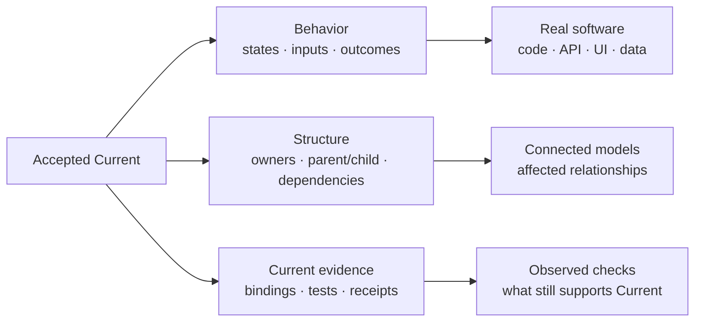
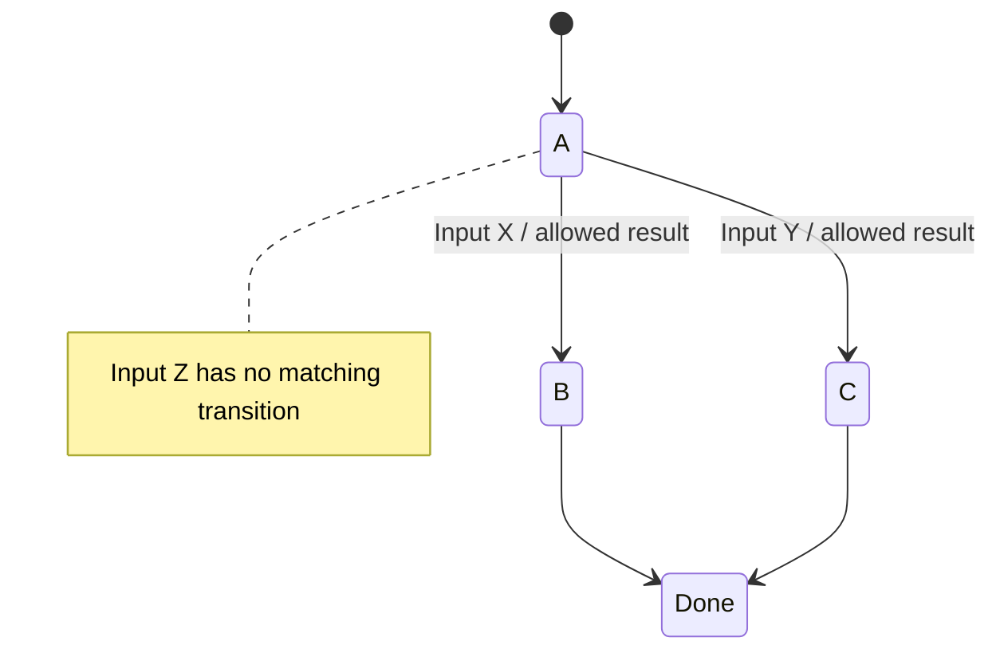
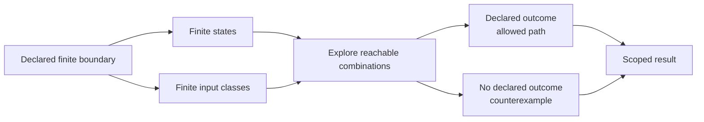
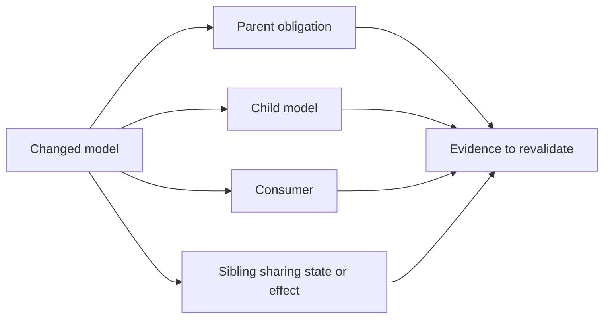
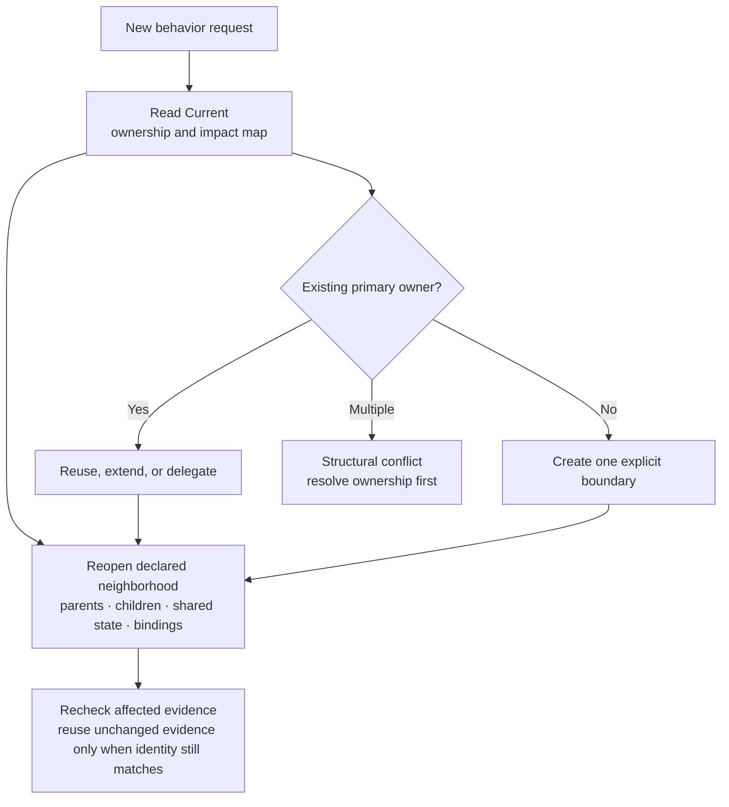
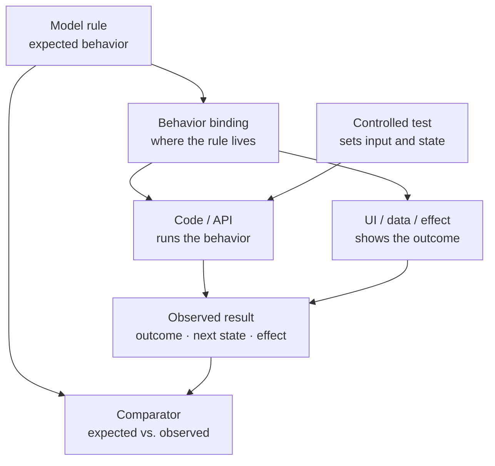
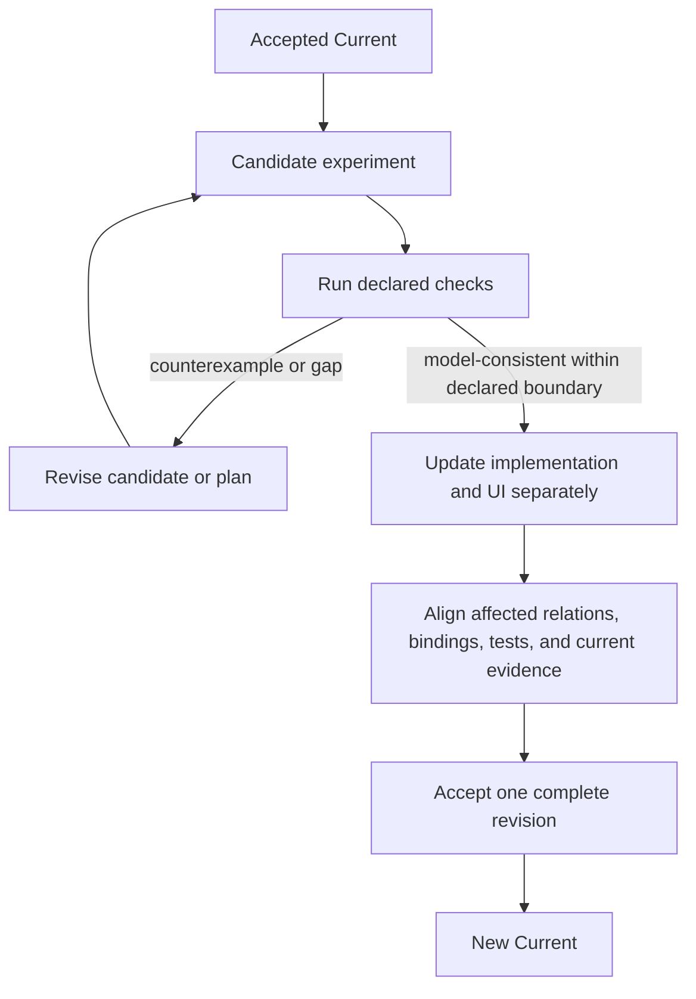

# FlowGuard

<!-- README HERO START -->
<p align="center">
  
</p>

<p align="center">
  
</p>

<p align="center">
  <strong>An AI-agent skill suite powered by an executable check engine.</strong>
</p>

<p align="center">
  FlowGuard keeps an executable model of what current evidence supports inside the declared software boundary,
  searches its declared behavior and structure, and checks a proposed change before it becomes the new Current.
</p>
<!-- README HERO END -->

| Public release | Schema | Runtime | License |
| --- | --- | --- | --- |
| `v0.68.11` | `1.0` | Python standard library only | MIT |

[中文说明](./README.zh-CN.md) · [Quick Start](#quick-start) · [Concept](./docs/concept.md) · [Documentation](#documentation-map)

## What FlowGuard Is

FlowGuard is a model-first preflight layer for AI-assisted software work.

Its primary agent surface is `.agents/skills/`: start with
`.agents/skills/flowguard/SKILL.md`, and keep the sibling FlowGuard skills
available so the kernel can select the smallest matching route.

The suite includes executable check scripts. The Python package is the check
engine used by those skills; it is not the skill installation itself.

FlowGuard does not merely save another specification file. It maintains a
current, executable map of the modeled software:

- what behaviors exist now;
- which states and transitions those behaviors allow;
- which code owns each behavior, or where ownership remains unresolved;
- which UI, API, CLI, field, resource, and side-effect boundaries realize it;
- which tests or checks currently support the model;
- how parent, child, producer, consumer, and sibling models are connected.

That map is the software's **FlowGuard DNA**.

The DNA says what the maintained model contains. **Current** says which exact
version of that DNA is accepted now.

When software or its evidence changes, the affected Current claims may become
stale. FlowGuard requires a reviewed revision, refreshed bindings, and current
evidence before the accepted Current advances. The historical change record
remains history; it is not reconstructed on every task and treated as the
current answer.

FlowGuard then gives an AI agent three capabilities that plain repository
search does not provide by itself:

1. search the declared finite behavior space for missing or rule-violating
   paths and, when path-quality review is triggered, surface unreachable or
   duplicated structure;
2. search the affected model neighborhood to see what else a change can make
   stale or inconsistent;
3. search the current structure for an existing owner or reusable path before
   adding another handler, module, screen flow, facade, or fallback.

These are three ways to understand FlowGuard's current capabilities, not three
additional public routes. They are bounded searches. FlowGuard does not discover every unknown fact in
arbitrary software, prove the whole production system correct, or guarantee a
globally optimal architecture.

## Why FlowGuard Exists

AI coding agents are good at local edits. They can find a nearby function,
change it, and make a visible test pass.

The harder problem is knowing whether that local edit still fits the whole
software system.

A repository may contain years of specifications, code, tests, changelogs, and
design discussions. That history does not automatically give an agent one
maintained answer to these questions:

- What does the software do **now**?
- Which component owns this behavior **now**?
- Which paths are legal, missing, or obsolete **now**?
- Which tests still support that answer after the last change?
- If this part changes, what other parts must be reconsidered?

Without a maintained current model, every new agent session must search and
reconstruct those answers again. The reconstruction may miss a branch, select
an outdated rule, or build a second path beside an existing one.

For example:

1. an agent is asked to fix retry handling;
2. it changes the function nearest the visible failure;
3. the visible test passes;
4. the same job is processed again later;
5. a side effect happens twice because repeated input was never modeled.

FlowGuard replaces "please be careful" with explicit questions about state,
paths, ownership, side effects, current evidence, and completion.

## What FlowGuard Builds: Current Software DNA

The native model directory is the DNA. It stays beside the software it
describes and contains the versioned models, parent/child interfaces,
code/test bindings, and their current evidence.

FlowGuard audits that directory in place. It does not create a second DNA
envelope, a copied authority directory, or an isolated reconstruction that can
silently drift from the real current model.

A useful Current model answers five connected questions.

| Question | What the DNA records |
| --- | --- |
| What behavior exists? | finite behavior blocks, inputs, states, outputs, errors, decisions, retries, timeouts, and completion |
| Who owns it? | one current model owner and the relevant code or external-system boundary |
| How is it reached? | UI, API, CLI, event, field, resource, producer-consumer, and parent-child relations |
| What proves it today? | exact tests, checkers, oracles, receipts, fingerprints, and freshness |
| What remains unknown? | omitted, stale, unresolved, blocked, or explicitly scoped gaps |


```mermaid
flowchart LR
    CURRENT["Accepted Current"] --> BEHAVIOR["Behavior<br/>states · inputs · outcomes"]
    CURRENT --> STRUCTURE["Structure<br/>owners · parent/child · dependencies"]
    CURRENT --> EVIDENCE["Current evidence<br/>bindings · tests · receipts"]
    BEHAVIOR --> SOFTWARE["Real software<br/>code · API · UI · data"]
    STRUCTURE --> NEIGHBORS["Connected models<br/>affected relationships"]
    EVIDENCE --> CHECKS["Observed checks<br/>what still supports Current"]
```

This is an information map, not merely a file index. Each relation states why
two things are connected: owns, implements, reads, writes, calls, displays,
validates, delegates, or affects. A missing or stale connection stays visible
as unknown instead of being filled in because two names look similar.

The Current model is not simply the newest file named `current`. Current
authority belongs only to the observed snapshot reached through the accepted
revision, activation receipt, and single pointer in `.flowguard/project.toml`.
Its complete current-intent view (`CurrentEffectiveIntentView`) states the
intent that remains active.

That view states the behavior that remains active after all accepted changes.
A revision delta says only what changed in one revision; history is never a
substitute for the maintained current meaning.

## The Core Model, in Plain Language

The smallest FlowGuard model has this shape:

```text
Input x State -> Set(Output x State)
```

In plain language:

- `Input` is an incoming event, such as a retry, click, payload, job, or release action.
- `State` is what the system remembers before the event.
- `Output` is what the step says happened.
- the new `State` is what the system remembers afterward.
- `Set(...)` means one input may have several legal branches; the model must say what they are.

The model is useful because it makes paths executable rather than leaving them
as prose that an agent may interpret differently each time.


```mermaid
stateDiagram-v2
    [*] --> A
    A --> B: Input X / allowed result
    A --> C: Input Y / allowed result
    B --> Done
    C --> Done
    note right of A
      Input Z has no matching transition
    end note
```

The diagram is intentionally abstract. FlowGuard does not need to invent a
business story to show the important fact: inside the declared finite boundary,
`Input Z` has no matching transition or declared outcome from state `A`.

The checker then explores the combinations that this finite boundary enables,
within the declared finite sequence bounds:


```mermaid
flowchart LR
    BOUNDARY["Declared finite boundary"] --> STATES["Finite states"]
    BOUNDARY --> INPUTS["Finite input classes"]
    STATES --> SEARCH["Explore reachable combinations"]
    INPUTS --> SEARCH
    SEARCH --> ALLOWED["Declared outcome<br/>allowed path"]
    SEARCH --> GAP["No declared outcome<br/>counterexample"]
    ALLOWED --> RESULT["Scoped result"]
    GAP --> RESULT
```

FlowGuard exhaustively explores those reachable traces only when the declared
inputs, states, and sequence bounds are finite and exploration completes. A
truncated exploration is a visible non-pass or blocked result, never a clean
pass.

This is why the model can reveal a case that neither the developer nor the AI
thought to ask about explicitly: the checker enumerates the reachable
combinations in the declared model instead of sampling only the most likely
story. It cannot reveal states, inputs, or dependencies that were never placed
inside that boundary.

The counterexample is not automatically proof of a production code bug. It is
evidence that the model, intended behavior, implementation binding, or test
coverage needs a specific review.

## Three Searches over One Current Model

FlowGuard's searches have different jobs. Keeping them separate prevents a
strong structural result from being overstated as production truth.

### 1. Behavior-path search

For a declared finite model, FlowGuard explores the stated transitions and
checks the supplied invariants, scenarios, safety rules, temporal obligations,
and known-bad cases.

It can make these structural problems visible:

- an input with no declared result;
- a branch that violates an invariant;
- an unreachable, duplicated, or non-terminal structure when the corresponding
  path-quality review is triggered;
- a retry that repeats a side effect;
- two branches that violate a declared conflict rule, invariant, oracle, or
  observable contract;
- truncated exploration, which is reported as a visible non-pass rather than a
  clean result.

The result applies only to the declared model boundary and the checks that ran.

### 2. Affected-neighborhood search

A local model can be green while a broader claim is no longer supported.

FlowGuard follows declared relations from the changed model to affected:

- ancestors and parent obligations;
- child models and their reattachment points;
- producers and consumers;
- delegated owners;
- siblings that share state, fields, resources, or side effects;
- tests and receipts whose input identity has changed.


```mermaid
flowchart LR
    Changed[Changed model] --> Parent[Parent obligation]
    Changed --> Child[Child model]
    Changed --> Consumer[Consumer]
    Changed --> Sibling[Sibling sharing state or effect]
    Parent --> Evidence[Evidence to revalidate]
    Child --> Evidence
    Consumer --> Evidence
    Sibling --> Evidence
```

Ordinary work loads the affected neighborhood, not the entire repository.
Whole-target claims require an explicit whole-target scope.

Affected-only reading avoids reconstructing the whole blueprint and can keep
the verified model/context projection proportional to the declared change.
Search still happens, and FlowGuard does not promise a fixed token saving.

### 3. Structural reuse and reduction search

Before adding a new path, FlowGuard can query Current DNA for the existing
behavior owner and related surfaces.

For a whole-target structure claim, FlowGuard also starts from an independently
discovered implementation inventory and checks both directions: every modeled
obligation should point to its implementation, and every in-scope
behavior-bearing implementation surface should lead to a model obligation, an
owner contract, or an explicit non-behavior disposition. That comparison can
expose an unbound implementation, an ownerless rule, or two structures claiming
the same responsibility. It does not infer every dependency in an unmodeled
repository.

This supports **reuse before growth**:

- reuse the existing state or side-effect owner;
- delegate a new UI, API, or CLI surface to the current behavior path;
- avoid a parallel handler that makes the same external promise;
- identify repeated validation or compatibility layers;
- propose a smaller structure when current obligations can still be preserved.


```mermaid
flowchart TB
    REQUEST["New behavior request"] --> LOOKUP["Read Current<br/>ownership and impact map"]
    LOOKUP --> OWNER{"Existing primary owner?"}
    LOOKUP --> AFFECTED["Reopen declared neighborhood<br/>parents · children · shared state · bindings"]
    OWNER -->|Yes| REUSE["Reuse, extend, or delegate"]
    OWNER -->|No| NEW["Create one explicit boundary"]
    OWNER -->|Multiple| CONFLICT["Structural conflict<br/>resolve ownership first"]
    REUSE --> AFFECTED
    NEW --> AFFECTED
    AFFECTED --> CHECK["Recheck affected evidence<br/>reuse unchanged evidence only when identity still matches"]
```

One primary owner means one authoritative implementation responsibility for a
behavior. It does **not** mean one global controller for the entire application.

FlowGuard does not remove code because it looks old, duplicated, or expensive.
A reduction must preserve the observable contract and account for callers,
consumers, owners, tests, oracles, topology, and every active responsibility.

The only safe outcomes are bounded classifications:

- `retain`;
- `contract-equivalent`;
- `retire-behavior-with-complete-current-proof`;
- `unresolved`.

If proof is missing or stale, the correct result is `unresolved`, not deletion.

| Candidate structure | Safe bounded outcomes |
| --- | --- |
| two owners or parallel paths for the same behavior | prove distinct responsibilities and retain separately; otherwise delegate, contract with observable-equivalence proof, or remain unresolved |
| fallback or compatibility surface | retain or delegate; retire only with complete current caller and responsibility proof |
| facade, adapter, or old entrypoint | keep the public boundary, or remove it only after callers, effects, and parity are proved |
| missing ownership, binding, consumer, or test evidence | `unresolved` |

## How the Model Stays Bound to the Software

A model is not useful merely because a diagram and some code both exist.
FlowGuard binds the same obligation across several evidence layers.


```mermaid
flowchart TB
    RULE["Model rule<br/>expected behavior"] --> BINDING["Behavior binding<br/>where the rule lives"]
    BINDING --> CODE["Code / API<br/>runs the behavior"]
    BINDING --> SURFACE["UI / data / effect<br/>shows the outcome"]
    TEST["Controlled test<br/>sets input and state"] --> CODE
    CODE --> OBSERVED["Observed result<br/>outcome · next state · effect"]
    SURFACE --> OBSERVED
    RULE --> COMPARE["Comparator<br/>expected vs. observed"]
    OBSERVED --> COMPARE
```

### Code binding

Each affected obligation should resolve to one current owner, one relevant code
contract, and exact implementation references.

Paths and symbol names prove traceability, not semantics. FlowGuard keeps the
plain-language behavior meaning separate from the source location so a renamed
function does not silently redefine the obligation.

### UI and external-surface binding

A screen, API endpoint, command, alias, adapter, or facade is a surface, not
automatically a new behavior.

When surfaces have the same actor, preconditions, terminal result, failure
boundary, material state writes, and side effects, they should map to the same
stable intent and selected current path. Extra surfaces can delegate instead of
growing a second implementation.

UI modeling also records reachable journeys, visible controls, disabled
reasons, cancel/recovery paths, terminal states, feedback, and implementation
evidence. A visible button alone does not prove that the user can complete or
recover from the workflow.

### Tests as sensors

Tests are not the model, and the model is not a replacement for tests.

Tests act like sensors attached to model obligations:

- the model says what must remain true;
- the code binding says where the behavior is realized;
- the test or checker observes a specific part of that behavior;
- the execution receipt says whether that sensor ran against current inputs.

A test counts as a current sensor only when it binds the same obligation and
owner contract, has the required assertion scope, and carries current execution
evidence.

If the model, code, test source, fixture, dependency, or covered input changes,
the old sensor reading may become stale. A previously passing test is not
silently carried forward as current proof.

Test design stays separate from current execution evidence. A well-designed
case that did not run is still `not_run`, not a pass.

## Current, Target, and Candidate Experiment Models

FlowGuard separates three meanings that are easy to confuse:

| Model | Meaning | Authority |
| --- | --- | --- |
| **Current / observed** | what the accepted evidence says exists now | may support current-system claims within its proven boundary |
| **Target / normative** | the intended replacement | a proposal, not current fact |
| **Candidate experiment** | a counterfactual change used for simulation | may reveal conflicts, but changes no current authority |

A filename, prompt statement, discovery hit, or passing Candidate check does
not make that Candidate current.

FlowGuard can run the Candidate against declared obligations before code is
accepted:

1. freeze the exact Current base and materialize a separate Candidate revision
   over the declared affected closure;
2. change the proposed transitions, ownership, structure, or relations;
3. run model checks and known-bad cases;
4. inspect counterexamples and affected-neighborhood gaps;
5. implement and collect current code/test evidence separately;
6. accept one complete revision set only when the required evidence matches;
7. move the single Current pointer last.


```mermaid
flowchart TB
    Current[Accepted Current] --> Candidate[Candidate experiment]
    Candidate --> Simulate[Run declared checks]
    Simulate -->|counterexample or gap| Revise[Revise candidate or plan]
    Revise --> Candidate
    Simulate -->|model-consistent within declared boundary| Implement[Update implementation and UI separately]
    Implement --> Rebind[Align affected relations, bindings, tests, and current evidence]
    Rebind --> Accept[Accept one complete revision]
    Accept --> Current2[New Current]
```

The first cumulative v5 revision has one direct main line. Produce exact
native-owner evidence before the intent bootstrap:

```powershell
python -m flowguard model-revision-owner-evidence --root . --model-parent-receipt <model-parent.json> --snapshot-id <snapshot-id> --output <owner-evidence.json> --json
python -m flowguard model-revision-intent-bootstrap --root . --model-parent-receipt <model-parent.json> --native-owner-evidence <owner-evidence.json> --revision-set-id <revision-id> --task-id <task-id> --snapshot-id <snapshot-id> --intent-bootstrap-input <bootstrap-input.json> --json
```

See [Modeling Protocol](./docs/modeling_protocol.md) and
[Implementation Blueprint](./docs/implementation_blueprint.md) for authority,
revision, rollback, and parent/child output-to-input relations; test design stays
separate from current execution evidence throughout that process.

## Co-evolution: Software and Model Change Together

FlowGuard is designed for a repeated loop, not a one-time modeling workshop.

```text
read and audit Current
-> resolve observed-current drift through its own accepted revision
-> select the affected model neighborhood
-> search paths and existing owners
-> build a Target or Candidate
-> run declared model checks
-> implement the admitted change
-> run affected code, UI, and test evidence
-> accept the new Current
```

When software gains an accepted behavior, state, relationship, or
responsibility, the next accepted Current must account for it. The model can
shrink when complete current evidence proves
that two surfaces are equivalent or one responsibility has been fully retired.

This co-evolution reduces repeated reconstruction. It does not eliminate the
need to observe code, tests, runtime behavior, or production telemetry when a
claim depends on them.

## What It Helps Catch

| Situation | What can go wrong | What FlowGuard makes visible |
| --- | --- | --- |
| Missing behavior path | an input has no legal outcome or recovery | a finite counterexample ending at the undeclared branch |
| Retry or repeated job | the same input creates another side effect | repeated-input traces and an idempotency invariant |
| Conflicting branches | two paths violate a declared conflict rule, invariant, oracle, or observable contract | the exact state and transition where the declared rules diverge |
| Unreachable or unfinished structure | a state cannot be entered, exited, or completed | unreachable nodes, missing terminals, and blocked journeys |
| Repeated functional paths | each page, API, command, alias, or wrapper grows a separate handler | one stable intent, one current owner, one selected path, and explicit delegation |
| Structure growth | a local change adds a new layer instead of using the existing architecture | reusable owners, duplicate boundaries, and bounded reduction candidates |
| UI workflow | controls exist but the user cannot recover, cancel, or reach a terminal state | launch-to-terminal journeys, controls, disabled reasons, feedback, and recovery paths |
| Refactor | a module split loses the real state or side-effect owner | facade boundaries, owner maps, parity obligations, and affected callers |
| Cache or refresh | old state is reused after it should be invalid | state fields, writers, readers, and freshness rules |
| Model-code-test drift | artifacts exist but no longer prove the same behavior | exact obligation-to-owner-to-test alignment rows and open gaps |
| Parent and child models | one local green check is treated as whole-system confidence | reattachment points, sibling impact, and scoped parent confidence |
| Tests and releases | old evidence is treated as proof after relevant inputs changed | receipt identity, freshness, and minimum revalidation |
| Public claims | a README, release note, or "done" message exceeds current evidence | the exact claim boundary and missing proof |

FlowGuard can expose a **structural error** in the declared model even when no
production failure has yet been observed. A structural counterexample becomes
a code-bug claim only after current model-code-test or runtime evidence binds it
to the implementation.

## Quick Start

Clone or open the repository:

```powershell
git clone https://github.com/liuyingxuvka/FlowGuard.git
cd FlowGuard
```

For AI agents, complete setup means:

1. read `AGENTS.md`;
2. load or copy every skill under `.agents/skills/` according to the host
   agent's skill mechanism;
3. start from `.agents/skills/flowguard/SKILL.md`;
4. keep the sibling FlowGuard skills available so the kernel can route to them;
5. run executable check scripts only when current evidence is needed.

Run a small check that compares a correct model with broken variants:

```powershell
python examples/job_matching/run_checks.py
```

The example should report:

- the correct model is `OK`;
- the broken duplicate-record model has invariant violations;
- the broken repeated-scoring model has invariant violations;
- the report includes counterexample traces showing the repeated-input path.

The example is intentionally abstract. It does not search real jobs or call an
AI model. It demonstrates repeated inputs, state writes, invariants, and
counterexamples.

Run `python -m flowguard --help` for the current command list. The command
executes checks and helpers; it is not the AI-agent skill installation surface.

## Use It in Another Project

First make the FlowGuard skill suite available to the AI agent working in the
target project. An ordinary target project uses the single clean consumer
projection under `$CODEX_HOME/skills/`; it does not copy the FlowGuard suite
into its local project and create a second suite authority.

When executable project records are useful, run:

```powershell
python -m flowguard project-adopt --root <target-project>
python -m flowguard project-audit --root <target-project>
python -m flowguard project-upgrade --root <target-project>
```

Then start with one risky boundary:

```text
choose one risky boundary
-> name the failure class to prevent
-> query the existing Current owner
-> describe Input, State, Output, effects, owners, and completion evidence
-> add one invariant or scenario
-> add one known-bad case
-> run the check
-> inspect the counterexample
-> revise the model, plan, code, tests, UI, or claim
```

External requirements, plans, designs, tasks, and status enter through
provider-neutral read-only `WorkContext` adapters. OpenSpec, Spec Kit,
Superpowers, Spark/OpenSpark, changelog/history, custom skills, declared files,
or no specification provider are peers. Their native status does not become
FlowGuard execution or test evidence.

For broad external behavior claims, the Behavior Commitment Ledger freezes the
expected source inventory, gives each modeled promise one primary owner, and
hands path-sensitive behavior to Primary Path Authority.

Its read-only lookup does not force every ordinary action through FlowGuard and
cannot guarantee that a future AI agent will follow the retrieved guidance.

## Minimal Runnable Model Sketch

The complete runnable version is in
[`examples/job_matching`](./examples/job_matching). Its core is small:

```python
@dataclass(frozen=True)
class State:
    processed: tuple[str, ...] = ()
    side_effects: int = 0


@dataclass(frozen=True)
class Input:
    job_id: str


class ProcessJob:
    accepted_input_type = Input
    reads = ("processed", "side_effects")
    writes = ("processed", "side_effects")

    def apply(self, input_obj: Input, state: State):
        if input_obj.job_id in state.processed:
            return [
                FunctionResult(
                    "already_processed",
                    state,
                    label="deduplicated_retry",
                )
            ]
        return [
            FunctionResult(
                "processed",
                replace(
                    state,
                    processed=state.processed + (input_obj.job_id,),
                    side_effects=state.side_effects + 1,
                ),
                label="first_processing",
            )
        ]
```

The model is useful only when it also includes a bad case and a rule worth
checking, such as: "the same job may not create duplicate side effects."

## When to Use It

Use FlowGuard when the next action depends on workflow state, ownership,
relationships, side effects, order, or evidence freshness—not only on nearby
code text.

Good fits:

- AI-agent coding work with multiple stages, handoffs, or validation gates;
- retries, deduplication, cache refresh, queues, ingestion, and repeated jobs;
- changes that may reuse or duplicate existing handlers, screens, APIs, or fields;
- UI flows with recovery, cancellation, disabled, terminal, or feedback states;
- refactors where public entrypoints and side effects must remain compatible;
- tests or releases where old evidence may be mistaken for current proof;
- parent/child model chains where local evidence must be reattached;
- explicit architecture contraction where behavior equivalence must be proven.

Bad fits:

- one-line typo fixes;
- formatting-only changes;
- tasks with no meaningful state, effect, order, ownership, or evidence boundary;
- claims that need statistical truth, business truth, or production telemetry
  rather than structural model checks.

## Advanced Agent Workflows

You can skip this section if you are only trying the first example.

FlowGuard has one model-first kernel and fourteen public satellite skills.
The table remains the canonical 15-member public inventory.

<details>
<summary><strong>Show all 15 FlowGuard skills</strong></summary>

<!-- FLOWGUARD SKILL TABLE EN START -->
| Skill | Use it when |
| --- | --- |
| `flowguard` | ordinary behavior/state modeling is enough, ownership is unclear, or several FlowGuard routes need coordination |
| `flowguard-existing-model-preflight` | an existing modeled system should be queried before adding another boundary |
| `flowguard-development-process-flow` | staged work, multi-skill order, freshness, installation, archive, publish, or release needs lifecycle governance |
| `flowguard-behavior-commitment-ledger` | broad behavior promises need source coverage, one primary owner, and Primary Path Authority handoff |
| `flowguard-field-lifecycle-mesh` | fields, schema keys, flags, defaults, aliases, migrations, replacements, or fallbacks need lifecycle ownership |
| `flowguard-contract-exhaustion-mesh` | a declared finite boundary needs canonical bad cases, combinations, or coverage receipts |
| `flowguard-ui-flow-structure` | UI content, controls, journeys, recovery, operability, transitions, and implementation evidence need modeling |
| `flowguard-code-structure-recommendation` | a model should drive pre-code modules, owners, facades, adapters, or validation boundaries |
| `flowguard-structure-mesh` | an existing large module, package, command, facade, or public API split needs parity and compatibility evidence |
| `flowguard-test-mesh` | validation is large, slow, stale, skipped, layered, release-only, or distributed across child suites |
| `flowguard-model-test-alignment` | model obligations, code contracts, bindings, or test evidence need direct comparison |
| `flowguard-model-mesh` | affected topology crosses model boundaries, child evidence is stale, or sibling/parent reattachment matters |
| `flowguard-model-topology-hazard-review` | a locally green model still needs topology-grounded future-use hazard review |
| `flowguard-architecture-reduction` | current DNA may support retention, equivalent contraction, proven retirement, or an unresolved result |
| `flowguard-model-miss-review` | runtime, tests, replay, logs, or manual checks fail after a FlowGuard model was green |
<!-- FLOWGUARD SKILL TABLE EN END -->

</details>

The suite table is parity-checked against
`.skillguard/flowguard-suite/suite-map.json`. Check-engine helpers are not
separate Codex skills.

## Evidence Has Three Different Meanings

FlowGuard deliberately separates three kinds of green result:

| Layer | What passed | What it does not prove |
| --- | --- | --- |
| Prompt and contract structure | the skill prompt, generated contract, references, and static/depth rules agree | the route's executable check did not necessarily run |
| Native evidence receipt | the route-owned command ran against declared current inputs and produced a freshness-verifiable terminal receipt | one receipt does not close every other required route or the parent claim |
| Self-governance parent closure | the parent consumed current exact-pass receipts for all required members and checked inventory, freshness, and distribution boundaries | it still proves only the declared suite obligations, not future AI behavior or production correctness |

If a prompt, contract, checker, model, code binding, test, fixture, or covered
input changes, older evidence may become stale.

Model regressions use three tiers:

- `fast` for narrow development feedback;
- `focused` for a wider selected surface;
- `full` for every required non-excluded model.

Only a current, terminal full-tier pass can contribute to a release claim.

For normal use, the simulator audits the manifest and delegates each selected
model to its native runner:

```powershell
python -m flowguard simulator --root . --list
python -m flowguard simulator --root . --model architecture_reduction
python -m flowguard simulator --root . --model "ui_*" --tier focused --json
python -m flowguard simulator --root . --all --tier full --jobs 1 --timeout 900
```

See [Validation and Distribution](./docs/validation_and_distribution.md) for
regression commands, background progress, evidence locations, cleanup,
installation, parity, and release verification.

## Relationship to the Guard Family

| Project | Focus |
| --- | --- |
| FlowGuard | stateful behavior, current software DNA, process flow, affected topology, and evidence freshness |
| LogicGuard | claims, evidence, warrants, assumptions, rebuttals, scope, and overclaiming in written reasoning |
| PhysicsGuard | low-fidelity residual checks and model-building blueprints for physical simulation debugging |
| FlowPilot | long-running project orchestration and route control for AI-agent software work |

## Documentation Map

### Start here

| File | Purpose |
| --- | --- |
| [`docs/concept.md`](./docs/concept.md) | short conceptual introduction |
| [`docs/modeling_protocol.md`](./docs/modeling_protocol.md) | core model-first protocol |
| [`docs/invariant_examples.md`](./docs/invariant_examples.md) | examples of useful invariants |
| [`docs/project_integration.md`](./docs/project_integration.md) | target-project adoption guidance |

### Current DNA, understanding, and authority

| File | Purpose |
| --- | --- |
| [`docs/flowguard_dna_directory.md`](./docs/flowguard_dna_directory.md) | native DNA directory and authority boundary |
| [`docs/model_understanding_readiness.md`](./docs/model_understanding_readiness.md) | task-derived understanding depth, receipts, and implementation admission |
| [`docs/flowguard_self_understanding_semantic_mesh.md`](./docs/flowguard_self_understanding_semantic_mesh.md) | whole-system semantic map and claim boundary |
| [`docs/implementation_blueprint.md`](./docs/implementation_blueprint.md) | independent inventory, bidirectional bindings, exact model/code/test qualification, and affected-only projection |

### Behavior, fields, UI, and code structure

| File | Purpose |
| --- | --- |
| [`docs/behavior_commitment_ledger.md`](./docs/behavior_commitment_ledger.md) | external behavior promises, source coverage, and primary ownership |
| [`docs/field_lifecycle_mesh.md`](./docs/field_lifecycle_mesh.md) | field, schema, alias, migration, replacement, and fallback lifecycle |
| [`docs/ui_flow_structure.md`](./docs/ui_flow_structure.md) | UI content, journeys, recovery, operability, and structure modeling |
| [`docs/code_structure_recommendation.md`](./docs/code_structure_recommendation.md) | model-derived code structure recommendations |
| [`docs/structure_mesh.md`](./docs/structure_mesh.md) | refactor, facade, and module-split governance |

### Models, tests, and topology

| File | Purpose |
| --- | --- |
| [`docs/model_test_alignment.md`](./docs/model_test_alignment.md) | model obligation, code contract, and test evidence alignment |
| [`docs/test_evidence_mesh.md`](./docs/test_evidence_mesh.md) | layered validation and evidence freshness |
| [`docs/model_mesh_protocol.md`](./docs/model_mesh_protocol.md) | parent/child model mesh governance |
| [`docs/model_topology_hazard_review.md`](./docs/model_topology_hazard_review.md) | topology-grounded future-use hazard review |
| [`docs/flowguard_model_miss_review.md`](./docs/flowguard_model_miss_review.md) | bounded diagnosis after a green model misses an observed failure |

### Process, evidence, and release

| File | Purpose |
| --- | --- |
| [`docs/development_process_flow.md`](./docs/development_process_flow.md) | staged development, validation freshness, archive, publish, and release gates |
| [`docs/risk_evidence_ledger.md`](./docs/risk_evidence_ledger.md) | risk-to-model-to-code-to-evidence confidence boundary |
| [`docs/flowguard_closure_contract.md`](./docs/flowguard_closure_contract.md) | closure contract for complete FlowGuard use |
| [`docs/validation_and_distribution.md`](./docs/validation_and_distribution.md) | validation tiers, evidence layers, monitoring, skill distribution, and release lifecycle |
| [`docs/github_release_checklist.md`](./docs/github_release_checklist.md) | source-only GitHub release checklist |

## Repository Layout

```text
flowguard/     Core library, review helpers, templates, mesh routes, CLI
examples/      Small executable models and public self-reviews
docs/          Protocols, API notes, examples, and adoption guidance
tests/         Focused regression tests for public helpers
assets/        README hero image, icon, and generation notes
```

## Public Boundary

This repository is a public starter and reference implementation. It includes
the FlowGuard skill suite, executable check scripts and check-engine code,
examples, protocol docs, public templates, and Codex-compatible AI-agent skill
material.

FlowGuard does not call an LLM API. It is not a prompt trick, an application's
database, a production telemetry system, or a replacement for tests, code
review, UI review, security review, or human judgment.

A FlowGuard pass means that the declared model obligations passed the checks
that actually ran against the stated current inputs. It does not mean:

- every unknown component was discovered;
- every production behavior was modeled;
- all code is correct;
- a structural counterexample is already a confirmed production bug;
- a Candidate is safe to promote without implementation evidence;
- the architecture is globally optimal;
- future AI agents will obey the model.

Missing, stale, skipped, truncated, scoped, unresolved, or blocked evidence
remains visible and cannot be renamed as a pass.

The repository does not include private project logs, credentials, customer
data, or a claim that every real system is fully covered.

## License

MIT. See [`LICENSE`](./LICENSE).
