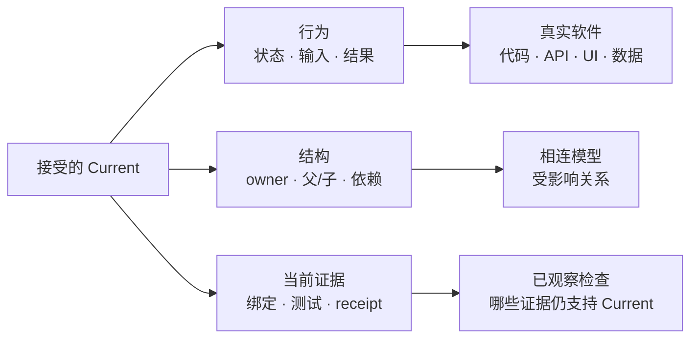
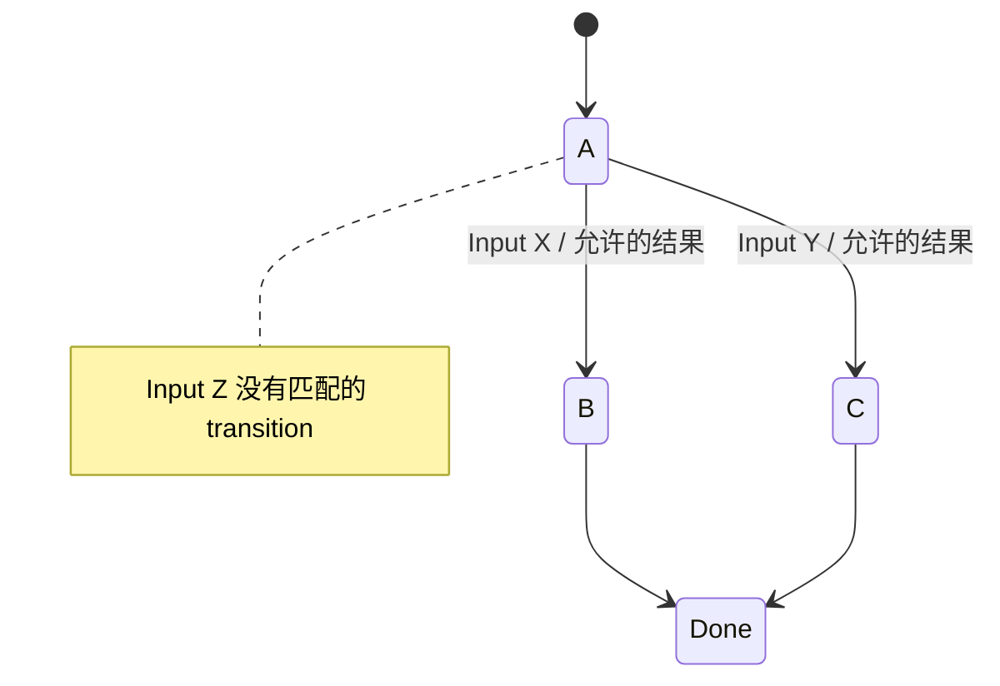
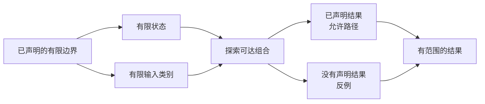
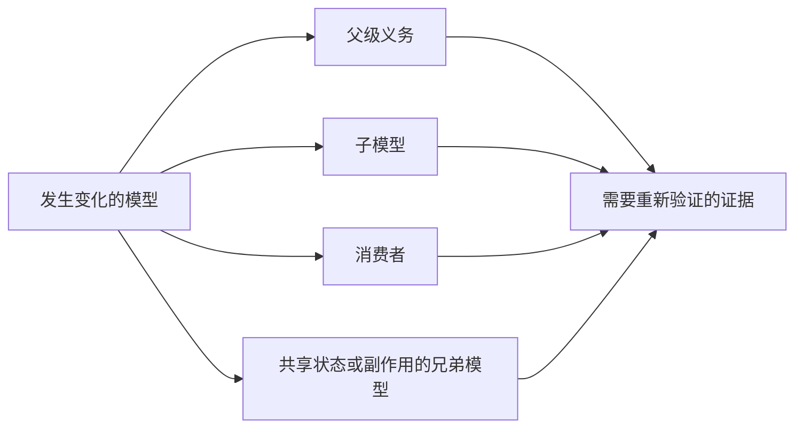
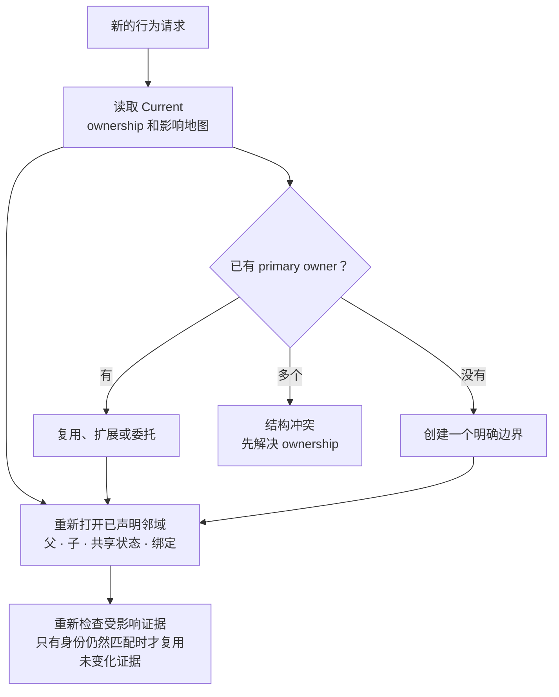
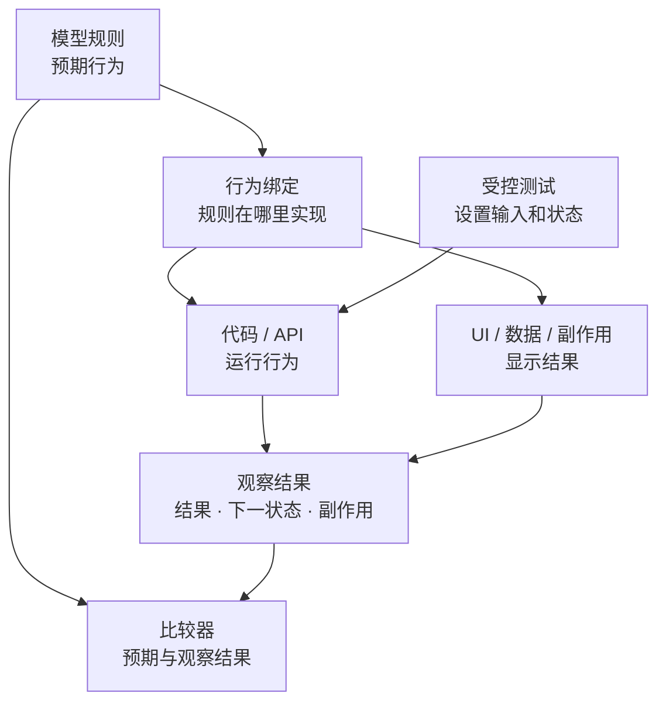
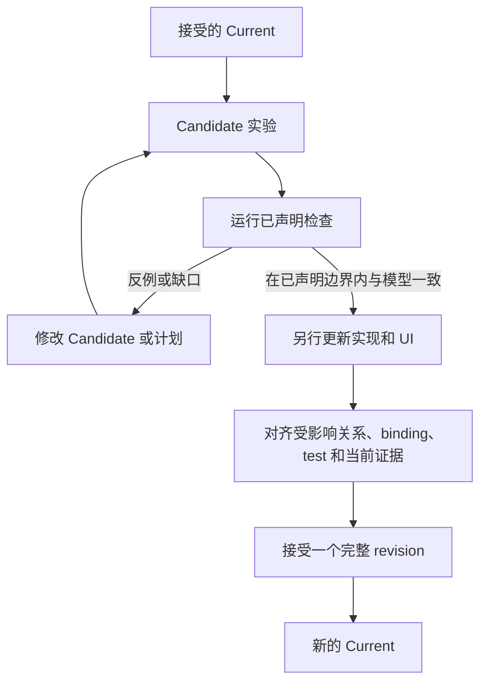

# FlowGuard

<!-- README HERO START -->
<p align="center">
  
</p>

<p align="center">
  
</p>

<p align="center">
  <strong>一套由可执行检查引擎驱动的 AI-agent 技能套件。</strong>
</p>

<p align="center">
  FlowGuard 持续维护一份可执行模型，说明当前证据在已声明的软件边界内支持什么，
  在已声明的范围内搜索行为和结构，并在一次拟议变更成为新的 Current 之前先检查它。
</p>
<!-- README HERO END -->

| 公开版本 | Schema | Runtime | License |
| --- | --- | --- | --- |
| `v0.68.11` | `1.0` | 仅使用 Python 标准库 | MIT |

[English](./README.md) · [快速开始](#快速开始) · [概念介绍](./docs/concept.md) · [文档地图](#文档地图)

## FlowGuard 是什么

FlowGuard 是面向 AI 辅助软件开发的一层 model-first 预检。

它面向 agent 的主要入口是 `.agents/skills/`：先从
`.agents/skills/flowguard/SKILL.md` 开始，并让其他 FlowGuard 技能保持可用，
这样 kernel 才能选择范围最小且真正匹配的路线。

这套技能附带可执行检查脚本。Python 包是这些技能使用的检查引擎；
它本身不是技能安装。

FlowGuard 不只是多保存一份规格文件。它会持续维护一张关于当前软件的、
可执行的信息地图：

- 现在有哪些行为；
- 这些行为允许哪些状态和转移；
- 哪段代码负责每项行为，或者哪些 ownership 仍未解决；
- 哪些 UI、API、CLI、字段、资源和副作用边界实现了它；
- 目前有哪些测试或检查仍然支持这个模型；
- 父模型、子模型、生产者、消费者和兄弟模型怎样连接。

这张地图就是软件的 **FlowGuard DNA**。

DNA 说明这份持续维护的模型包含什么。**Current** 则说明当前接受的是这份 DNA 的哪一个精确版本。

软件或证据发生变化时，受影响的 Current 声明可能会过期。只有经过审查的 revision、
已经刷新的 binding 和当前证据都到位后，FlowGuard 才允许被接受的 Current 前进。
历史变更记录仍然只是历史；FlowGuard 不会在每次任务中重新拼接历史，
再把拼出来的结果当作当前答案。

因此，与普通的仓库搜索相比，FlowGuard 还能给 AI agent 三种额外能力：

1. 在已声明的有限行为空间中搜索缺失或违反规则的路径；当 path-quality review
   被触发时，再暴露不可达或重复结构；
2. 搜索受影响的模型邻域，看看一次变化还会让哪些内容变得过期或不一致；
3. 在新增 handler、module、screen flow、facade 或 fallback 之前，
   先在当前结构中查找已有 owner 或可复用路径。

这三种搜索是理解 FlowGuard 当前能力的三种方式，不是三条额外的公开 route。
它们都有明确边界。FlowGuard 不会发现任意软件中所有未知事实，
不会证明整个生产系统都正确，也不会保证找到全局最优的软件架构。

## 为什么需要 FlowGuard

AI 编程 agent 很擅长局部修改。它可以找到附近的函数，完成修改，
再让眼前的一项测试通过。

更难的问题是：这项局部修改是否仍然适合整个软件系统。

一个仓库可能积累了多年的规格、代码、测试、changelog 和设计讨论。
但这些历史材料不会自动给 agent 一份持续维护的答案，告诉它：

- 软件**现在**到底做什么？
- **现在**由哪个组件负责这项行为？
- **现在**哪些路径合法、缺失或已经过时？
- 上次变化之后，哪些测试仍然支持这个答案？
- 如果这一部分改变，还有哪些部分必须重新检查？

如果没有一份持续维护的 Current 模型，每个新的 agent session 都要重新搜索、
重新拼接这些答案。这个过程中可能漏掉一个分支、采用一条过期规则，
或者在已有路径旁边又造出第二条路径。

例如：

1. 你让 agent 修复 retry 处理；
2. 它修改了离可见故障最近的函数；
3. 眼前的测试通过了；
4. 后面同一个 job 又被处理了一次；
5. 因为重复输入从未进入模型，一个副作用发生了两次。

FlowGuard 不再只是要求 agent “小心一点”，而是明确询问状态、路径、
ownership、副作用、当前证据和完成条件。

## FlowGuard 建立什么：软件的 Current DNA

原生模型目录就是 DNA。它和被描述的软件放在一起，里面保存版本化模型、
父子接口、代码/测试绑定以及它们的当前证据。

FlowGuard 直接审计这个目录。它不会再建立第二套 DNA 包装、复制一份权威目录，
也不会做一份可能悄悄偏离真实 Current 模型的隔离重建。

一份有用的 Current 模型会回答五个彼此连接的问题。

| 问题 | DNA 记录什么 |
| --- | --- |
| 现在有什么行为？ | 有限行为块、输入、状态、输出、错误、判断、重试、超时和完成条件 |
| 谁负责它？ | 一个 Current 模型 owner，以及相关代码或外部系统边界 |
| 怎样到达它？ | UI、API、CLI、事件、字段、资源、生产者-消费者和父子关系 |
| 今天用什么证明它？ | 精确的测试、checker、oracle、receipt、fingerprint 和 freshness |
| 还有什么不知道？ | 被遗漏、已过期、未解决、已阻塞或明确限缩范围的缺口 |



这是一张信息地图，不只是一份文件索引。每条关系都会说明两个对象为什么连接：
负责、实现、读取、写入、调用、展示、验证、委托或影响。缺失或过期的连接会明确保持为
unknown，不会因为两个名字看起来相似就自动补齐。

Current 模型并不等于文件名叫 `current` 的最新文件。Current 权威只属于 observed snapshot；
这个 snapshot 必须经过已接受的 revision、activation receipt，以及
`.flowguard/project.toml` 中的唯一 pointer 才能到达。它完整的当前意图视图
（`CurrentEffectiveIntentView`）说明哪些 intent 仍然有效。

这个视图说明全部已接受变化完成后，哪些行为仍然有效。
一次 revision delta 只说明那一轮改变了什么；历史永远不能替代持续维护的当前含义。

## 用大白话解释核心模型

最小的 FlowGuard 模型是这个形状：

```text
Input x State -> Set(Output x State)
```

翻成人话：

- `Input` 是进入系统的事件，例如一次 retry、click、payload、job 或 release 动作。
- `State` 是事件发生前系统记住的内容。
- `Output` 是这一步对外说明发生了什么。
- 新的 `State` 是这一步结束后系统记住的内容。
- `Set(...)` 表示一个输入可能有多条合法分支；模型必须明确说明这些分支。

模型之所以有用，是因为它把路径变成可执行内容，而不是留下几段 prose，
让不同 agent 每次给出不同理解。



这张图故意保持抽象。FlowGuard 不需要编造一个业务故事，也能表达关键事实：
在已声明的有限边界内，`Input Z` 在状态 `A` 下没有匹配的 transition 或声明结果。

然后，checker 会在已声明的有限 sequence bound 内，探索这个有限边界允许的组合：



只有当已声明的 input、state 和 sequence bound 都是有限的，而且探索完整结束时，
FlowGuard 才会穷举这些可达 trace。一次被截断的探索会明确报告为 non-pass 或 blocked，
绝不会被当作干净的 pass。

这就是为什么模型能够暴露一个开发者和 AI 都没有主动想到的问题：
checker 会枚举已声明模型中的可达组合，而不是只抽样最可能发生的故事。
但它无法发现从未被放进这个边界的状态、输入或依赖。

这个反例不会自动证明生产代码中存在 bug。它只说明模型、预期行为、
实现绑定或测试覆盖需要一次具体审查。

## 在同一个 Current 模型上进行三种搜索

FlowGuard 的三种搜索各有不同任务。把它们分开，才能避免把一个很强的结构结果
夸大成生产事实。

### 1. 行为路径搜索

对于一份已声明的有限模型，FlowGuard 会探索其中写明的 transition，
并检查提供的 invariant、scenario、safety rule、temporal obligation 和 known-bad case。

它可以让这些结构性问题变得可见：

- 一个输入没有声明结果；
- 一个分支违反 invariant；
- 当对应的 path-quality review 被触发时，一个结构不可达、重复或无法到达终态；
- 一次 retry 重复产生副作用；
- 两条分支违反已声明的 conflict rule、invariant、oracle 或 observable contract；
- 搜索被截断；这种情况会明确报告为 non-pass，而不是干净结果。

结果只适用于已声明的模型边界以及真正运行过的检查。

### 2. 受影响邻域搜索

一个局部模型可能是 green，但更大范围的声明已经不再成立。

FlowGuard 会沿着已声明关系，从发生变化的模型继续找到受影响的：

- ancestor 和 parent obligation；
- child model 及其 reattachment point；
- producer 和 consumer；
- 被委托的 owner；
- 共享状态、字段、资源或副作用的 sibling；
- 输入身份已经变化的测试和 receipt。



普通任务只加载受影响邻域，而不是整个仓库。
只有明确的 whole-target 声明才需要 whole-target 范围。

只读取受影响范围可以避免重建整份 blueprint，并让已经验证的 model/context projection
大体随已声明变化的范围增长。搜索仍然会发生，FlowGuard 不承诺固定节省多少 token。

### 3. 结构复用与收缩搜索

在新增一条路径之前，FlowGuard 可以先从 Current DNA 中查询已有行为 owner
和相关 surface。

对于 whole-target 结构声明，FlowGuard 还会从独立发现的实现清单开始，
并检查两个方向：每项建模义务都应该指向它的实现；每个范围内、承载行为的实现 surface
都应该指向一项模型义务、一个 owner contract，或一项明确的 non-behavior disposition。
这种比较可以暴露没有绑定的实现、没有 owner 的规则，
或者两个结构同时声称负责同一项责任。它不会推断未建模仓库中的所有依赖。

这支持 **先复用，再增长**：

- 复用已有状态或副作用 owner；
- 让新的 UI、API 或 CLI surface 委托给当前行为路径；
- 避免新增一条做出相同外部承诺的平行 handler；
- 找出重复的 validation 或 compatibility layer；
- 当现有义务仍能保留时，提出更小的结构。



一个 primary owner 表示一项行为只有一个权威实现责任。
它**不**表示整个应用只能有一个全局控制器。

FlowGuard 不会因为代码看起来很旧、重复或成本高就删除它。
一次收缩必须保留可观察契约，并完整说明 caller、consumer、owner、test、oracle、
topology 和每项仍然有效的责任。

安全结果只能是这些有边界的分类：

- `retain`；
- `contract-equivalent`；
- `retire-behavior-with-complete-current-proof`；
- `unresolved`。

如果 proof 缺失或过期，正确结果是 `unresolved`，而不是删除。

| 候选结构 | 安全且有边界的结果 |
| --- | --- |
| 同一行为有两个 owner 或两条平行路径 | 证明责任不同并分别保留；否则选择委托、用可观察等价性证明进行收缩，或保持 unresolved |
| fallback 或 compatibility surface | 保留或委托；只有完整证明当前 caller 和责任后才能退休 |
| facade、adapter 或旧 entrypoint | 保留公开边界；只有 caller、副作用和 parity 都得到证明后才能删除 |
| ownership、binding、consumer 或 test evidence 缺失 | `unresolved` |

## 模型怎样与软件保持绑定

仅仅因为一张图和一些代码同时存在，模型还不算有用。
FlowGuard 会跨越多个证据层，把它们绑定到同一项义务。



### 代码绑定

每项受影响义务都应该解析到一个 Current owner、一个相关 code contract
和精确的实现位置。

路径和 symbol name 只能证明可追踪性，不能证明语义。FlowGuard 会把大白话的行为含义
与源码位置分开，因此函数改名不会悄悄重新定义这项义务。

### UI 与外部 surface 绑定

一个 screen、API endpoint、command、alias、adapter 或 facade 只是 surface，
不会自动成为一项新行为。

当多个 surface 拥有相同 actor、前置条件、终态结果、失败边界、重要状态写入和副作用时，
它们应该映射到同一个稳定 intent 和选定的 Current 路径。额外 surface 可以采用委托，
不必再长出第二套实现。

UI 建模还会记录可达 journey、可见 control、disabled reason、取消/恢复路径、
终态、feedback 和实现证据。只有一个可见按钮，不能证明用户能够完成 workflow
或从中恢复。

### 把测试当作传感器

测试不是模型，模型也不能代替测试。

测试像连接在模型义务上的传感器：

- 模型说明什么必须保持为真；
- 代码绑定说明这项行为在哪里实现；
- 测试或 checker 观察这项行为中的一个具体部分；
- 执行 receipt 说明这个传感器是否针对 Current 输入真正运行过。

只有当测试绑定同一项 obligation 和 owner contract，具有所需 assertion scope，
并带有当前执行证据时，它才算一个 Current 传感器。

如果模型、代码、测试源码、fixture、依赖或覆盖输入发生变化，
旧的传感器读数就可能过期。以前通过的测试不会被悄悄续期为当前证据。

测试设计与当前执行证据始终分开。一项设计得很好的 case 如果没有运行，
仍然是 `not_run`，不是 pass。

## Current、Target 与 Candidate 实验模型

FlowGuard 会明确分开三种很容易混淆的含义：

| 模型 | 含义 | 权威范围 |
| --- | --- | --- |
| **Current / observed** | 已接受证据说明现在真实存在的内容 | 可以在已经证明的边界内支持 Current 系统声明 |
| **Target / normative** | 计划替换成的样子 | 只是一项提案，不是当前事实 |
| **Candidate experiment** | 用来模拟的一项反事实变化 | 可以暴露冲突，但不会改变 Current 权威 |

文件名、prompt 说法、discovery hit 或一个通过检查的 Candidate，
都不会让这个 Candidate 自动成为 Current。

在接受代码之前，FlowGuard 可以先让 Candidate 对照已声明义务运行：

1. 冻结精确的 Current base，并在已声明的 affected closure 上物化一份独立 Candidate revision；
2. 修改拟议的 transition、ownership、structure 或 relation；
3. 运行模型检查和 known-bad case；
4. 检查 counterexample 和 affected-neighborhood gap；
5. 另行实现并收集当前 code/test evidence；
6. 只有所需证据完全匹配时，才接受一个完整 revision set；
7. 最后才移动唯一的 Current pointer。



第一次累计 v5 revision 只有一条直接主线。先生成精确的 native-owner evidence，
再进行 intent bootstrap：

```powershell
python -m flowguard model-revision-owner-evidence --root . --model-parent-receipt <model-parent.json> --snapshot-id <snapshot-id> --output <owner-evidence.json> --json
python -m flowguard model-revision-intent-bootstrap --root . --model-parent-receipt <model-parent.json> --native-owner-evidence <owner-evidence.json> --revision-set-id <revision-id> --task-id <task-id> --snapshot-id <snapshot-id> --intent-bootstrap-input <bootstrap-input.json> --json
```

关于 authority、revision、rollback 和 parent/child output-to-input relation，见
[建模协议](./docs/modeling_protocol.md) 与
[实现蓝图](./docs/implementation_blueprint.md)；整个过程中，测试设计是否齐全始终与
当前执行证据是否通过分开。

## 共同演进：软件与模型一起变化

FlowGuard 为反复运行的循环而设计，不是一次性的建模 workshop。

```text
读取并审计 Current
-> 通过它自己的 accepted revision 解决 observed-current drift
-> 选择受影响的模型邻域
-> 搜索路径和已有 owner
-> 建立 Target 或 Candidate
-> 运行已声明的模型检查
-> 实现已经准入的变化
-> 运行受影响的代码、UI 与测试证据
-> 接受新的 Current
```

当软件获得一项已接受的新行为、状态、关系或责任时，下一个 accepted Current 必须说明它。
当完整 Current 证据证明两个 surface 等价，或一项责任已经完整退休时，模型可以收缩。

这种共同演进减少了反复重建信息，但不会取消对代码、测试、runtime behavior
或 production telemetry 的观察；只要一项声明依赖它们，就仍然需要相应证据。

## 它能帮助发现什么

| 场景 | 可能出什么问题 | FlowGuard 让什么变得可见 |
| --- | --- | --- |
| 行为路径缺失 | 一个输入没有合法结果或恢复路径 | 一条结束在未声明分支的有限反例 |
| retry 或重复 job | 同一个输入又产生一次副作用 | 重复输入 trace 和一项 idempotency invariant |
| 分支冲突 | 两条路径违反已声明的 conflict rule、invariant、oracle 或 observable contract | 已声明规则发生分歧的精确状态和 transition |
| 不可达或未完成的结构 | 一个状态无法进入、退出或完成 | 不可达节点、缺失终态和被阻塞的 journey |
| 重复功能路径 | 每个页面、API、command、alias 或 wrapper 都长出单独的 handler | 一个稳定 intent、一个 Current owner、一条选定路径和明确委托 |
| 结构增长 | 一次局部变化新增一层，而不是使用已有架构 | 可复用 owner、重复边界和有边界的收缩候选 |
| UI workflow | control 存在，但用户无法恢复、取消或到达终态 | 从启动到终态的 journey、control、disabled reason、feedback 和恢复路径 |
| refactor | module 拆分丢失真正的 state owner 或 side-effect owner | facade 边界、owner map、parity obligation 和受影响 caller |
| cache 或 refresh | 旧状态在应该失效后仍被使用 | state field、writer、reader 和 freshness rule |
| model-code-test drift | 多项产物都存在，却不再证明同一个行为 | 精确的 obligation-to-owner-to-test alignment row 和 open gap |
| 父子模型 | 一项局部 green 被当成整个系统的信心 | reattachment point、sibling impact 和有范围的 parent confidence |
| 测试与发布 | 相关输入变化后，旧证据仍被当成证明 | receipt identity、freshness 和最低 revalidation |
| 公开声明 | README、release note 或 “done” 说得比当前证据更多 | 精确的 claim boundary 和缺失证明 |

即使还没有观察到生产故障，FlowGuard 也可以暴露已声明模型中的**结构性错误**。
只有当前 model-code-test 或 runtime evidence 把结构反例绑定到实现之后，
它才可以升级为代码 bug 声明。

## 快速开始

克隆或打开仓库：

```powershell
git clone https://github.com/liuyingxuvka/FlowGuard.git
cd FlowGuard
```

对于 AI agent，完整 setup 表示：

1. 读取 `AGENTS.md`；
2. 按照宿主 agent 的技能机制，加载或复制 `.agents/skills/` 下的全部技能；
3. 从 `.agents/skills/flowguard/SKILL.md` 开始；
4. 保持其他 FlowGuard 技能可见，让 kernel 能够路由到它们；
5. 只有需要当前可执行证据时，才运行检查脚本。

运行一个小检查，对比正确模型和几个坏版本：

```powershell
python examples/job_matching/run_checks.py
```

这个例子应该报告：

- 正确模型是 `OK`；
- broken duplicate-record model 存在 invariant violation；
- broken repeated-scoring model 存在 invariant violation；
- 报告包含 counterexample trace，展示重复输入路径。

这个例子故意保持抽象。它不会搜索真实 job，也不会调用 AI model。
它只展示重复输入、状态写入、invariant 和 counterexample。

运行 `python -m flowguard --help` 可以查看当前命令列表。这个命令用于执行检查和 helper；
它不是 AI-agent skill installation surface。

## 接入另一个项目

先让目标项目中的 AI agent 能够使用 FlowGuard 技能套件。普通目标项目使用
`$CODEX_HOME/skills/` 下唯一的干净 consumer projection；它不会把 FlowGuard 技能套件
复制到本地项目，再建立第二套 suite authority。

当可执行项目记录有用时，运行：

```powershell
python -m flowguard project-adopt --root <target-project>
python -m flowguard project-audit --root <target-project>
python -m flowguard project-upgrade --root <target-project>
```

然后从一个风险边界开始：

```text
选择一个风险边界
-> 命名要防止的 failure class
-> 查询已有 Current owner
-> 描述 Input、State、Output、副作用、owner 和完成证据
-> 添加一项 invariant 或 scenario
-> 添加一个 known-bad case
-> 运行检查
-> 检查 counterexample
-> 修改模型、计划、代码、测试、UI 或声明
```

外部 requirement、plan、design、task 和 status 通过 provider-neutral 的只读
`WorkContext` adapter 进入。OpenSpec、Spec Kit、Superpowers、Spark/OpenSpark、
changelog/history、自定义技能、已声明文件或不使用任何规格 provider，彼此都是平级选项。
它们自己的 status 不会变成 FlowGuard execution 或 test evidence。

对于范围较广的外部行为声明，Behavior Commitment Ledger 会冻结预期 source inventory，
为每项已建模承诺指定一个 primary owner，并把 path-sensitive 行为交给 Primary Path Authority。

它的只读查询不会强制每个普通动作都经过 FlowGuard，也不能保证未来的 AI agent
一定会遵守检索到的指导。

## 最小可运行模型示例

完整可运行版本位于
[`examples/job_matching`](./examples/job_matching)。它的核心很小：

```python
@dataclass(frozen=True)
class State:
    processed: tuple[str, ...] = ()
    side_effects: int = 0


@dataclass(frozen=True)
class Input:
    job_id: str


class ProcessJob:
    accepted_input_type = Input
    reads = ("processed", "side_effects")
    writes = ("processed", "side_effects")

    def apply(self, input_obj: Input, state: State):
        if input_obj.job_id in state.processed:
            return [
                FunctionResult(
                    "already_processed",
                    state,
                    label="deduplicated_retry",
                )
            ]
        return [
            FunctionResult(
                "processed",
                replace(
                    state,
                    processed=state.processed + (input_obj.job_id,),
                    side_effects=state.side_effects + 1,
                ),
                label="first_processing",
            )
        ]
```

只有同时包含坏例子和一条值得检查的规则，这个模型才有用。
例如：“同一个 job 不可以产生重复副作用。”

## 什么时候使用

当下一步依赖 workflow state、ownership、relationship、副作用、顺序或 evidence freshness，
而不只依赖附近的代码文本时，使用 FlowGuard。

适合：

- 包含多个阶段、handoff 或 validation gate 的 AI-agent 编程任务；
- retry、deduplication、cache refresh、queue、ingestion 和重复 job；
- 可能复用或重复已有 handler、screen、API 或 field 的变化；
- 包含恢复、取消、disabled、终态或 feedback 状态的 UI flow；
- 公开 entrypoint 和副作用必须保持兼容的 refactor；
- 旧证据可能被误当成 Current proof 的测试或发布；
- 局部证据必须重新接回 parent 的 parent/child model chain；
- 必须证明行为等价的明确 architecture contraction。

不适合：

- 一行 typo 修复；
- 纯格式修改；
- 没有重要状态、副作用、顺序、ownership 或 evidence boundary 的任务；
- 需要统计事实、业务事实或 production telemetry，
  而不是结构化模型检查的声明。

## 高级 Agent 工作流

如果你只是想运行第一个例子，可以先跳过这一节。

FlowGuard 有一个 model-first kernel 和十四个公开 satellite skill。
下表仍然是公开的 15 项 canonical inventory。

<details>
<summary><strong>显示全部 15 个 FlowGuard 技能</strong></summary>

<!-- FLOWGUARD SKILL TABLE ZH START -->
| Skill | 什么时候使用 |
| --- | --- |
| `flowguard` | 普通行为/状态建模就够了、ownership 不清楚，或需要协调多条 FlowGuard 路线 |
| `flowguard-existing-model-preflight` | 已建模系统应先查询现有边界，再决定是否新增 |
| `flowguard-development-process-flow` | staged work、multi-skill order、freshness、安装、archive、publish 或 release 需要 lifecycle governance |
| `flowguard-behavior-commitment-ledger` | 广泛行为承诺需要 source coverage、一个 primary owner 和 Primary Path Authority handoff |
| `flowguard-field-lifecycle-mesh` | field、schema key、flag、default、alias、migration、replacement 或 fallback 需要 lifecycle ownership |
| `flowguard-contract-exhaustion-mesh` | 已声明的有限边界需要 canonical bad case、组合或 coverage receipt |
| `flowguard-ui-flow-structure` | UI content、control、journey、recovery、operability、transition 和 implementation evidence 需要建模 |
| `flowguard-code-structure-recommendation` | 模型应在写代码前推导 module、owner、facade、adapter 或 validation boundary |
| `flowguard-structure-mesh` | 已有的大型 module、package、command、facade 或 public API 拆分需要 parity 和 compatibility evidence |
| `flowguard-test-mesh` | validation 很大、很慢、已过期、被 skip、分层、release-only，或分散在 child suite |
| `flowguard-model-test-alignment` | model obligation、code contract、binding 或 test evidence 需要直接比较 |
| `flowguard-model-mesh` | affected topology 跨越模型边界、child evidence 过期，或 sibling/parent reattachment 很重要 |
| `flowguard-model-topology-hazard-review` | 局部 green 模型仍需要 topology-grounded future-use hazard review |
| `flowguard-architecture-reduction` | Current DNA 可能支持保留、等价收缩、已证明退休或 unresolved 结果 |
| `flowguard-model-miss-review` | FlowGuard 模型 green 后，runtime、test、replay、log 或人工检查仍然失败 |
<!-- FLOWGUARD SKILL TABLE ZH END -->

</details>

这张技能表会与 `.skillguard/flowguard-suite/suite-map.json` 做 parity check。
Check-engine helper 不是独立的 Codex skill。

## 证据中的三种不同含义

FlowGuard 会刻意分开三种不同的 green 结果：

| 层级 | 真正通过了什么 | 还没有证明什么 |
| --- | --- | --- |
| Prompt and contract structure | 技能 prompt、生成的 contract、reference 和 static/depth rule 相互一致 | 这条路线的 executable check 不一定真正运行过 |
| Native evidence receipt | route-owned command 针对已声明的 Current 输入运行，并生成 freshness 可验证的终态 receipt | 一项 receipt 不能关闭其他所有必需路线，也不能自动关闭 parent claim |
| Self-governance parent closure | parent 消费了所有必需成员的 Current exact-pass receipt，并检查 inventory、freshness 和 distribution boundary | 它仍然只证明已声明的 suite obligation，不证明未来 AI behavior 或 production correctness |

如果 prompt、contract、checker、model、code binding、test、fixture 或 covered input 发生变化，
旧证据就可能过期。

模型回归分为三个 tier：

- `fast` 用于较窄的日常开发反馈；
- `focused` 用于范围更广的选定 surface；
- `full` 用于每个必需且未明确排除的模型。

只有 Current、已到达终态的 full-tier pass 才能参与 release claim。

普通使用时，simulator 会审计 manifest，并把每个选中的模型交给它自己的 native runner：

```powershell
python -m flowguard simulator --root . --list
python -m flowguard simulator --root . --model architecture_reduction
python -m flowguard simulator --root . --model "ui_*" --tier focused --json
python -m flowguard simulator --root . --all --tier full --jobs 1 --timeout 900
```

关于 regression command、后台 progress、evidence location、cleanup、installation、parity
和 release verification，见[验证与分发](./docs/validation_and_distribution.md)。

## 与 Guard Family 的关系

| 项目 | 关注点 |
| --- | --- |
| FlowGuard | 有状态行为、软件的 Current DNA、流程、受影响 topology 和 evidence freshness |
| LogicGuard | 写作推理中的 claim、evidence、warrant、assumption、rebuttal、scope 和 overclaiming |
| PhysicsGuard | 物理仿真调试中的低保真 residual check 和建模蓝图 |
| FlowPilot | 长期 AI-agent 软件工作的项目编排和路线控制 |

## 文档地图

### 从这里开始

| 文件 | 用途 |
| --- | --- |
| [`docs/concept.md`](./docs/concept.md) | 简短概念介绍 |
| [`docs/modeling_protocol.md`](./docs/modeling_protocol.md) | 核心 model-first 协议 |
| [`docs/invariant_examples.md`](./docs/invariant_examples.md) | 常用 invariant 示例 |
| [`docs/project_integration.md`](./docs/project_integration.md) | 目标项目接入指南 |

### Current DNA、理解与权威

| 文件 | 用途 |
| --- | --- |
| [`docs/flowguard_dna_directory.md`](./docs/flowguard_dna_directory.md) | 原生 DNA 目录与权威边界 |
| [`docs/model_understanding_readiness.md`](./docs/model_understanding_readiness.md) | 由任务推导的理解深度、receipt 和实现准入 |
| [`docs/flowguard_self_understanding_semantic_mesh.md`](./docs/flowguard_self_understanding_semantic_mesh.md) | whole-system 语义地图与 claim boundary |
| [`docs/implementation_blueprint.md`](./docs/implementation_blueprint.md) | 独立 inventory、双向 binding、精确 model/code/test qualification 与 affected-only projection |

### 行为、字段、UI 与代码结构

| 文件 | 用途 |
| --- | --- |
| [`docs/behavior_commitment_ledger.md`](./docs/behavior_commitment_ledger.md) | 外部行为承诺、source coverage 和 primary ownership |
| [`docs/field_lifecycle_mesh.md`](./docs/field_lifecycle_mesh.md) | field、schema、alias、migration、replacement 和 fallback lifecycle |
| [`docs/ui_flow_structure.md`](./docs/ui_flow_structure.md) | UI content、journey、recovery、operability 和结构建模 |
| [`docs/code_structure_recommendation.md`](./docs/code_structure_recommendation.md) | 由模型推导代码结构建议 |
| [`docs/structure_mesh.md`](./docs/structure_mesh.md) | refactor、facade 和 module-split governance |

### 模型、测试与 topology

| 文件 | 用途 |
| --- | --- |
| [`docs/model_test_alignment.md`](./docs/model_test_alignment.md) | model obligation、code contract 和 test evidence alignment |
| [`docs/test_evidence_mesh.md`](./docs/test_evidence_mesh.md) | 分层 validation 与 evidence freshness |
| [`docs/model_mesh_protocol.md`](./docs/model_mesh_protocol.md) | parent/child model mesh governance |
| [`docs/model_topology_hazard_review.md`](./docs/model_topology_hazard_review.md) | topology-grounded future-use hazard review |
| [`docs/flowguard_model_miss_review.md`](./docs/flowguard_model_miss_review.md) | green 模型遗漏一次 observed failure 后的有边界诊断 |

### 流程、证据与发布

| 文件 | 用途 |
| --- | --- |
| [`docs/development_process_flow.md`](./docs/development_process_flow.md) | staged development、validation freshness、archive、publish 与 release gate |
| [`docs/risk_evidence_ledger.md`](./docs/risk_evidence_ledger.md) | risk-to-model-to-code-to-evidence confidence boundary |
| [`docs/flowguard_closure_contract.md`](./docs/flowguard_closure_contract.md) | 完整使用 FlowGuard 的 closure contract |
| [`docs/validation_and_distribution.md`](./docs/validation_and_distribution.md) | validation tier、evidence layer、monitoring、skill distribution 与 release lifecycle |
| [`docs/github_release_checklist.md`](./docs/github_release_checklist.md) | 仅发布源码的 GitHub release checklist |

## 仓库结构

```text
flowguard/     核心库、review helper、template、mesh route、CLI
examples/      小型可执行模型和公开 self-review
docs/          协议、API 说明、示例和接入指南
tests/         针对公开 helper 的回归测试
assets/        README hero 图、图标和生成说明
```

## 公开边界

这个仓库是一个公开 starter 和 reference implementation。它包含 FlowGuard 技能套件、
可执行检查脚本和检查引擎代码、示例、协议文档、公开 template，以及兼容 Codex 的
AI-agent skill material。

FlowGuard 不调用 LLM API。它不是 prompt trick、应用数据库、production telemetry system，
也不能替代测试、code review、UI review、security review 或人类判断。

FlowGuard pass 的含义是：已声明的模型义务，针对已说明的 Current 输入，
通过了真正运行的那些检查。它不表示：

- 已经发现每个未知组件；
- 已经建模每项生产行为；
- 所有代码都正确；
- 一个结构反例已经是确认过的生产 bug；
- Candidate 可以在没有实现证据的情况下安全晋升；
- 架构是全局最优；
- 未来 AI agent 一定会遵守模型。

缺失、过期、被跳过、被截断、限缩范围、未解决或已阻塞的证据
必须保持可见，不能被重新命名为 pass。

这个仓库不包含私有项目 log、credential、客户数据，也不声称已经完整覆盖每个真实系统。

## License

MIT。见 [`LICENSE`](./LICENSE)。
