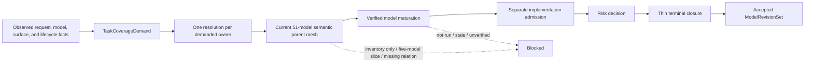

# FlowGuard whole-system semantic self mesh

FlowGuard's current candidate model universe contains 51 executable models. The
semantic self mesh does more than inventory their names: every model has one of
four dispositions, at least one semantic parent, at least one consumer, and a
plain-language rationale. The machine-readable authority is
`.flowguard/authoritative_model_system/semantic_model_mesh.json`.

The checked-in mesh is deliberately a **model candidate**, not a self-issued
completion receipt. It becomes usable for a whole-system understanding claim
only when the same current identities are covered by terminal native model
checks, the full model-regression owner, verified model maturation, and one
accepted model revision set.

## Coverage summary

| Disposition | Count | Meaning |
|---|---:|---|
| `connected` | 26 | Participates directly in a cross-model understanding, validation, maintenance, or release path. |
| `delegated_or_supporting` | 24 | Owns a bounded specialist result that another declared model consumes. |
| `intentional_leaf` | 1 | Ends at a deliberate bounded artifact and hands its result to a current parent. |
| `scoped_out` | 0 | No member of the current 51-model universe is silently omitted from this whole-system candidate. |

The 51 models are organized into seven semantic parents:

| Semantic parent | Primary members | Count by primary parent |
|---|---|---:|
| Authority and understanding | authority, preflight, demand, maturation, freshness, risk, closure | 10 |
| Model mesh and composition | hierarchy, partitions, refinement, composition, misses, hazards, replay | 9 |
| Behavior contracts and evidence | commitments, primary paths, contract alignment, runtime and test evidence | 10 |
| Architecture and lifecycle | structure, reduction, fields, schema replacement, compatibility disposal | 5 |
| Agent guidance and skills | AI entry, handoffs, guidance, skill suite, diagrams | 6 |
| Development, release, and adoption | process, context, maintenance routing, adoption, templates, docs, release | 7 |
| UI and human operability | UI flow, content visibility, real surface, operability | 4 |

Models may have a second parent when their output genuinely crosses a boundary;
that is why the relation total is larger than the model count. The JSON records
every parent and consumer edge explicitly.

## What the native model rejects

The authoritative model and the whole-flow closure model contain direct bad
cases for these failures:

- all current names are present, but semantic dispositions or parent/consumer edges
  are absent;
- only a locally green five-model slice is supplied for a whole-system claim;
- the derivation-base or semantic-mesh fingerprint is empty;
- the semantic artifact is defined but its evidence is `not_run`, stale, or
  otherwise not terminal and independently verified;
- the transfer chain skips the semantic-mesh join or reaches a terminal with
  pending outputs.

These checks establish the model and its rejection semantics. They do not by
themselves prove the running package, installed skills, Git revision, tag, or
GitHub release; those identities remain separate release gates. They also do
not prove that an independent builder can recreate equivalent software from
the model alone. That stronger claim needs complete build, dependency,
environment, asset, data, migration, and external equivalence evidence rather
than another wrapper around the same semantic mesh.
