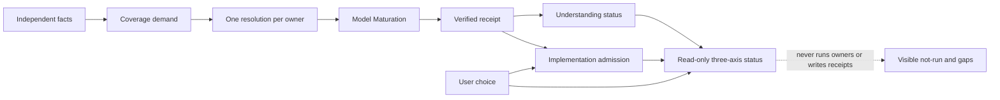

# Model Understanding Readiness

FlowGuard does not ask an AI to say, “I understand this software.” It asks the
AI to publish a checkable chain showing what it examined, what remains open,
and whether implementation is currently admissible.

## The Chain

```text
independently observed task facts
-> TaskCoverageDemand
-> one canonical resolution per demanded owner
-> Model Maturation
-> canonical receipt
-> independent receipt verification
-> separate implementation admission
-> RiskLedger confidence
-> thin ClosureContract integrity check
```

This is one adaptive path. `ordinary`, `standard`, `deep`, and `release` are
derived presentation tiers, not modes the caller selects to avoid work. Every
triggered owner remains required in every tier.

## What Each Part Means

1. **Task facts** describe the actual change and say where each fact came from:
   the request, current observed model, public surface, or lifecycle/process
   change. Unknown, omitted, contradictory, unmapped, and scoped facts remain
   visible instead of disappearing from the denominator.
2. **TaskCoverageDemand** deterministically derives which FlowGuard owners must
   contribute. The caller may add obligations but cannot subtract built-in
   triggered obligations.
3. **Owner resolutions** give every demanded owner exactly one result:
   `satisfied`, `not_triggered`, `unresolved`, or `blocked`, with exact task,
   demand, obligations, evidence, and fingerprint identity. TaskCoverage and
   Model Maturation read projections of the same result. “Not run” is not a
   pass.
4. **Model Maturation** checks whether the exact candidate model closes the
   demanded behavior/state/transition/boundary/evidence gaps for this task.
5. **Receipt verification** independently reloads the canonical receipt and
   verifies task, candidate, coverage universe, input, evidence, and terminal
   identities. A hand-written mapping claiming `current=true` is rejected.
6. **Implementation admission** is separate from understanding sufficiency.
   Read-only work needs no code admission; normal code requires closed current
   maturation. Explicit user permission can bound an attempt with visible open
   gaps, but cannot turn those gaps into proof or waive toolchain, destructive,
   or active-owner blockers.
7. **RiskLedger** owns full/scoped/blocked broad confidence. ClosureContract
   checks exact identity continuity, required terminal material, and agreement
   with that decision; it does not calculate risk again.

## The Three Answers Stay Separate

The read-only status projection never compresses the workflow into one green
boolean. It reports:

- understanding sufficiency: `not_run`, `unresolved`, `scoped_verified`,
  `verified`, `stale`, or `blocked`;
- FlowGuard implementation admission: `not_requested`, `ready`,
  `ready_scoped`, `no_code_requested`, `stale`, or `blocked`;
- user execution choice: `model_first`, `direct_user_choice`, or `no_code`.

A direct user choice can authorize a bounded attempt. It never changes the
understanding result and never manufactures FlowGuard-ready evidence.



## Roles And Permissions

FlowGuard does not invent the target software's users. A plan administrator,
end user, operator, service account, or external system belongs in the target
software's own behavior model when relevant. FlowGuard's records name only its
development-process actors and evidence owners. Likewise, the Behavior
Commitment Ledger records externally visible promises and their primary owner;
it is not a database of the target application's user accounts or permissions.

## ModelMesh Is Topology-Triggered

ModelMesh runs when affected models are related, a parent/child boundary
changes, child evidence is stale, a model needs partitioning, a cross-model
refinement is claimed, or whole-flow confidence is requested. A repository
having three or more unrelated models is only a discovery clue and does not
trigger ModelMesh by itself.

For a whole-FlowGuard claim, the current observed-model inventory is only the
finite universe. Every member must also have one semantic disposition:
`connected`, `intentional_leaf`, `delegated_or_supporting`, or `scoped_out`,
with a rationale and required current relation. A complete list without those
meanings is an asset inventory, not proof of system understanding.

FlowGuard's current self-model applies that rule to all 64 observed models. It
groups them into 7 semantic parent domains and records 189 explicit
parent/consumer relations; every model is connected, delegated/supporting, or
an intentional leaf, with no undispositioned member. See
[`flowguard_self_understanding_semantic_mesh.md`](./flowguard_self_understanding_semantic_mesh.md).
This semantic map is the model-system authority used to understand and evolve
the software; it is not wrapped in a second package or registry. Its current
claim is task-bounded understanding. Clean-room reconstruction would require
additional source, asset, dependency, build, environment, data-migration, and
external rebuild-equivalence evidence, so that stronger claim remains outside
the v0.68.5 boundary.
The behavior-preserving code contraction is recorded separately in
[`understanding_plumbing_reduction.md`](./understanding_plumbing_reduction.md),
because fewer modules or fields are not themselves evidence of deeper
understanding.

## Tests Can Be Designed Before Code Without Pretending They Ran

Model-Test Alignment reports `pre_code_status` separately from
`executed_evidence_status`. Obligations, external-contract oracles, and known
bad cases can be ready before implementation. Their execution status remains
`not_run` until the exact current implementation is exercised.

## Distribution Evidence

DevelopmentProcessFlow does not carry a fixed skill count or perform
installation. For install or release work it consumes one typed
`DistributionEvidence` from the distribution owner. That evidence is current
only when the source projection and installed projection fingerprints match
and the independent verification result is terminal and passing.

## Command-Line Entry

Create a current-schema `TaskFacts.to_dict()` JSON file, then derive the demand:

```powershell
python -m flowguard task-coverage-demand --facts task-facts.json --json
```

After an owner publishes a canonical maturation receipt, verify it from the
receipt store with the exact verification context:

```powershell
python -m flowguard model-maturation-receipt-verify --context verification-context.json --root . --receipt-root .flowguard/receipts --json
```

The CLI result proves only the declared identity and checks. It does not prove
unknown behavior outside the frozen task or target model.

To inspect already-produced artifacts without executing any owner, pass exact
artifact paths to the read-only command:

```powershell
python -m flowguard model-understanding-status `
  --task-facts task-facts.json `
  --model-identity model-identity.json `
  --coverage-demand coverage-demand.json `
  --owner-resolution owner-existing-model-preflight.json `
  --owner-resolution owner-model-maturation.json `
  --maturation-report maturation-report.json `
  --receipt-verification maturation-verification.json `
  --implementation-admission implementation-admission.json `
  --user-choice model_first `
  --json
```

The command never resumes a run, performs missing validation, publishes a
receipt, or changes authority. Missing inputs are returned as `not_run` or
`unresolved`.
