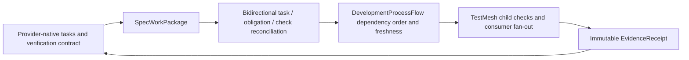

# Specification Provider Work Packages

FlowGuard does not replace OpenSpec, Spec Kit, or another specification tool.
The provider continues to own requirements, task completion, native
verification, and archive state. FlowGuard reads one project-root-bounded work
package and governs the development-process relationships that previously fell
between provider tasks and FlowGuard evidence.



The bridge preserves distinct identities for the provider, work package,
change, task, provider obligation, provider check, stable FlowGuard validation
obligation, verification session, immutable receipt, and receipt consumer. A
task checkbox is never evidence, and a provider task never becomes a
product-runtime behavior owner.

## Reconciliation

Every in-scope provider task must map to an obligation/check or have a typed
provider/infrastructure owner with a reason. Every required obligation and
check must map back to a task or infrastructure owner. Obligation-to-check
links without an owner do not satisfy this gate.

The built-in adapters are read-only and reject paths outside the selected
project root. OpenSpec reads active change artifacts. Spec Kit reads
`.specify/` plus `specs/<feature>/` and reports `artifact_only` when its CLI is
unavailable. Neither adapter scans the computer.

## Verification sessions and receipts

`spec-session-begin` captures a content-hashed canonical-source manifest.
Reports, logs, caches, receipts, bytecode, run records, and verification output
are derived state and cannot enter the same input fingerprint.

`spec-check-run` normalizes the real command, working directory, timeout,
expected exit, tools, environment, stable validation coverage, and complete
input manifest. It runs a check only when its dependencies passed. A failed
dependency yields `not-run` and does not start the heavy process. Every run
captures a post manifest; a source change during execution blocks the receipt.

Only terminal success with exit code, complete coverage, exact result files,
unchanged inputs, and an independently verifiable immutable receipt is
reusable. Cross-change reuse is disabled unless explicitly declared safe and
the neutral execution identity is identical. Several provider checks may
consume one receipt; each work package receives a consumer-local portable
reference to the original immutable envelope instead of copying or rerunning
the receipt. A light package-local aggregate can then bind that shared child
evidence to the package's own obligations.

`spec-session-close` captures the same-session post manifest and blocks when
inputs changed, mappings are incomplete, required checks are missing/non-pass,
or provider tasks remain incomplete. The provider's own final verification and
archive gate still run afterward.

## Commands

```text
python -m flowguard spec-work-package-audit --root . --provider openspec --change <change> --json
python -m flowguard spec-session-begin --root . --provider openspec --work-package <change> --json
python -m flowguard spec-check-run --root . --provider openspec --work-package <change> --check-id <id> --semantic-id <stable-id> --validation-obligation <id> --timeout-seconds 600 -- python -m pytest -q
python -m flowguard spec-session-close --root . --provider openspec --work-package <change> --json
```

Canonical JSON uses language-neutral machine identities and reports
`executed`, `reused-current`, `stale`, `not-run`, or `blocked`. Localized
human explanations belong in a presentation layer, not in receipt identity or
input fingerprints.

## Product UI boundary

This bridge is development-process tooling. Its provider ids, task ids,
receipt hashes, cache keys, session state, and audit fields are not product UI
content. Product UI admission, typography, navigation, and design-language
rules remain owned by UI Flow Structure.
