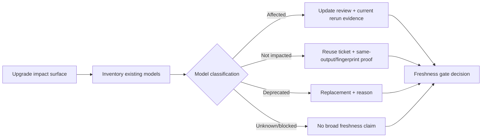

## Overview

The gate has one job: prevent an upgrade from silently overclaiming the
freshness of older FlowGuard models.

It does not mean "rerun everything." It means "classify everything":

## Data Model

- `ModelFreshnessRecord`: inventory row for one existing model, including
  dependency artifacts, FlowGuard semantic ids, previous evidence, and optional
  replacement.
- `UpgradeImpact`: changed package artifacts and FlowGuard semantic ids for
  the current upgrade.
- `ModelImpactAssessment`: explicit classification: `affected`,
  `not_impacted`, `deprecated`, `blocked`, or `unknown`.
- `ModelReuseTicket`: proof that prior evidence can be reused, including
  current fingerprints, current semantics, previous evidence id, and optional
  same-output proof.
- `ModelRerunEvidence`: proof that an affected model has had model/test update
  review and a current passing rerun.
- `ModelImpactFreshnessPlan` and `ModelImpactFreshnessReport`: the review input
  and structured gate result.

## Behavior

The helper blocks when:

- no model inventory exists;
- a model has no classification;
- a directly touched dependency is marked `not_impacted` without a rationale;
- a directly touched dependency reuses old evidence without same-output proof;
- an unaffected model has no current reuse ticket;
- an affected model has no current passing rerun evidence;
- affected model/test update review is missing;
- a deprecated model has no replacement or reason.

The helper allows reuse when:

- the model is explicitly classified `not_impacted`;
- the reuse ticket names the reused evidence and says fingerprints,
  dependencies, FlowGuard semantics, and output are still current;
- direct dependency or semantic hits have a narrower non-impact rationale and
  same-output proof.

## Non-Goals

- No automatic filesystem scanner in this change. Projects can build the
  inventory from their own model registry, `.flowguard` tree, release tooling,
  or CI metadata.
- No forced full historical rerun. The gate is selective and evidence-based.
- No dependency on OpenSpec, Codex, Git, or a non-standard runtime library.

## Validation

- Focused unit tests cover green reuse/rerun/deprecated paths and known-bad
  missing classification, missing reuse ticket, missing rerun, and missing
  same-output proof.
- A FlowGuard executable model catches missing classification, blind reuse of
  old evidence, and affected-model acceptance without rerun.
- OpenSpec validation ensures the behavior is captured as a formal change.
