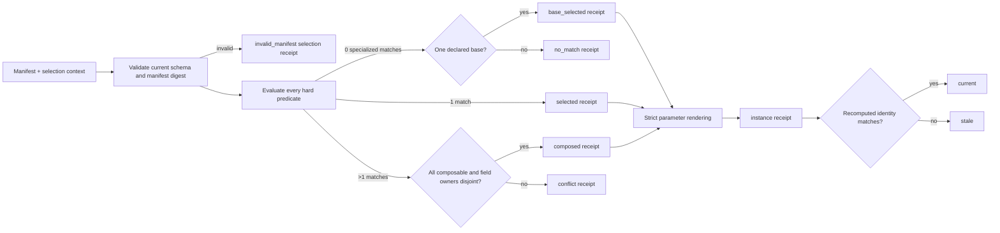

## Context

FlowGuard currently has two useful but separate template surfaces: `flowguard.templates` owns route-scoped starter-file generation, while `flowguard.risk_templates` owns reusable risk-card search and harvest. Neither surface is a deterministic decision engine for choosing and composing a validated template pack from declared context. This change adds that missing internal layer without changing either existing owner.

The implementation is constrained to new, isolated paths. The current public facade, CLI, launcher, risk-template library, existing template modules, and peer-owned compositional-kernel work remain untouched.

The governing function flow is:

Each modeled function block follows `Input x State -> Set(Output x State)`:

- `ValidateManifest`: manifest plus registry state produces either a validated manifest identity or an invalid-manifest result without advancing selection state.
- `SelectTemplatePacks`: validated manifest plus context produces exactly one zero/one/many disposition and a sealed selection receipt.
- `InstantiateTemplatePacks`: a current selectable receipt plus exact parameters produces a rendered field map and sealed instance receipt, or a blocked instance result.
- `ValidateReceipt`: current inputs plus a receipt produces `current` or `stale`; it never silently refreshes the supplied receipt.

## Goals / Non-Goals

**Goals:**

- Provide a canonical v1 manifest for deterministic template-pack selection.
- Use bounded, declarative, all-or-nothing predicates rather than fuzzy scoring.
- Make zero, one, and multiple matches explicit and auditable.
- Allow composition only through opt-in plus non-overlapping top-level field ownership.
- Bind selection and rendered instances to canonical digests so stale reuse is visible.
- Cover the finite decision boundary with an executable FlowGuard model and focused unit tests.

**Non-Goals:**

- Replacing `flowguard.templates` or `flowguard.risk_templates`.
- Adding a CLI, public-facade export, launcher integration, package dependency, or compatibility reader.
- Supporting arbitrary predicate code, fuzzy ranking, implicit fallbacks, nested field merges, or multiple manifest schema versions.
- Editing or synchronizing any installed skill in this change.

## Decisions

### 1. Keep the registry in one independent internal module

The implementation lives in `flowguard/template_packs.py`. Callers that intentionally adopt the feature can import this module directly, but the public facade is unchanged. This keeps ownership separate from starter-template rendering and risk-card storage.

Alternative considered: extend `templates.py` or `risk_templates.py`. Rejected because each already has a different primary responsibility and both are peer-owned in the active workspace.

### 2. Use one current, sealed manifest schema

`flowguard.template-pack-manifest.v1` contains a manifest id/version, template entries, and a declared manifest digest. Selection requires the declared digest to equal the canonical digest of every semantic manifest field. There is no fallback reader for unknown schemas.

Each entry declares:

- stable `template_id` and `version`;
- integer `priority`;
- zero or more bounded hard predicates;
- `base` and `composable` flags;
- exact top-level `owned_fields`;
- exact `required_parameters`;
- a JSON-compatible template field map.

Structural validation requires unique ids, one base at most, a predicate-free/non-composable base, at least one predicate for every specialized entry, exact agreement between owned fields and template top-level keys, and exact agreement between declared parameters and placeholders.

Alternative considered: infer identity from file timestamps or object identity. Rejected because neither is portable nor semantic.

### 3. Restrict predicates to a finite declarative language

Predicates address top-level context keys and use only `equals`, `one_of`, `contains`, `contains_all`, and `exists`. Every predicate on an entry must pass. Missing keys fail closed except for an explicit `exists: false` predicate. Unknown operators or invalid operand shapes invalidate the manifest.

Alternative considered: Python callables or expression evaluation. Rejected because they are not portable, serializable, exhaustible, or safe to replay.

### 4. Make the complete zero/one/many boundary explicit

Specialized entries are matched first; a base entry never competes with them.

- Zero specialized matches select the sole declared base, or produce `no_match` when no base exists.
- One specialized match produces `selected`.
- Multiple specialized matches produce `composed` only when every match is composable and their owned-field sets are pairwise disjoint.
- Otherwise multiple matches produce `conflict`, identifying non-composable matches or conflicting fields.

Selected/composed order is canonical: ascending `(priority, template_id)`. The registry never guesses which conflicting match is “best.”

Alternative considered: first-match-wins or score-based selection. Rejected because manifest order and heuristic scoring can silently hide a valid conflict.

### 5. Treat top-level fields as the composition ownership boundary

Every template is a JSON-compatible top-level mapping. `owned_fields` must exactly equal its keys. Composition merges only those top-level mappings; nested partial ownership is intentionally unsupported in v1. This gives field conflicts one precise owner test.

Alternative considered: recursive merge. Rejected because nested ownership and list semantics would introduce ambiguous conflict rules before a demonstrated need.

### 6. Chain immutable selection and instance receipts

`flowguard.template-pack-selection-receipt.v1` records the manifest digest, context digest, matched ids, selected ids, disposition, findings, and its own digest. `flowguard.template-pack-instance-receipt.v1` additionally binds the current selection digest, exact parameter digest, rendered field map, status/findings, and its own digest.

Receipt validation recomputes the canonical result from current inputs. Any difference in schema, manifest content, context, parameters, selected entries, or rendered output returns `stale`; validation does not mutate or renew the old receipt.

### 7. Use strict declared-parameter rendering

String leaves may contain `${parameter}` placeholders. The union of selected entries' declared parameters must equal the supplied parameter keys exactly. Missing and extra parameters block instantiation. Rendering is recursive over JSON values and does not evaluate code.

### 8. Hand file-template factories to SkillGuard through one neutral projection

`flowguard.skillguard_template_adapter` registers the current `FILE_TEMPLATE_COMMANDS` factories through the native bounded-predicate registry. A target route is an exact `route:flowguard-template:*` id; no lexical match can select it. The adapter emits the complete unsealed central catalog and one applicability result per native entry, with exact file-content, factory, manifest, and validator identities. SkillGuard applies only neutral sealing and generic zero/one/safe-many rules, while FlowGuard remains owner of the route, files, builders, model semantics, and native checks.

## Field Lifecycle

| Field family | Primary owner | Required/default | Invalid or stale condition |
|---|---|---|---|
| Manifest schema/id/version/digest | manifest | all required; no schema fallback | unknown schema, empty identity, missing/mismatched digest |
| Entry id/version/priority | entry | id/version required; priority `0` | duplicate/empty identity or non-integer priority |
| Predicates | specialized entry | at least one; base has none | unknown operator, invalid operand, undeclared context behavior |
| Base/composable | entry | both false | multiple bases; base marked composable |
| Owned fields/template map | entry | exact non-empty equality | missing owner, undeclared output field, duplicate composed owner |
| Required parameters/placeholders | entry | exact set equality | missing/extra declaration or supplied value |
| Selection receipt identity | selection function | always emitted, including no-match/conflict | any recomputed field or digest differs |
| Instance receipt identity | instantiation function | emitted as instantiated or blocked | stale selection, wrong parameters, rendered/digest difference |

## Risks / Trade-offs

- [The v1 predicate language is intentionally small] -> Add new operators only in a new schema revision with dedicated invalid-shape cases.
- [Top-level ownership cannot express partial nested composition] -> Keep v1 unambiguous; introduce nested ownership only with a separate model and migration decision.
- [A manifest author can overuse a base template] -> Base selection is explicit in the receipt and happens only after zero specialized matches.
- [Digest stability depends on canonical JSON] -> Accept only JSON-compatible values and use sorted, compact UTF-8 JSON for every identity.
- [Direct module imports are not yet launcher-visible] -> Leave a checked owner handoff task; do not create an uncoordinated second launcher path.

## Migration Plan

This is additive and has no migration of existing templates or risk cards. Introduce the new module, executable model, and focused tests; validate the isolated change; then hand the stable internal API to the existing launcher owner in a separate integration change. Rollback removes only the new paths because no existing facade or persisted format is modified.

## Open Questions

There are no blocking questions for v1. CLI/public-facade exposure and launcher consumption require a later owner decision rather than being inferred here.
