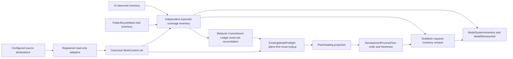

## Context

FlowGuard 0.61.0 has the right high-level owners for behavior commitments,
existing-model lookup, process ordering, model authority, field coverage, UI
coverage, and test evidence. The gap is at the boundary where external
planning material enters those owners.

The current `SpecContext` shape gives official OpenSpec a privileged core
schema and a singular downstream field family. That prevents Spec Kit,
Superpowers-generated plans, declared project files, and future planning
systems from participating as peers without either changing the core again or
recreating the retired provider work-package system. The retired work-package
system is not a suitable base because it mixed planning context with provider
task reconciliation, sessions, cached execution, receipts, completion
projection, and archive readiness.

Coverage has a second, related weakness. Behavior Commitment Ledger,
ExistingModelPreflight, ModelSystemInventory, and TestMesh can review declared
rows, but a caller can still obtain a green result by omitting a modelable
source, UI surface, field, model, or evidence obligation from the declared
set. This change therefore needs both a neutral input boundary and an
independently derived expected inventory.

The design must preserve the current ownership structure:

- Behavior Commitment Ledger owns external behavior promises and their
  exactly-one primary model mapping.
- ExistingModelPreflight owns reuse-first model and same-intent surface lookup.
- UI Flow Structure owns UI semantics and observed UI inventory.
- FieldLifecycleMesh owns leaf-field semantics and lifecycle inventory.
- PlanDetailing owns normalized executable plan detail.
- DevelopmentProcessFlow owns lifecycle order and freshness.
- ModelSystemInventory and ModelRevisionSet own model-system completeness and
  atomic authority transitions.
- TestMesh owns test and evidence accounting.
- External planning systems retain authoring, execution, validation, status,
  and lifecycle authority over their own artifacts.

The three subject lanes remain authoritative and disjoint:
`observed_implementation`, `normative_target`, and
`counterfactual_experiment`.

## Goals / Non-Goals

**Goals:**

- Replace `SpecContext` directly with one provider-neutral `WorkContext`
  contract.
- Allow zero, one, or many independently fingerprinted contexts in one
  FlowGuard operation.
- Normalize external artifacts through generic roles while preserving native
  identities and native ownership.
- Make every WorkContext read-only and incapable of provider execution,
  validation, session, cache, receipt, completion, or archive authority.
- Keep plane selection in Behavior Commitment Ledger and keep subject-lane
  authority in the model-authority system.
- Derive expected coverage independently of caller-declared modeled rows and
  reconcile the exact expected and disposed sets.
- Reuse the existing BCL, ExistingModelPreflight, PlanDetailing,
  DevelopmentProcessFlow, UI, field, TestMesh, ModelSystemInventory, and
  ModelRevisionSet owners instead of creating parallel owners.
- Make the current API, CLI, templates, project guidance, and maintained
  consumer prompts provider-neutral.
- Use direct current-format replacement, with no runtime compatibility alias,
  fallback reader, dual field family, or dual command.

**Non-Goals:**

- FlowGuard will not author, edit, validate, execute, resume, complete,
  synchronize, or archive native provider work.
- WorkContext will not become a behavior ledger, task orchestrator, receipt
  store, provider SDK, or universal document parser.
- The core will not hard-code Spec Kit, Superpowers, or every future planning
  system. They can use declared-file profiles until a justified convenience
  adapter is added.
- Generic artifact roles will not replace provider-native schemas or domain
  judgment.
- WorkContext status or task checkboxes will not become model, test, release,
  or archive evidence.
- This change will not merge product runtime, agent operation, and development
  process ownership.

## Decisions

### 1. Use one small WorkContext core and peer adapters

The core will define `WorkContext`, `WorkContextArtifact`,
`WorkContextAdapter`, registration, generic discovery/read entrypoints, and
review. Provider implementations will live behind the adapter boundary, for
example:

- `flowguard/work_context.py`
- `flowguard/work_context_adapters/openspec.py`
- `flowguard/work_context_adapters/declared_files.py`

The core module will not contain provider-specific fields, provider-specific
artifact enums, a preferred provider, or provider-specific public convenience
functions. Official OpenSpec and declared files are built-in peer adapters.
Spec Kit and Superpowers participate immediately through declared-file
profiles; a later convenience adapter can be registered without changing the
WorkContext schema.

An adapter has only two operations:

```text
discover(project_root, declaration) -> native work ids
read(project_root, native_work_id, declaration) -> WorkContext
```

There is deliberately no adapter operation for write, apply, execute,
validate, resume, synchronize, complete, archive, session, cache, receipt, or
reuse. Registration is explicit, adapter ids are unique, and an unknown
adapter fails visibly. The generic reader never guesses another adapter and
never falls back to raw file reading.

Alternative considered: restore `SpecWorkPackage` and add more providers.
Rejected because its execution and receipt bridge duplicates native provider,
DevelopmentProcessFlow, and TestMesh authority.

Alternative considered: keep `SpecContext` and add provider fields. Rejected
because the public name, default provider, fixed artifacts, and downstream
singular fields would retain the OpenSpec preference.

### 2. Make identity, content, role, and authority explicit

`WorkContext` will contain:

- `context_id`
- `adapter_id`
- `native_work_id`
- `native_owner_id`
- `project_root`
- `context_root`
- `subject_lane`
- `read_only`
- `current`
- `artifacts`
- `required_artifact_roles`
- `behavior_source_surface_ids`
- `context_fingerprint`
- `native_metadata`

`WorkContextArtifact` will contain:

- `artifact_id`
- `artifact_role`
- `source_ref`
- `content_fingerprint`
- `size`

The sole generic artifact-role set is:

- `scope`
- `requirement`
- `acceptance`
- `design`
- `plan`
- `task`
- `status`
- `history`
- `other`

Provider-native filenames and document types map to these roles but remain
available through stable native ids and bounded metadata. Adapters declare the
roles required for a particular source. Missing required roles block that
context; optional roles remain explicit rather than being synthesized.

Every artifact fingerprint covers its bytes. The context fingerprint covers
the canonical ordered artifact inventory, adapter/native identities, roots,
lane, required roles, behavior-source links, read-only/current state, and
canonical native metadata. `current=true` means the reviewed identity still
matches the currently read bounded content. It does not mean the provider has
accepted, completed, validated, or archived the work.

Authority-bearing metadata is invalid. A context carrying commands, write
requests, execution/check ownership, sessions, caches, receipts, reuse
decisions, completion projections, or archive readiness fails review rather
than being partially consumed.

### 3. Bound discovery to explicit project declarations

Configured sources will be declared under the existing project manifest,
conceptually as repeated `work_context.sources` rows. Each row identifies its
adapter, bounded root or file set, native work selection/discovery rule,
subject lane, required artifact roles, required/optional disposition, and
known behavior-source surface links.

Adapters resolve every root and artifact under the explicit project root.
Empty, nested where disallowed, absolute-outside-root, traversal, symlink
escape, duplicate identity, and unregistered-adapter cases fail closed.
FlowGuard does not scan the rest of the computer to guess planning systems.

The resulting set is canonicalized by stable context and artifact identities.
Zero contexts is valid only when no configured source is required. A required
source that discovers no context is a visible gap. Duplicate context ids,
conflicting native identities, or the same normative source with incompatible
semantics block aggregation.

### 4. Keep WorkContext lane-aware but plane-neutral

`subject_lane` classifies what version of the subject the material describes:

- accepted active requirements/plans normally use `normative_target`;
- alternatives and brainstorms use `counterfactual_experiment`;
- current implementation, current UI/API, and current release facts use
  `observed_implementation`.

A WorkContext is still only an input to development work. It never becomes a
current model snapshot or a primary behavior owner. Target and experiment
contexts cannot become observed authority through discovery, validation,
green status, naming, or a `current` flag.

Behavior plane remains a Behavior Commitment Ledger decision. When a context
contains a product-runtime, agent-operation, or development-process promise,
`behavior_source_surface_ids` link the artifact to the corresponding BCL
source rows and typed commitment targets. ExistingModelPreflight performs its
canonical plane-first commitment lookup before consuming contexts. It may
select any of the three behavior planes; it must not force
`development_process` merely because the promise arrived in a planning file.

For example, a Superpowers skill itself is an `agent_operation` source. A plan
produced by that skill is a read-only WorkContext. Product behavior promised
inside the plan remains a `product_runtime` BCL commitment owned by its product
model. Those three identities stay linked but never merge ownership.

### 5. Reuse existing owners through one data flow



The WorkContext layer contributes source identities and content, not semantic
ownership. BCL continues to own commitment/source reconciliation.
ExistingModelPreflight continues to own current-model and same-intent reuse
lookup. PlanDetailing and DevelopmentProcessFlow consume only normalized
context references. TestMesh consumes native FlowGuard evidence. UI and field
specialists contribute their complete inventories without giving their
semantic decisions to BCL.

No subsystem receives a provider command or provider receipt from
WorkContext. If a native provider must be validated or archived, its own
workflow performs that operation outside this adapter path. FlowGuard may
record that the external operation is still required, but cannot execute or
claim it.

### 6. Make completeness an exact-set reconciliation

The expected source inventory will be derived independently from configured
WorkContext adapter inventories, release/document sources, declared
interfaces, UI observed inventories, and FieldLifecycleMesh leaf inventories.
It will have its own revision and discovery evidence.

BCL will reconcile that expected set against declared source surfaces and
require one explicit disposition for every modelable item:

- modeled by a commitment and exactly one primary owner model;
- delegated to an existing exact-intent commitment/path;
- scoped out with a typed reason and boundary.

Missing, unexpected, stale, fingerprint-mismatched, conflicting normative, or
undisposed rows block completeness. Required ids come from the independent
inventory, not from the ledger rows being checked.

ModelSystemInventory will consume the canonical BCL loader/reviewer and the
independent source inventory instead of treating the declared ledger set as
the required set. UI and field inventory revisions remain specialist-owned and
are projected into that shared revision. TestMesh binds its required item ids
to the same inventory revision.

### 7. Derive model-authority impact from owner artifacts

Observed model-system audit will compare the current model regression/source
inventory with the stored observed snapshot. A snapshot that omits a required
model or source surface cannot stay green merely because its stored contents
are internally consistent.

ModelRevisionSet will add `changed_source_surface_ids` and derive changed
source, commitment, field, side-effect, contract, and test sets from the exact
`owner_artifact_refs` on changed snapshots and relations. Caller-supplied
changed-id lists remain assertions to check, not the authority for affected
closure.

The existing owner-artifact endpoint kinds remain the join:

- `external_surface` to source surface;
- `behavior_commitment` to commitment;
- `field_inventory` to field;
- `side_effect_inventory` to side effect;
- `code_contract` to contract;
- `test_evidence` to test.

Unmapped or ambiguous owner artifacts block the revision rather than causing a
run-all fallback.

### 8. Replace singular downstream fields directly

ExistingModelPreflight will replace singular `spec_context` with plural
`work_contexts`. It will validate every context after plane-first lookup,
preserve adapter/native owner/lane/fingerprint identity, and require typed BCL
mapping for cross-plane targets. WorkContext is not added to the UI/API/CLI
same-intent surface-kind enum.

PlanDetail source, step, and validation rows will replace every
`spec_context_*` field with `work_context_*` references. A step can cite
several contexts and artifacts. Artifact roles replace assumptions about a
proposal/design/spec/tasks set. Provider status cannot satisfy a validation
row.

DevelopmentProcessFlow artifacts, actions, and plans will likewise use plural
WorkContext references. DPF receives reviewed normalized contexts; it does not
call provider adapters to execute work. Context fingerprint changes stale
dependent PlanDetail, DPF, maintenance, and evidence rows through the existing
freshness graph.

Maintenance scan and self-maintenance will use the same generic ids and
fingerprints. TestMesh does not need a provider schema; it only binds native
evidence to the shared required inventory revision.

### 9. Use one current public surface and one upgrade boundary

The public Python API will export only WorkContext types and generic
read/discover/review/registration functions. The CLI and template surface will
use `work-context` and `work-context-template`. Provider selection is an
explicit adapter argument or project declaration.

`SpecContext`, `spec_context_*`, `BCL_SOURCE_OPENSPEC`, `spec-context`,
`spec-context-template`, provider-specific core helper exports, and their old
templates are removed from normal runtime. There is no deprecated alias,
alternate successful parser, automatic OpenSpec default, or provider-neutral
fallback.

`project-upgrade` is the sole one-time boundary allowed to recognize the old
project artifact shape and write the direct current WorkContext shape. After
upgrade, normal readers reject old fields and commands. Historical changelog,
archived OpenSpec, release, and immutable evidence records remain historical
and are not rewritten.

### 10. Keep prompt maintenance and validation with their current owners

Only the kernel, Behavior Commitment Ledger, ExistingModelPreflight,
DevelopmentProcessFlow/PlanDetailing, and TestMesh consumer guidance needs
provider-neutral wording. The maintained author sources are changed under the
existing SkillGuard `unit:flowguard-suite`, then compiled and installed as one
clean consumer projection. Official third-party OpenSpec, Spec Kit, and
Superpowers skills stay outside SkillGuard authority.

Executable validation remains owner-specific:

- adapters prove bounded read and fingerprint behavior;
- BCL proves exact source-set and conflict behavior;
- preflight proves plane and ownership separation;
- PlanDetail/DPF prove projection and freshness;
- model authority proves complete snapshot/revision closure;
- TestMesh proves evidence accounting;
- native providers prove their own validation and archive lifecycle;
- SkillGuard proves maintained prompt-source and consumer-projection parity.

## Risks / Trade-offs

- [Generic roles can hide useful native distinctions] → Preserve native ids,
  bounded metadata, and source references while keeping the core role enum
  small; add an adapter only when repeated native parsing justifies it.
- [A permissive adapter could smuggle execution authority into metadata] →
  validate the adapter contract, reject authority-bearing fields, and keep
  public entrypoints read/discover-only.
- [Several normative contexts can disagree] → compare source-role and semantic
  fingerprints in BCL and block unresolved conflicts; never resolve by adapter
  order or provider preference.
- [A context can change during planning] → hash every artifact and the
  canonical context inventory, then stale all dependent rows on mismatch.
- [Independent discovery can be more expensive than caller declarations] →
  scope discovery to explicit project roots, content-address inventories, and
  reuse only exact current inventory revisions.
- [Direct replacement breaks callers using SpecContext] → provide a bounded
  project-upgrade step and clear migration diagnostics, but no second runtime
  success path.
- [`current=true` may be mistaken for provider acceptance] → define it only as
  current content identity and repeat the zero-evidence claim boundary in API,
  CLI, templates, and reviews.
- [UI and field rows could be flattened into generic ledger semantics] →
  project only their inventory identities and dispositions; their specialist
  models retain admission, lifecycle, and semantic judgment.
- [A broad final test run could hide owner ambiguity] → freeze exact owners and
  affected inventory first; ambiguous impact blocks instead of falling back to
  run-all.

## Migration Plan

1. Freeze the current 0.61.0 observed head and the completed OpenSpec-only
   context change so the direct replacement has an exact base.
2. Add the WorkContext core and the OpenSpec and declared-files adapter
   modules, with bounded read/fingerprint tests and no execution methods.
3. Add the independent source inventory and extend BCL exact-set, source-role,
   fingerprint, disposition, and normative-conflict review.
4. Replace all singular SpecContext fields in ExistingModelPreflight,
   PlanDetailing, DevelopmentProcessFlow, maintenance scan, and
   self-maintenance with plural WorkContext references in one migration.
5. Join UI and FieldLifecycleMesh inventories, bind TestMesh to the resulting
   inventory revision, and strengthen ModelSystemInventory and
   ModelRevisionSet affected-closure derivation.
6. Replace the public API, CLI, templates, project guidance, docs, and current
   models. Add only the one-time `project-upgrade` converter; remove all old
   runtime names and verify zero residuals outside historical records.
7. Update the five affected maintained consumer prompt surfaces under
   SkillGuard, regenerate the clean consumer projection, and verify installed
   parity.
8. Run focused adapter, BCL, preflight, PlanDetail, DPF, maintenance,
   model-authority, RevisionSet, and TestMesh tests; then run model regression,
   strict OpenSpec, project audit, skill-suite validation, full tests, clean
   package/clone verification, and release parity on one frozen source state.

Rollback is release-level, not a runtime fallback. Before project upgrade,
retain the prior project manifest/artifact snapshot. If migration validation
fails, restore the prior released code and prior project snapshot together.
After the new format is accepted, repair forward or restore that whole pair;
do not re-enable SpecContext readers or commands inside the new runtime.

## Open Questions

No unresolved question blocks implementation. Additional convenience adapters
for Spec Kit or Superpowers can be proposed later from repeated declared-file
usage, but they must satisfy the same read-only adapter contract and cannot
change the core schema or receive provider preference.
